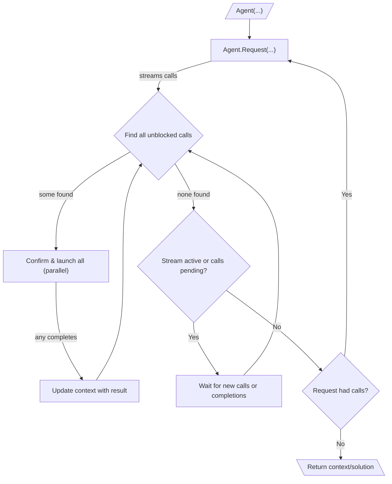

# 010: Agent/Loop

> [!DEFINITION] [Loop](./000_glossary.md)
> A sequence of :term[Request]{canonical="Request"}s aimed at achieving a goal. The agent continues to invoke :term[Request]{canonical="Request"}s, process the resulting :term[Call]{canonical="Call"}s, and feed the output back into the context of the next :term[Request]{canonical="Request"} until no more :term[Call]{canonical="Call"}s are generated.

> Sidenote:
>
> - Requires:
>   - :term[001: Agent/Request]{href="./001_agent_request.md"}
>   - :term[008: Agent/Output]{href="./008_agent_output.md"}

The :term[Execution Loop]{canonical="Execution Loop"} is the engine that orchestrates all the message types and protocols from previous chapters. It enables an agent to perform multi-step tasks by iteratively making :term[Requests]{canonical="Request"}. This iterative process of context assembly, tool use, and feedback is what is commonly meant when referring to an "agent."

## The Execution Loop

The execution loop is the primary mechanism for autonomous, multi-step execution. It operates via a nested loop structure:

::::columns
:::column

1.  **Outer Loop (Request Generation):** The agent's lifecycle is a sequence of :term[Request]{canonical="Request"}s. It starts with an initial context and enters a loop.
2.  **Request & Call Streaming:** Inside the loop, it invokes a single :term[Request]{canonical="Request"}. The :term[Request]{canonical="Request"} streams back :term[Calls]{canonical="Call"} as they are generated, which are collected into a pending queue.
3.  **Inner Loop (Call Orchestration):** For each :term[Request]{canonical="Request"}, an inner orchestration loop is responsible for executing its associated :term[Calls]{canonical="Call"}. This process is highly concurrent:
    - The orchestrator continuously scans the queue of pending :term[Calls]{canonical="Call"} to find all that are currently unblocked (i.e., their dependencies are met).
    - All unblocked :term[Calls]{canonical="Call"} can be presented for confirmation and then executed in parallel. This concurrency is safe because the agent's :term[State]{canonical="State"} is immutable: once a value is written to a specific path via :term[Output Path]{canonical="Output Path"}, it cannot be overwritten. This allows the model to propose mutually exclusive :term[Calls]{canonical="Call"}—such as different branches of a conditional—that write to the same output path. The first of these calls to execute successfully sets the value, and any others that were alternatives will not be executed because their preconditions (the path being empty) are no longer met. This ensures a deterministic outcome without conflicts.

      > Sidenote:
      >
      > - [008: Agent/Output](./008_agent_output.md)

    - As each :term[Call]{canonical="Call"} completes, its output updates the shared context, potentially unblocking other pending :term[Calls]{canonical="Call"}.
    - This reactive, parallel execution continues until the stream for the current :term[Request]{canonical="Request"} is closed and all of its pending :term[Calls]{canonical="Call"} have been drained. This model significantly reduces latency, as the agent can start working on multiple independent steps simultaneously, even before the full plan is known.

4.  **Termination Check:** Once the inner loop completes, the agent inspects the final :term[Solution]{canonical="Solution"} from the parent :term[Request]{canonical="Request"}. If it contains no :term[Calls]{canonical="Call"}, the agent's goal is considered complete, and the outer loop terminates.
5.  **Continuation:** If the :term[Solution]{canonical="Solution"} did contain :term[Calls]{canonical="Call"}, the agent loops back to step 2, invoking a new :term[Request]{canonical="Request"} with the enriched context that now contains the results of the previous execution step.
6.  **Output Generation:** Upon termination, the `output` field of the final :term[Solution]{canonical="Solution"} contains the result, conforming to the user-defined output schema.

:::
:::column

:::
::::

## :term[Human-in-the-Loop]{canonical="HITL"}

The new :term[Execution Loop]{canonical="Execution Loop"} provides robust support for human oversight by placing the confirmation step just before execution. This ensures the user is only prompted to act on calls that are ready to run:

- **Approval:** Before an unblocked :term[Call]{canonical="Call"} is executed, the system can present it to a user for approval. This is an efficient approach, as it prevents the user from having to review and confirm calls that might be blocked by dependencies and never run.
- **Correction:** The user can modify the parameters of a :term[Call]{canonical="Call"} or even replace it with a different one

It is important to note that these specific :term[HITL]{canonical="HITL (Human-in-the-Loop)"} mechanisms are not part of the core protocol. The architecture simply provides the necessary separation between proposing actions and executing them, giving developers the flexibility to implement any kind of intervention, from a simple manual approval to a complex, automated system with timeouts.

This capability is critical for safety and for collaborative tasks where the agent acts as an assistant. User adjustments and feedback can be leveraged by the :term[Plan]{canonical="Plan"}, allowing the agent to refine its strategy based on human input.

## From Simple Loops to Strategic Plans

The :term[Execution Loop]{canonical="Execution Loop"} provides a dynamic structure for agent behavior, but its power is in executing tactical, single-shot :term[Requests]{canonical="Request"}. To manage complex, multi-step workflows with dependencies, a more advanced system of strategic planning is required.

The next document, :term[011: Agent/Plan]{href="./011_agent_plan.md"}, introduces the protocol for defining these long-term strategies as a graph of interconnected :term[Tool Calls]{canonical="Call"}.
