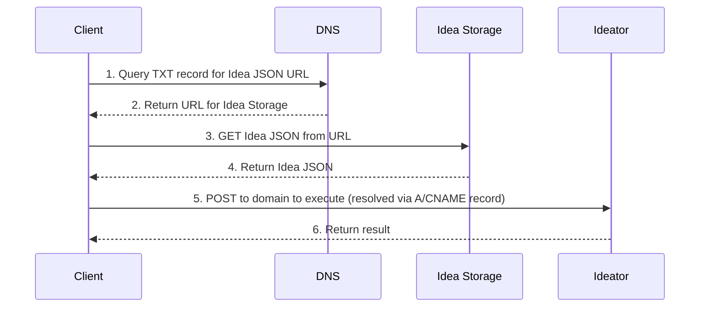

# 102: Concept/Sovereignty

> Sidenote:
>
> - Requires:
>   - [101: Concept/Idea](./101_concept_idea.md)
>   - [103: Concept/Ideator](./103_concept_ideator.md)

## Introduction

This document specifies the protocol for **Sovereignty**, which defines the spectrum of autonomy available to creators in the ecosystem. It outlines a layered architecture for hosting and execution, allowing participants to choose their desired level of control, from using fully managed services to self-hosting a complete, sovereign implementation.

This model is the practical bridge between an abstract `Ideator` and a concrete, running service.

## Decentralized Identity via DNS

The ecosystem's architecture is a spectrum of autonomy built upon a single, foundational principle: **decentralized identity via DNS**. This foundation ensures that an `Idea` is not tied to any single platform or provider, making true sovereignty possible. An `Idea` is given a unique domain name, and a `TXT` record for that domain points to the canonical `Idea` JSON document. By controlling this DNS record, a creator has full and final authority over their `Idea`'s identity and location.

### Unified Request Flow: User Sovereignty via DNS

The diagram below illustrates the two primary interactions with an Idea: fetching its definition (`GET`) and executing it as a service (`POST`). It shows how standard DNS records give the user full control over routing.

**The user's DNS record is the control plane.** The domain's `TXT` record points to the location of the `Idea`'s JSON definition file (`Idea Storage`). The domain's primary `A` or `CNAME` record points to the execution endpoint (`Ideator`). By controlling these two records, the user directs all traffic, deciding whether to use managed services or their own infrastructure.

> [!HEADSUP] Heads up
> It's helpful to view this model as a spectrum of autonomy. At one end lies a managed service that provides convenience. At the other end lies **full sovereignty**: using a custom domain and self-hosting all services, effectively becoming one's own provider. The managed layers serve as an optional, progressive bridge between these two states.



## The Layered Architecture

On top of the foundational principle of decentralized identity, the system provides five optional, progressive layers of service functionality. These layers allow creators to choose their desired level of control, from using fully managed services for convenience to self-hosting a complete, sovereign implementation.

### Layer 1: Managed Hosting

This layer provides an immediate, zero-friction hosting solution for the Ideator source file itself.

- **How It Works:** As an easy entry point, we offer to host a user's Ideator source file on our S3 bucket. The `TXT` record we create for their managed subdomain will point to this S3 URL. At any time, the user can choose to host the file elsewhere and update their `TXT` record to point to the new location (e.g., their own server, IPFS, etc.).
- **Purpose:** To eliminate the need for creators to arrange their own file hosting just to get started.

---

### Layer 2: Static UI Generation

This layer makes Ideators accessible and useful to humans with zero server-side compute.

- **How It Works:** A generic, static web page is served for all Ideator domains that opt into this service. When a user visits an Ideator's domain in a browser, client-side JavaScript on that page performs a DNS-over-HTTPS (DoH) query to fetch the `TXT` record for the domain, retrieves the source URL (from Layer 1 hosting), fetches the Ideator's definition file, and dynamically renders a user interface.
- **Purpose:** Provides a free, instantly usable web app for any Ideator, lowering the barrier to entry.

---

### Layer 3: CDN-Powered `GET` Endpoint

This layer enhances machine-to-machine interoperability for reading an Idea's definition.

- **How It Works:** By placing a CDN in front of the hosting layer, we can use request rewriting rules. A `GET` request to an Idea's domain is intelligently routed by the CDN to serve a JavaScript module. This allows developers to use **named exports** to import specific parts of the `Idea` directly. The raw `Idea` document remains accessible via an `Accept: application/json` header.
- **Purpose:** To provide powerful and idiomatic programmatic access with full type-safety.

```ts
// X-Typescript-Types header is also served for environments like Deno
const { default: run, schema } = await import('http://my-idea.com');
console.log(`Idea's schema is`, schema);

// run idea as a function directly
await run(input);
```

---

### Layer 4: Publishing (`PUT`)

This layer provides the ability to publish and update an Idea programmatically.

- **How It Works:** This layer handles authenticated `PUT` requests to an Idea's domain. A single request can upload a new version of the Idea's source file and atomically update any necessary records to make the new version live.
- **Purpose:** To provide a secure and simple API for creators to manage the lifecycle of their Ideas.

```ts
// publish new version of the idea
await fetch('http://my-idea.com', {
  method: 'PUT',
  data: JSON.stringify({ context, schema, solution }),
});
```

---

### Layer 5: Full API Execution (`POST`)

This is the highest layer of functionality, transforming an Ideator into a true, invocable web service.

- **How It Works:** This layer handles `POST` requests to an Ideator's domain, executing its logic. This can be implemented via a managed serverless function or by a user self-hosting their own endpoint.
- **Purpose:** To provide the full power of a serverless architecture, allowing anyone to publish a fully functional microservice with just a static definition file.

```ts
// invoke idea as a service with new context
const idea = await fetch('http://my-idea.com', {
  method: 'POST',
  data: JSON.stringify(context),
});
console.log('New solution for idea', idea.solution, 'conforming to schema', idea.schema);
```

### The Idea vs. The Service: A Note on Execution

A core principle of this architecture is the separation of the public manifest (`Idea`) from its execution. An `Idea` is a complete, self-contained blueprint. It contains the schema, context, and solution—everything needed for a capable agent to run it. This empowers any user to fetch an `Idea` and execute it within their own local environment, allowing for experimentation, remixing, and sovereign use on their own terms.

The "Full API Execution" layer is therefore not a requirement but a powerful convenience and a commercial opportunity. It allows a creator to offer their `Idea` as a robust, managed service. This is where commerce and trade secrets can thrive within an open ecosystem. A creator can publish a public `Idea` as a transparent contract—a manifest of what the service does and what it returns—while keeping their specific implementation details private.

This private implementation is the creator's "secret sauce." It might involve proprietary models, specialized hardware, unique data sources, or sophisticated methods for handling incomplete or imperfect information. The service becomes a reliable "black box" that fulfills the public promise of the `Idea`, creating a marketplace where open, portable protocols and valuable, private implementations can coexist and build upon one another.

## From a Sovereign Idea to a Sovereign Namespace

While DNS provides sovereignty over a single `Idea`, its true power is in establishing a **Sovereign Namespace**. A domain name like `my-project.com` does not just point to one `Idea`; it defines the root of a digital estate over which the owner has full control.

This namespace can be structured using paths, just like a website.

- The root of the domain (`my-project.com`) can resolve to a primary `Idea` (like a bot, a process, or a project overview).
- Paths within that domain (`my-project.com/schemas/User`) can resolve to other, nested `Ideas`.

This creates a clear hierarchy: the **domain** establishes sovereignty over the entire namespace, and the **path** provides structure within it. This allows a single sovereign identity to host and manage a whole collection of interconnected `Ideas`, from a single component to an entire application. This model of addressing is detailed further in the :term[Addressing]{href="./109_concept_addressing.md"} concept.

## API Specification

All HTTP interactions happen at the root of the Idea's domain (`/`).

- **`GET /`**
  - With `Accept: text/html` header (Layer 2): Returns the static UI loader or redirects to the `page` URL.
  - With `Accept: application/json` header (Layer 3): Returns the Idea's source JSON file.
- **`PUT /`** (Layer 4)
  - Requires authentication. A single `PUT` request both uploads the new Idea source file and atomically updates the `code` URL in the `TXT` record to make the new version live.
- **`POST /`** (Layer 5)
  - Requires authentication/authorization. Executes the Ideator.
  - The request body is a JSON object containing the payload, e.g., `{"context": "The user's input to be processed"}`.

```

```

```

```
