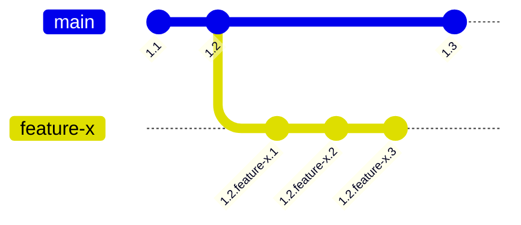

# 108: Concept/Visibility

> [!DEFINITION] :term[Visibility]{canonical="Visibility"}
> The set of mechanisms that control which version of an :term[Idea]{canonical="Idea"} is resolved in a given context. Visibility is determined by a combination of an :term[Idea]{canonical="Idea"}'s version history, its branch associations, and the requester's search path.

> Sidenote:
>
> - Requires:
>   - :term[107: Concept/Identity]{href="./107_concept_identity.md"}
> - Enables:
>   - :term[109: Concept/Addressing]{href="./109_concept_addressing.md"}

For a system of evolving, interconnected :term[Ideas]{canonical="Idea" href="./101_concept_idea.md"} to be useful, there must be a clear and predictable way to determine which version of an :term[Idea]{canonical="Idea" href="./101_concept_idea.md"} is seen—or **visible**—in any given context. This document describes the two-part model that governs :term[visibility]{canonical="Visibility"}: the versioning system that creates the possible states of an :term[Idea]{canonical="Idea" href="./101_concept_idea.md"}, and the selection mechanism that chooses which state becomes visible.

## Versioning: Creating the States to Be Seen

Before a version can be selected, it must exist. :term[Hierarchical Versioning]{canonical="Hierarchical Versioning"} is the mechanism for creating and tracking the different states of an :term[Idea]{canonical="Idea" href="./101_concept_idea.md"} over time. A version is not just a simple number but a rich, dot-separated hierarchy that tells the story of an :term[Idea]{canonical="Idea" href="./101_concept_idea.md"}'s evolution.

<<<<<<< Updated upstream
Versions consist of **integer revisions** for sequential, public releases (like `1.2`) and **branched revisions** for named development lines (like `feature-x`). For example, a version like `1.2.feature-x.3` tells us this is the third revision of a `feature-x` branch that was created from version `1.2`.
=======
::::columns
:::column
Versions consist of **integer revisions** for sequential, public releases (like `1.2`) and **branched revisions** for named development lines (like `feature-x`). For example, a version like `1.2.feature-x.3` tells us this is the third revision of a `feature-x` branch that was created from version `1.2`.
:::
:::column

:::
::::
>>>>>>> Stashed changes

The rules for evolving a version are:

- **Compatible Changes**: A non-breaking edit where the new version can be safely used as a drop-in replacement for the old. Examples include changing the `context` or `solution` data, or adding a new field to the `schema`. Such changes create a new minor revision (e.g., `1.2` becomes `1.2.1`).
- **Breaking Changes**: A change where the new version cannot be used as a substitute for the old. This typically involves removing or modifying existing fields in the `schema`. These changes must "bubble up" to a higher level of the version hierarchy (e.g., a change breaking compatibility with `1.2` would create `1.3`). The system can automatically detect schema-based breaking changes.

## Selection: Choosing the Visible State

With a rich history of versions available, a selection mechanism is needed to choose the correct one. This is handled by a clear separation between how an :term[Idea]{canonical="Idea" href="./101_concept_idea.md"} is published and how it is retrieved. The process has two retrieval dimensions: **spatial** (which partitions to search) and **temporal** (as of what point in time).

### Branches: Publication and Partitioning

> [!DEFINITION] :term[Branch]{canonical="Branch"}
> A named tag that partitions the visibility space, creating a parallel, isolated environment for development and experimentation. Associating an :term[Idea]{canonical="Idea"} with a branch is an act of publication.

For example, every :term[Idea]{canonical="Idea" href="./101_concept_idea.md"} version in the database is associated with one or more :term[branches]{canonical="Branch"} like `["main", "feature/new-billing"]`. This act of publication makes the :term[Idea]{canonical="Idea" href="./101_concept_idea.md"} available within those specific partitions, enabling a safe workflow.

This provides two fundamental benefits:

- **Isolation**: Work on a new feature (e.g., on a `feature/new-billing` :term[branch]{canonical="Branch"}) doesn't interfere with the stable `main` :term[branch]{canonical="Branch"}. This prevents half-finished or buggy work from affecting production systems.
- **Experimentation**: :term[Branches]{canonical="Branch"} are cheap and easy to create. This encourages experimentation, allowing developers to discard a :term[branch]{canonical="Branch"} if an experiment doesn't work out, with no impact on the main system.

### The Search Path: Prioritized Retrieval

> [!DEFINITION] :term[Search Path]{canonical="Search Path"}
> An ordered list of branch names that defines the retrieval mechanism. It tells the resolver which partitions to look in, and in what order of priority, creating a cascading overlay system.

This retrieval mechanism is core to the development workflow and answers the **spatial** question. For example, a developer's typical :term[search path]{canonical="Search Path"} might be set to `['feature/my-new-idea', 'staging', 'main']`.

This configuration creates a cascading overlay system for retrieval:

1.  First, search for a matching :term[Idea]{canonical="Idea" href="./101_concept_idea.md"} in the `feature/my-new-idea` partition.
2.  If not found, search in the `staging` partition.
3.  Finally, fall back to searching in the `main` partition.

This allows a developer to see a specific, intended reality composed of their local changes seamlessly layered on top of the stable system.

### The Cutoff Time: Temporal Retrieval

> [!DEFINITION] :term[Cutoff Time]{canonical="Cutoff Time"}
> A timestamp that accompanies a resolution request, instructing the resolver to find the version of an :term[Idea]{canonical="Idea"} that was considered latest as of that specific moment in time.

The second dimension of retrieval is **temporal**. Every resolution query is performed against the state of the system as it existed at a specific moment. This is controlled by the :term[Cutoff Time]{canonical="Cutoff Time"}.

If a :term[cutoff time]{canonical="Cutoff Time"} is not provided, it defaults to the current time (`now()`), retrieving the most recent visible versions. However, by providing a timestamp from the past, you can perform a "time-traveling query." This instructs the resolver to find the version of an :term[Idea]{canonical="Idea" href="./101_concept_idea.md"}—and all its dependencies—that was latest according to the :term[search path]{canonical="Search Path"} at that exact moment. This capability is the technical foundation for perfect reproducibility.

> Sidenote:
>
> - :term[107: Concept/Identity]{href="./107_concept_identity.md"}

## From Model to Application

This chapter has defined the theoretical model for :term[visibility]{canonical="Visibility"}—the mechanisms for creating different states and selecting between them. With this model in place, the final piece is the practical language for interacting with it.

The next document, :term[109: Concept/Addressing]{href="./109_concept_addressing.md"}, introduces the :term[idea:]{canonical="idea:"} URI scheme, the concrete syntax used to request a specific view and navigate this rich, versioned, and branched reality.
