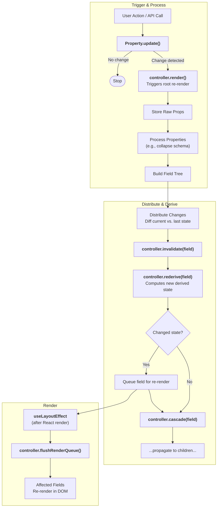

# 802: Package/UI

> [!DEFINITION] [Tree Style Architecture](./000_glossary.md)
> A high-performance, flexible UI rendering system that achieves efficiency through a custom controller architecture, per-property validation, and an intelligent, dependency-based derivation system.

> Sidenote:
>
> - Requires:
>   - :term[800: Package/Schemistry]{href="./800_package_schemistry.md"}

The **UI Package** implements the **Tree Style Architecture**, a rendering engine designed to extend the concept of schema-driven forms into a general-purpose **Auto-Design Engine**.

## Vision: Beyond Forms

While initially inspired by projects like `react-jsonschema-form`, this library moves beyond simple data binding. It acts as a templating system where a **Schema** (structure) and **Data** (content) are fed into an engine that automatically renders the appropriate UI.

This "Auto-Design" capability allows the same underlying model to be presented in various modes:

- **Edit Mode**: A fully interactive form for data entry.
- **Show Mode**: A read-only, styled presentation view.

This versatility ensures that a single source of truth—the Schema—drives both data input and presentation.

## Core Architecture

### Dynamic Property System with Derivations

The system is built around a self-extending controller. Instead of a fixed set of features, modular **Properties** register themselves and their inter-dependencies, creating a powerful derivation graph.

- **Self-Registration**: Properties (e.g., `data`, `schema`, `vars`) are modular and register automatically upon import.
- **Dependency Declaration**: Properties declare their needs (e.g., `styles` depends on `vars` and `settings`).
- **Chained Derivations**: When a base property changes, the controller automatically re-derives dependent properties in topological order, ensuring state consistency.
- **Type Safety**: The controller's type definition is inferred from the union of all registered properties.

### User-Defined Properties

The dynamic property system allows for deep extensibility. Developers can register custom properties to implement domain-specific logic, such as:

- **Slots**: Determining which UI components to render based on `styles`.
- **Errors**: Performing validation based on `data` and `schema`.
- **Custom Logic**: Reacting to specific data conditions to alter UI behavior.

### Themable Component System

The rendering engine is decoupled from specific UI frameworks via a **Theme** system. This orchestrates the flow from abstract data to concrete pixels:

1.  **Schema**: Defines the structure and hierarchy.
2.  **Controller**: Processes schema and data into a specific `state` for every field.
3.  **Vars**: CSS-like variables declaratively assign `Atom` components to named `slots`.
4.  **Atoms**: Leaf-level components (e.g., `<Input />`) that bind to field state.
5.  **Fields**: Orchestrators that compose `Atoms` based on the current `vars`.

This separation allows for customization at every level, from data processing to final rendering.

## State Management

The controller centrally manages the tree's state, utilizing **Structural Sharing** to minimize memory usage and maximize performance.

- **Raw Props**: The source of truth (`data`, `vars`), never mutated. Supports both controlled and uncontrolled modes.
- **Current State (`controller.current`)**: The processed, derived state distributed to fields.
- **Last State (`controller.last`)**: A snapshot used for differential updates.

Fields do not hold local copies of data; they reference slices of the central `controller.current` state tree. This ensures coherency across the entire UI.

## The Update & Derivation Pipeline

The controller uses a unified pipeline for all updates, ensuring a predictable flow of state.

1.  **Trigger**: An event (user input, API call) triggers a property's `update` method.
2.  **Process**: Raw props are processed into a consistent internal state (`controller.current`).
3.  **Distribute**: The controller diffs `current` vs `last` to identify changed fields.
4.  **Invalidate & Derive**:
    - **`rederive()`**: Re-computes dependent properties (e.g., `styles`) for affected fields.
    - **`cascade()`**: Propagates changes (like CSS variables) down to descendants.
5.  **Render**: Updates are queued and flushed in a single batch via `useLayoutEffect`.

### Architecture Diagram: Update Lifecycle



## Performance

The architecture minimizes React reconciliation overhead through:

- **Precise Change Detection**: Deep equality checks and state diffing ensure only truly changed fields are updated.
- **Selective Invalidation**: The derivation graph ensures only dependent properties are recomputed.
- **Batched Rendering**: Multiple changes are coalesced into a single DOM update cycle.
- **Smart Cascading**: Variable inheritance is cached and only triggers re-renders when the final output (e.g., `style` object) actually changes, effectively deduplicating updates.

## API Reference

### Controller Methods

```typescript
// Update a field property
controller.update(path: string, property: string, value: any): Promise<boolean>

// Merge with existing property value
controller.merge(path: string, property: string, value: object): Promise<boolean>

// Get property value
controller.get(property: string, path?: string): any

// Inherit property value up the tree
controller.inherit(property: string, path: string, key?: string): any

// Register field subscriber
controller.register(path: string, forceRender: () => void): () => void
```

### Property Registration Example

```typescript
const StylesProperty = {
  priority: 50,
  fieldDefaults: { styles: {} },
  dependencies: ['vars', 'settings'],

  derive: field => {
    const newStyles = getComputedFieldStyles(
      field.mode,
      varName => field.controller.inherit('vars', field.path, varName),
      field.type
    );
    return { styles: newStyles };
  },

  invalidate: (field, controller, newValue, oldValue) => {
    controller.rederive(field, ['styles']);
    controller.cascade(field, ['styles']);
  },
};

Property.register('styles', StylesProperty);
```
