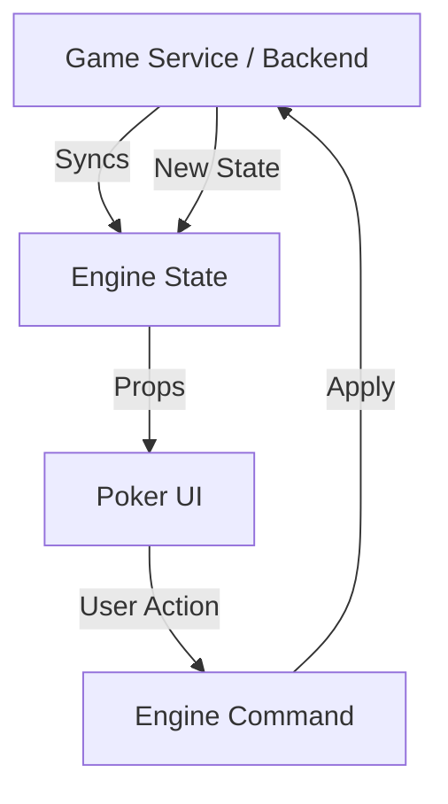

# 851: Package/Poker UI

> [!DEFINITION] Poker UI
> A pure functional React UI library for the Poker Engine. It strictly follows the "controlled component" paradigm, rendering the game state provided to it and emitting actions back to the consumer, containing zero business logic.

> Sidenote:
>
> - Requires:
>   - :term[851: Package/Poker Engine]{href="./851_package_poker_engine.md"}
> - Compatible with:
>   - :term[850: Package/Game Service]{href="./850_package_game_service.md"}

The **Poker UI** package demonstrates the ideal architecture for game interfaces in a modern, shared-backend ecosystem. It provides a complete, themeable poker table interface that delegates all domain logic to the :term[Poker Engine]{href="./851_package_poker_engine.md"}.

## Philosophy

This project enforces a strict separation between presentation and logic:

1.  **Pure View**: The UI contains **zero game logic**. It does not calculate winners, enforce rules, or manage turn order. It simply renders the `State` provided by the engine.
2.  **Controlled Input**: Following the React "controlled component" pattern (like `<input value={...} onChange={...} />`), the main `<PokerGame />` component accepts a `state` prop and calls `onStateChange` (or dispatches commands) when user interactions occur.
3.  **Registrable Engine**: It relies entirely on the :term[Poker Engine]{href="./851_package_poker_engine.md"} for domain logic, ensuring the frontend and backend share the exact same ruleset.
4.  **Service Ready**: It is immediately compatible with the :term[Game Service]{href="./850_package_game_service.md"}, allowing for seamless multiplayer integration.

## Architecture

The architecture relies on a unidirectional data flow where the backend (or a local engine instance) is the single source of truth.



This separation of concerns enables key capabilities:

- **Optimistic Updates**: Actions can be applied locally for instant feedback while waiting for server confirmation.
- **Replayability**: The UI can be fed a history of states to perfectly replay a hand.
- **Testability**: The UI can be tested with static JSON fixtures without mocking complex game logic.

## Usage

The core abstraction is the `<PokerGame />` component. It requires a `state` object (conforming to the Engine's `State` interface) and an event handler.

```tsx
import React, { useState } from 'react';
import * as Poker from '@idealic/poker-engine';
import { PokerUI } from '@idealic/poker-ui';
import '@idealic/poker-ui/src/style.scss';

const App = () => {
  // 1. Initialize state (typically from backend)
  const [state, setState] = useState<Poker.State>(initialState);

  const handleStateChange = (newState: Poker.State) => {
    // 2. Optimistically update local state
    setState(newState);

    // 3. Send action to backend (conceptually)
    // api.sendAction(newState.lastAction);
  };

  return (
    <PokerUI
      state={state}
      onStateChange={handleStateChange}
      author="Player1" // The perspective to render (hole cards, etc.)
      options={{
        buyIn: 1000,
      }}
    />
  );
};
```

### Integration with Game Service

When composed with the :term[Game Service]{href="./850_package_game_service.md"}, the flow delegates processing to the backend:

```tsx
// ... inside your component
const handleStateChange = async (newState: Poker.State) => {
  // The Service processes the state (validating logic, advancing streets)
  const processed = await Service.process(newState);
  setState(processed);
};
```

## Customization

The UI is designed for extensibility. Specific sub-components can be overridden via the `components` prop while maintaining the overall layout and logic flow.

```tsx
import { PokerUI, Card } from '@idealic/poker-ui';

// Custom card component
const MyCustomCard = props => <div className="my-fancy-card">{props.card}</div>;

<PokerUI
  state={state}
  components={{
    Card: MyCustomCard, // Override the Card component
    // Chips, Player, Board, etc. can also be overridden
  }}
/>;
```

## Styling

Default styles are provided in `src/style.scss`, utilizing BEM naming conventions (e.g., `.poker-player`, `.poker-card`) to facilitate easy overriding via standard CSS.
