# 02: Company/Process

> [!DEFINITION] Standard Process
> The operational protocol for converting abstract vision into concrete execution through shared responsibility, iterative synthesis, and high-frequency synchronization.
>
> Sidenote:
>
> - Paired with: :term[00: Company/Truth]{href="./50_prompt_truth.md"}

We stand at a crossroads. To move beyond the phase of exploration and truly achieve, uncover, and progress, we must invent and adhere to a disciplined process.

Our process is defined by three distinct artifacts that guide ideas from inception to reality.

## 1. The Artifacts

We separate our work into three specific stages to ensure clarity, safety, and alignment.

### :term[20: Specification]{href="./20_document_spec.md"} (The Truth)

The permanent destination. This is the rigorous, ever-evolving specification of our system. It is the only source of truth.

- **Adherence to Truth:** It strictly follows the standards defined in :term[00: Company/Truth]{href="./50_prompt_truth.md"}. It must be self-contained and free from ambiguity.
- **Correctness over Speed:** Unlike transient documents, the Specification must be rigorously correct. It is better to leave a section undefined than to define it falsely.
- **The Map:** It describes _where we are going_. It allows every team member to understand the broader picture without needing to hold the entire plan in their head.
- **Evergreen:** It is the absolute **Source of Truth for the System** (Code, Presentation, Architecture).

### :term[21: Proposal]{href="./21_document_proposal.md"} (The Proposal)

The transient proposal. This is where we safely articulate what we _want_ to do. It allows us to explore changes without corrupting the truth.

- **Source of Tickets:** This document is the seed from which specific engineering tickets are derived. It is the **Source of Truth for Jira**.
- **Separation of Concerns:** It separates "What we want" from "How we implement it." This allows us to debate the value of the idea without getting bogged down in syntax.
- **Safe Exploration:** It allows us to propose radical changes without breaking the source of truth. If a Proposal is rejected, nothing is lost but a text file.
- **Context for the Machine:** LLMs require precise context. This document provides the "instruction prompt" for the machine.

### :term[22: Alignment]{href="./22_document_alignment.md"} (The Contract)

The synthesized agreement. This is the auto-generated summary of our debate. It ensures that every voice is heard and every decision is explicitly recorded before execution begins.

- **Synthesized Wisdom:** It converts a threaded conversation into a flat list of technical requirements. It filters out the noise and keeps the signal.
- **Dynamic Consensus:** It is not just a log; it is a workspace where the author and reviewer align on the _new_ plan that emerged from the discussion.
- **Machine Instruction:** It serves as the verified input for the AI to execute the changes.
- **Disposable:** It is a one-time artifact that serves as the **Source of Truth for the Review**.

## 2. The Cycle of Consensus

We do not just "write code." We follow a cycle:

```mermaid
flowchart TD
    %% Artifacts
    Proposal[📄 Proposal]
    Alignment[📄 Alignment]
    Spec[📘 Specification]

    %% Flow
    Author([Author]) -->|1. Drafts| Proposal
    Proposal -->|2. Discuss via PR| Team([Team])
    Team -->|3. Comments| AI([AI Agent])
    AI -->|4. Synthesizes| Alignment
    Alignment -->|5. Confirms| Team
    Team -- "Consensus" --> Exec(Execution)
    Exec -->|6. Updates| Spec
```

1.  **Draft Proposal:** An author creates a :term[Proposal Document]{href="./21_document_proposal.md"} describing the problem and proposed solution.
2.  **Discuss:** The team reviews the Proposal via a Pull Request. Comments, questions, and debates occur here.
3.  **Synthesize Alignment:** We use AI to generate an :term[Alignment Document]{href="./22_document_alignment.md"} from the discussion. This converts "comments" into "requirements."
4.  **Confirm:** The team verifies the Alignment Document. Once merged, the plan is locked.
5.  **Execute:** We update the :term[Specification]{href="./20_document_spec.md"} and the codebase based on the Alignment.

## 3. The Ritual of Synchronization

> [!DEFINITION] 1-on-1 Calls
> High-frequency human touchpoints designed to unblock execution, answer questions, and maintain mutual trust.

We synchronize daily to prevent the drift that occurs when people work in isolation.

- **Daily 10-Minute One-on-Ones:** A brief, high-intensity touchpoint with leadership to ensure the compass is still pointing true.
- **Preparation is Mandatory:** Participants must come with prepared topics.
- **The Safety of Process:** This ritual eliminates the anxiety of the unknown.

## 4. The Role of the Machine

We use AI not to replace our thinking, but to enforce it. The machine is the lever; the Alignment Document is the fulcrum.

- **Dictate to Define:** We often dictate our raw thoughts to capture the nuance of intent.
- **Input for Execution:** The Alignment Document serves as the primary input for the LLM.
- **Verify the Output:** We judge the LLM's output against the standard defined in our documents.

## Summary

We trade the illusion of freedom for the reality of progress. By constraining _how_ we decide, we liberate _what_ we can achieve.
