# 02: Company/Process

> [!DEFINITION] Standard Process
> The operational protocol for converting abstract vision into concrete execution through shared responsibility, iterative synthesis, and high-frequency synchronization.

> Sidenote:
>
> - Paired with: :term[00: Company/Truth]{href="./50_prompt_truth.md"}

We stand at a crossroads. To move beyond the phase of exploration and truly achieve, uncover, and progress, we must invent and adhere to a disciplined process.

## 1. The Vision

We operate on a core belief: **With the correct Specification, the execution becomes trivial.**

Currently, we perform the "implementation" of documents into code/presentations manually, while simultaneously building the tools to automate this. The **Specification** acts as the centralized source of truth. **Having this truth makes the final labor trivial and eliminates the need for micromanagement.**

Once a Proposal is approved, execution enters a phase of **Creative Freedom**. The engineer is free to solve the problem however they see fit, constrained only by the boundaries of the **Specification** and the Tickets derived from the Proposal.

**Crucially, we never edit the Specification directly.** The Proposal process is not optional; it is the necessary step to unlock any change to the Source of Truth.

> [!DANGER] NO WORK WITHOUT APPROVAL
> Do not start "doing" (coding, designing in Figma) until the **Proposal** is approved.
>
> - **Fail Fast in Design:** It is cheap to rewrite a Proposal. It is expensive to rewrite code or redo 20 slides.
> - **High-Level First:** Solve the intent and direction before solving the symptoms.

## 2. The Artifacts

We separate our work into three specific stages to ensure clarity, safety, and alignment.

### :term[20: Specification]{href="./20_document_spec.md"} (The Truth)

The permanent destination. This is the rigorous, ever-evolving specification of our system. It is the only source of truth.

- **Adherence to Truth:** It strictly follows the standards defined in :term[00: Company/Truth]{href="./50_prompt_truth.md"}. It must be self-contained and free from ambiguity.
- **Correctness over Speed:** Unlike transient documents, the Specification must be rigorously correct. It is better to leave a section undefined than to define it falsely.
- **The Map:** It describes _where we are going_. It allows every team member to understand the broader picture without needing to hold the entire plan in their head.
- **Handling Complexity:** For large systems with a "large surface area," it is impossible to hold the entire context in memory. The Specification allows the system to evolve while maintaining a coherent source of truth.
- **Evergreen:** It is the absolute **Source of Truth for the System** (Code, Presentation, Architecture).

### :term[21: Proposal]{href="./21_document_proposal.md"} (The Proposal)

The transient proposal (RFC). This is where we safely articulate what we _want_ to do. It allows us to explore changes without corrupting the truth.

- **Source of Tickets:** This document is the seed from which specific engineering tickets are derived. It is the **Source of Truth for Intent** (and subsequently, for Jira).
- **Separation of Concerns:** It separates "What we want" from "How we implement it." This allows us to debate the value of the idea without getting bogged down in syntax.
- **Safe Exploration:** It allows us to propose radical changes without breaking the source of truth. If a Proposal is rejected, nothing is lost but a text file.
- **Context for the Machine:** LLMs require precise context. This document provides the "instruction prompt" for the machine.

### :term[22: Alignment]{href="./22_document_alignment.md"} (The Contract)

The synthesized agreement. This is the auto-generated summary of our debate. It ensures that every voice is heard and every decision is explicitly recorded before execution begins.

- **Synthesized Wisdom:** It converts a threaded conversation into a flat list of technical requirements. It filters out the noise and keeps the signal.
- **Dynamic Consensus:** It is not just a log; it is a workspace where the author and reviewer align on the _new_ plan that emerged from the discussion.
- **Machine Instruction:** It serves as the verified input for the AI to execute the changes.
- **Local Verification:** It acts as a local test for the author to ensure the machine (and thus the team) has a complete understanding of the feedback before moving to execution.
- **Disposable:** It is a one-time artifact that serves as the **Source of Truth for the Review**. It is **never committed** to the repository.

## 3. The Cycle of Consensus

We do not just "write code." We follow a cycle:

```mermaid
sequenceDiagram
    autonumber
    actor Author
    participant Proposal as 📄 Proposal (RFC)
    participant Team
    participant Alignment as 📄 Alignment
    participant Jira as 🎫 Jira Tickets
    participant Artifact as Artifact
    participant Spec as 📘 Specification

    Note over Proposal: Source of Truth for Intent
    Author->>Proposal: 1. Drafts Proposal

    loop Feedback Cycle
        Proposal->>Team: 2. Discuss via PR
        Team->>Alignment: 3. Review Comments & Generate Alignment

        Note over Alignment: Source of Truth for Consensus
        Alignment->>Author: 4. Validation: Is everything captured?
        Author->>Proposal: 5. Applies Changes / Refines Intent
    end

    Note over Spec: Source of Truth for System
    Proposal->>Spec: 6. Update Spec (Creative Freedom)

    Note over Jira: Source of Truth for Priorities
    Spec->>Jira: 7. Create Tickets from Spec
    Jira->>Artifact: 8. Create Artifact (Creative Freedom)
    Artifact->>Spec: 9. Verify Reality matches Spec
```

1.  **Draft Proposal:** An author creates a :term[Proposal Document]{href="./21_document_proposal.md"} describing the problem and proposed solution.
2.  **Discuss:** The team reviews the Proposal via a Pull Request. Comments, questions, and debates occur here.
3.  **Synthesize Alignment:** We use AI to generate an :term[Alignment Document]{href="./22_document_alignment.md"} from the discussion. This converts "comments" into "requirements."
4.  **Review & Regenerate:** The author reviews the Alignment Document. If it is inaccurate, **do not edit it**. Add clarifying comments to the PR and regenerate the document until it passes the "Test of Understanding."
5.  **Update Specification:** Once aligned, we update the :term[Specification]{href="./20*document_spec.md"} to reflect the new design \_before* writing code. This is a creative step where the "What" becomes the "How".
6.  **Ticketize:** We create **Jira Tickets** based on the updated Specification.
7.  **Create Artifact:** We build the final output (Code, Presentation, etc.).

> [!NOTE] Not Bureaucracy, But Clarity
> This process is not about restriction; it is about preservation.
>
> - **Proposal** preserves the intent (Source of Truth for Intent).
> - **Alignment** preserves the consensus (Source of Truth for Review).
> - **Jira** tracks the priority (Source of Truth for Priorities).
> - **Specification** tracks the reality (Source of Truth for System).
>
> By fixing communication and understanding _before_ execution, we liberate the engineer to work with confidence.

> [!NOTE] Creative Freedom & Implementation Plans
> During the **Execute** phase, the engineer/LLM may generate an internal **Implementation Plan** (step-by-step technical instructions). This is a personal artifact used to bridge the gap between the Proposal and the Code. It does **not** require team review. As long as the outcome matches the agreed Proposal, the "how" is left to the creator's discretion.

> [!WARNING] Handling Deviations
> If, during execution, you discover a flaw in the plan or a need to deviate from the agreed approach, you **MUST** loop back. Update the Proposal or create a new one. Do not silently diverge from the consensus.

## 4. The Ritual of Synchronization

> [!DEFINITION] 1-on-1 Calls
> High-frequency human touchpoints designed to unblock execution, answer questions, and maintain mutual trust.

We synchronize daily to prevent the drift that occurs when people work in isolation.

- **Daily 10-Minute One-on-Ones:** A brief, high-intensity touchpoint with leadership to ensure the compass is still pointing true.
- **Preparation is Mandatory:** Participants must come with prepared topics.
- **The Safety of Process:** This ritual eliminates the anxiety of the unknown.

## 5. The Role of the Machine

We use AI not to replace our thinking, but to enforce it. The machine is the lever; the Alignment Document is the fulcrum.

- **Dictate to Define:** We often dictate our raw thoughts to capture the nuance of intent.
- **Input for Execution:** The Alignment Document serves as the primary input for the LLM.
- **Verify the Output:** We judge the LLM's output against the standard defined in our documents.

## Summary

We trade the illusion of freedom for the reality of progress. By constraining _how_ we decide, we liberate _what_ we can achieve.
