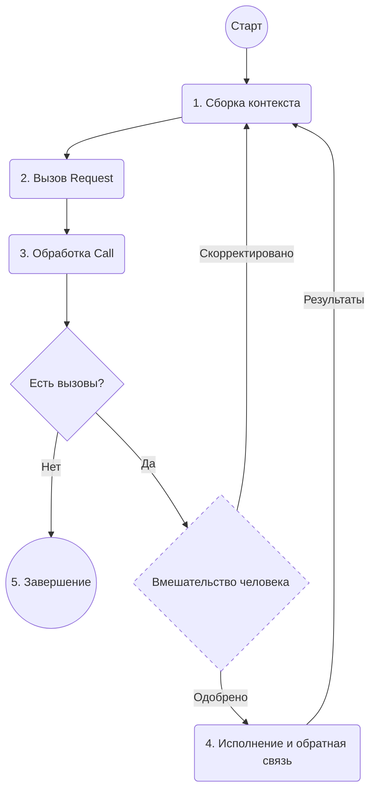

# 005: Агент/Цикл

> [!DEFINITION] [Цикл](./000_glossary.md)
> Последовательность `Request`, направленная на достижение цели. Агент продолжает вызывать `Request`, обрабатывать полученные `Call` и возвращать результат в контекст следующего `Request` до тех пор, пока `Call` больше не будут создаваться.

- Требования:
  - [001: Агент/Запрос](./001_agent_request.md)
  - [002: Агент/Инструмент](./002_agent_tool.md)
  - [004: Агент/Вызов](./004_agent_call.md)

Этот документ описывает **цикл исполнения**, который позволяет агенту выполнять многошаговые задачи, итеративно создавая [001: Агент/Запрос](./001_agent_request.md). Этот итеративный процесс сборки контекста, использования инструментов и получения обратной связи — это то, что обычно подразумевают, говоря об «агенте».

## Цикл исполнения

Цикл исполнения — это основной механизм для автономного, многошагового выполнения. Он работает следующим образом:

1.  **Сборка контекста:** Цикл начинается со сборки исходного контекста, который может включать цель пользователя, текущее `State` и другую релевантную информацию.
2.  **Вызов Request:** Он вызывает [001: Агент/Запрос](./001_agent_request.md) с текущим контекстом и схемой доступных `Tools`.
3.  **Обработка Call:** `Request` возвращает `solution`, содержащее массив из нуля или более [004: Агент/Вызов](./004_agent_call.md). Важно, что на этом этапе эти `Call` являются лишь предложенными действиями; они еще не выполнены.
4.  **Исполнение и обратная связь:**
    - Если `solution` содержит `Call`, цикл их выполняет. Для `Explicit` `Call` это включает вызов соответствующего кода `Activity`.
    - Результаты этих `Call` затем добавляются обратно в контекст для следующей итерации.
5.  **Завершение:** Если `solution` не содержит `Call`, агент считает, что его цель достигнута, и цикл завершается.

## Вмешательство человека (HITL)

Ключевая особенность цикла исполнения — это естественная поддержка человеческого контроля. Поскольку цикл отделяет генерацию `Call` от их исполнения, это создает возможность для вмешательства пользователя:

- **Одобрение:** Перед выполнением `Call` система может представить их пользователю для одобрения. Движок исполнения можно настроить на шаг подтверждения (например, через callback-функцию), который будет действовать как точка останова, приостанавливая цикл до получения ввода от человека.
- **Корректировка:** Пользователь может изменять параметры `Call` или даже заменять его другим

Важно отметить, что эти конкретные механизмы HITL не являются частью основного протокола. Архитектура просто обеспечивает необходимое разделение между предложением действий и их выполнением, предоставляя разработчикам гибкость для реализации любого вида вмешательства, от простого ручного одобрения до сложной автоматизированной системы с тайм-аутами.

Эта возможность критически важна для безопасности и для совместных задач, где агент выступает в роли ассистента. Корректировки и обратная связь от пользователя могут быть использованы [010: Агент/План](./010_agent_plan.md), позволяя агенту уточнять свою стратегию на основе человеческого ввода.

## Роль данных в цикле

Цикл исполнения создает динамическую структуру для поведения агента, но его мощь реализуется через данные, которые циркулируют внутри него. Состояние, вводы и выводы, управляемые на каждом цикле, позволяют агенту поддерживать контекст, учиться и выполнять сложные многошаговые планы.

Следующий документ, [006: Агент/Данные](./006_agent_data.md), рассматривает протоколы для управления этими данными.