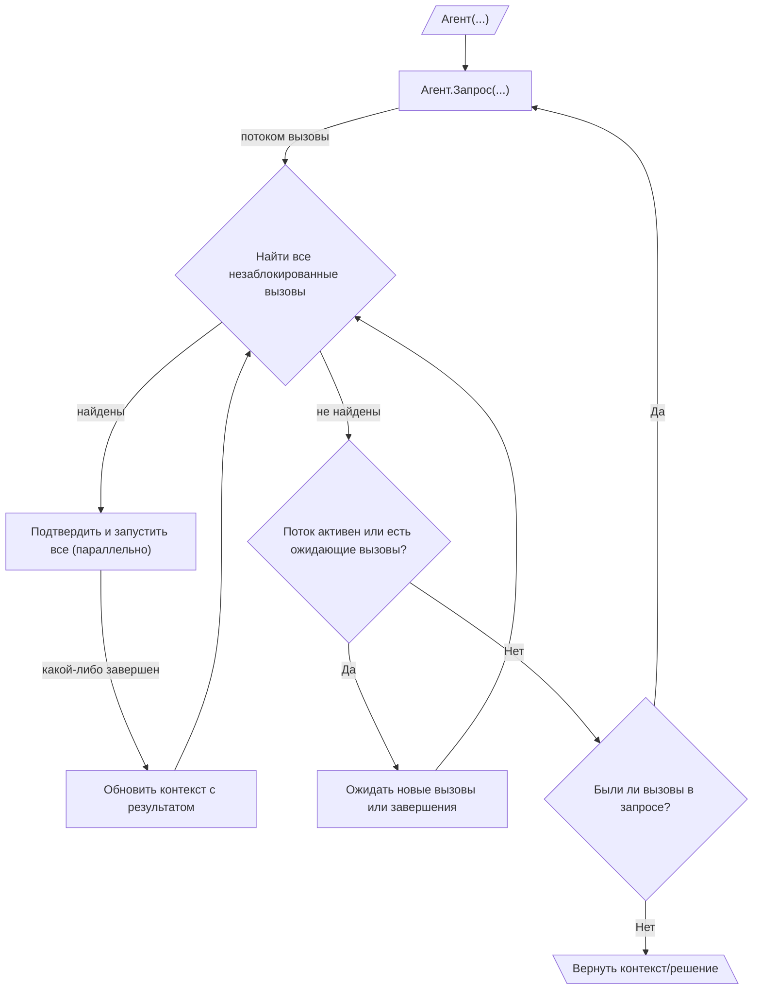

# 005: Агент/Цикл

> [!DEFINITION] :term[Цикл]{canonical="Loop"}
> Последовательность :term[Запросов]{canonical="Request"}, направленная на достижение цели. Агент продолжает вызывать :term[Запросы]{canonical="Request"}, обрабатывать полученные :term[Вызовы]{canonical="Call"} и передавать результат обратно в контекст следующего :term[Запроса]{canonical="Request"}, пока не перестанут генерироваться новые :term[Вызовы]{canonical="Call"}.

> Sidenote:
>
> - Требуется:
>   - :term[001: Агент/Запрос]{href="./001_agent_request.md"}
>   - :term[002: Агент/Инструмент]{href="./002_agent_tool.md"}
>   - :term[004: Агент/Вызов]{href="./004_agent_call.md"}

Этот документ описывает :term[Цикл выполнения]{canonical="Execution Loop"}, который позволяет агенту выполнять многошаговые задачи путем итеративного создания :term[Запросов]{canonical="Request"}. Этот итеративный процесс сборки контекста, использования инструментов и обратной связи — это то, что обычно подразумевается под словом «агент».

## Цикл выполнения

Цикл выполнения — это основной механизм для автономного, многошагового исполнения. Он работает на основе вложенной структуры циклов:

::::columns
:::column

1.  **Внешний цикл (Генерация запросов):** Жизненный цикл агента представляет собой последовательность :term[Запросов]{canonical="Request"}. Он начинается с исходного контекста и входит в цикл.
2.  **Потоковая передача запросов и вызовов:** Внутри цикла агент инициирует один :term[Запрос]{canonical="Request"}. :term[Запрос]{canonical="Request"} потоком возвращает генерируемые :term[Вызовы]{canonical="Call"}, которые собираются в очередь ожидания.
3.  **Внутренний цикл (Оркестрация вызовов):** Для каждого :term[Запроса]{canonical="Request"} внутренний цикл оркестрации отвечает за выполнение связанных с ним :term[Вызовов]{canonical="Call"}. Этот процесс высококонкурентен:
    - Оркестратор постоянно сканирует очередь ожидающих :term[Вызовов]{canonical="Call"}, чтобы найти все, которые в данный момент не заблокированы (то есть их зависимости удовлетворены).
    - Все незаблокированные :term[Вызовы]{canonical="Call"} могут быть представлены для подтверждения, а затем выполнены параллельно. Такая параллельность безопасна, поскольку :term[Состояние]{canonical="State"} агента неизменно: как только значение записано по определенному пути через `_outputPath`, оно не может быть перезаписано. Это позволяет модели предлагать взаимоисключающие :term[Вызовы]{canonical="Call"} — например, разные ветви условного оператора, — которые записывают данные в один и тот же выходной путь. Первый из успешно выполненных вызовов устанавливает значение, а любые другие альтернативные вызовы не будут выполнены, так как их предусловия (путь должен быть пустым) больше не соблюдаются. Это обеспечивает детерминированный результат без конфликтов.
    - По мере завершения каждого :term[Вызова]{canonical="Call"} его результат обновляет общий контекст, потенциально разблокируя другие ожидающие :term[Вызовы]{canonical="Call"}.
    - Это реактивное параллельное выполнение продолжается до тех пор, пока поток для текущего :term[Запроса]{canonical="Request"} не будет закрыт и все его ожидающие :term[Вызовы]{canonical="Call"} не будут обработаны. Эта модель значительно снижает задержку, так как агент может начать работать над несколькими независимыми шагами одновременно, даже до того, как станет известен полный план.
4.  **Проверка завершения:** После завершения внутреннего цикла агент проверяет итоговое :term[Решение]{canonical="Solution"} из родительского :term[Запроса]{canonical="Request"}. Если оно не содержит :term[Вызовов]{canonical="Call"}, цель агента считается достигнутой, и внешний цикл завершается.
5.  **Продолжение:** Если :term[Решение]{canonical="Solution"} содержало :term[Вызовы]{canonical="Call"}, агент возвращается к шагу 2, инициируя новый :term[Запрос]{canonical="Request"} с обогащенным контекстом, который теперь содержит результаты предыдущего шага выполнения.
6.  **Генерация вывода:** По завершении поле `output` итогового :term[Решения]{canonical="Solution"} содержит результат, соответствующий определенной пользователем схеме вывода.

:::
:::column

:::
::::

## :term[Человек в цикле]{canonical="HITL"}

Новый :term[Цикл выполнения]{canonical="Execution Loop"} обеспечивает надежную поддержку контроля со стороны человека, помещая шаг подтверждения непосредственно перед выполнением. Это гарантирует, что пользователю предлагается действовать только в отношении вызовов, которые готовы к запуску:

- **Подтверждение:** Перед выполнением незаблокированного :term[Вызова]{canonical="Call"} система может представить его пользователю для одобрения. Это эффективный подход, поскольку он избавляет пользователя от необходимости просматривать и подтверждать вызовы, которые могут быть заблокированы зависимостями и никогда не выполнятся.
- **Исправление:** Пользователь может изменять параметры :term[Вызова]{canonical="Call"} или даже заменять его другим

Важно отметить, что эти конкретные механизмы :term[ЧВЦ]{canonical="HITL"} не являются частью основного протокола. Архитектура просто обеспечивает необходимое разделение между предложением действий и их выполнением, предоставляя разработчикам гибкость для реализации любого вида вмешательства, от простого ручного подтверждения до сложной автоматизированной системы с тайм-аутами.

Эта возможность критически важна для безопасности и совместных задач, где агент выступает в роли помощника. Корректировки и обратная связь от пользователя могут быть использованы :term[Планом]{canonical="Plan"}, позволяя агенту совершенствовать свою стратегию на основе человеческого ввода.

## Роль данных в цикле

:term[Цикл выполнения]{canonical="Execution Loop"} обеспечивает динамическую структуру для поведения агента, но его сила заключается в потоке данных внутри него. Это управляется :term[типом сообщения Данные]{canonical="Data Message"}, который рассматривается в :term[006: Агент/Данные]{href="./006_agent_data.md"}.
