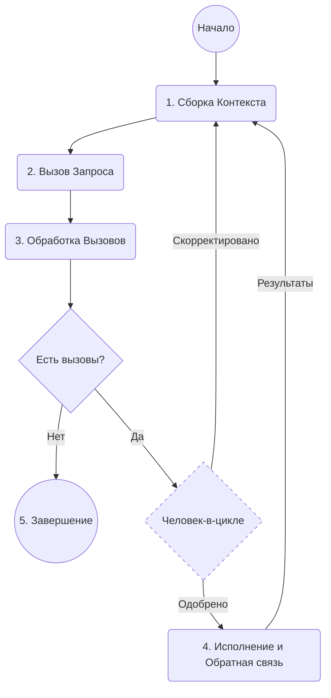

# 005: Агент/Цикл

> **Цикл:** Последовательность `Request`ов, направленная на достижение цели. Агент продолжает вызывать `Request`ы, обрабатывать полученные `Call`ы и возвращать результат в контекст следующего `Request`а до тех пор, пока `Call`ы не перестанут генерироваться. — [Глоссарий](./000_glossary.md)

- Требования:
  - [001: Агент/Запрос](./001_agent_request.md)
  - [002: Агент/Инструмент](./002_agent_tool.md)
  - [004: Агент/Вызов](./004_agent_call.md)

Этот документ описывает **цикл исполнения**, который позволяет агенту выполнять многошаговые задачи, итеративно создавая [001: Агент/Запрос](./001_agent_request.md)ы. Этот итеративный процесс сборки контекста, использования инструментов и обратной связи — это то, что обычно подразумевают, говоря об «агенте».

## Цикл Исполнения

Цикл исполнения — это основной механизм для автономного, многошагового выполнения. Он работает следующим образом:

1.  **Сборка Контекста:** Цикл начинается со сборки начального контекста, который может включать цель пользователя, текущее `State` и другую релевантную информацию.
2.  **Вызов Запроса:** Он вызывает [001: Агент/Запрос](./001_agent_request.md) с текущим контекстом и схемой доступных `Tools`.
3.  **Обработка Вызовов:** `Request` возвращает `solution`, содержащий массив из нуля или более [004: Агент/Вызов](./004_agent_call.md)ов. Важно отметить, что на этом этапе эти `Call`ы являются лишь предложенными действиями; они еще не выполнены.
4.  **Исполнение и Обратная связь:**
    - Если `solution` содержит `Call`ы, цикл их выполняет. Для `Explicit` `Call`ов это включает вызов соответствующего кода `Activity`.
    - Результаты этих `Call`ов затем добавляются обратно в контекст для следующей итерации.
5.  **Завершение:** Если `solution` не содержит `Call`ов, агент считает свою цель достигнутой, и цикл завершается.

## Человек-в-цикле (HITL)

Ключевой особенностью цикла исполнения является его естественная поддержка контроля со стороны человека. Поскольку цикл разделяет генерацию `Call`ов и их выполнение, это создает возможность для вмешательства пользователя:

- **Одобрение:** Перед выполнением `Call`ов система может представить их пользователю для одобрения. Движок исполнения можно настроить с шагом подтверждения (например, функцией обратного вызова), который действует как точка останова, приостанавливая цикл до получения ввода от человека.
- **Коррекция:** Пользователь может изменять параметры `Call`а или даже заменять его другим.

Важно отметить, что эти конкретные механизмы HITL не являются частью основного протокола. Архитектура просто обеспечивает необходимое разделение между предложением действий и их выполнением, предоставляя разработчикам гибкость для реализации любого вида вмешательства, от простого ручного одобрения до сложной автоматизированной системы с тайм-аутами.

Эта возможность критически важна для безопасности и совместных задач, где агент выступает в роли помощника. Корректировки и обратная связь от пользователя могут быть использованы [012: Агент/План](./012_agent_plan.md), что позволяет агенту уточнять свою стратегию на основе человеческого ввода.

## Роль Данных в Цикле

Цикл исполнения обеспечивает динамическую структуру для поведения агента, но его мощь реализуется через данные, которые циркулируют внутри него. Состояние, входы и выходы, управляемые на каждом цикле, позволяют агенту поддерживать контекст, учиться и выполнять сложные, многошаговые планы.

Следующий документ, [006: Агент/Данные](./006_agent_data.md), рассматривает протоколы для управления этими данными.