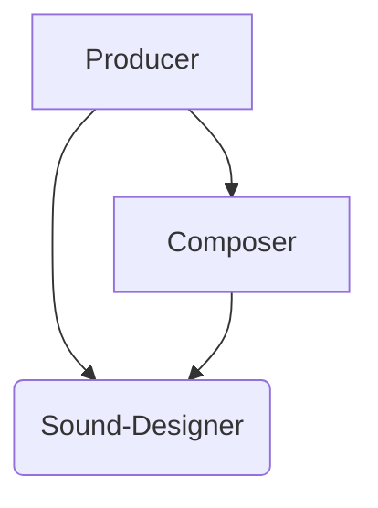

# 009: Агент/Модуль

> **Модуль**: протокол для изоляции контекста исполнения. Вызывается свойством `_module` в `Call` и исполняет `Activity` или новый `Request` в «чистой» среде, а свойство `_imports` предоставляет контролируемый доступ к родительскому контексту. — [Глоссарий](./000_glossary.md)

- Требует:
  - [004: Агент/Вызов](./004_agent_call.md)
- Дополняется:
  - [008: Агент/Импорты](./008_agent_imports.md)

Предыдущие документы описывали, как определяются и исполняются отдельные `Tools`, но **Протокол Модулей** решает ключевую задачу масштабирования и компоновки этих возможностей. Он предоставляет мощный механизм для исполнения `Tools` в изолированных «чистых» средах, предотвращая смешивание контекстов и обеспечивая настоящую переиспользуемость. Делегируя `Call` внешнему модулю — будь то определение другого `Request` или `Activity` в подзапросе — система может создавать сложное поведение агента из автономных, независимо разработанных компонентов.

## Проблема: Монолитные `Tools` и смешивание контекстов

По мере роста возможностей агента, определение всех `Tools` в едином, монолитном контексте становится непрактичным.

1.  **Большие схемы**: У LLM есть практические ограничения на сложность схем, которые они могут обработать за один запрос. Объединение множества сложных `Tools` может превысить эти лимиты, мешая LLM правильно обработать доступные варианты.
2.  **Смешивание контекстов**: Когда все `Tools` работают в одном контексте, LLM может попасть под влияние нерелевантной информации, что приводит к неверному выбору `Tool` или заполнению параметров.
3.  **Отсутствие переиспользуемости**: `Tool`, определенный для одного агента, нелегко перенести на другой, не захватив с собой весь его контекст.

Протокол Модулей решает эти проблемы, вводя **Область Видимости Модуля** — способ делегировать `Call` во внешнюю, изолированную среду исполнения.

## Свойство `_module`

Область Видимости Модуля определяется свойством `_module` в схеме `Tool`. Это свойство указывает системе рассматривать `Call` не как внутреннюю операцию, а как запрос к внешнему модулю.

Свойство `_module` является строкой (`string`) и может использоваться двумя способами:

- **Ссылка на сохраненный `Request`**: Строка может быть путем или URL-адресом к JSON-файлу, который определяет автономный `Request` — JSON-объект, содержащий свойства `context` и `schema`. Это позволяет `Tool` делегировать свое исполнение совершенно отдельному набору инструкций.

  > Sidenote: Сохраненный, переиспользуемый [001: Агент/Запрос](./001_agent_request.md) — это наиболее распространенная форма `Идеи`. Протокол Модулей является основным механизмом для компоновки этих `Идей` в более сложные системы. Подробнее см. в [101: Концепция/Идея](./101_concept_idea.md).

- **Создание анонимного модуля**: Строковый литерал `'anonymous'` указывает на анонимный модуль. Это используется для создания изолированной среды исполнения для `Вызова Инструмента` (`Tool Call`) (скрытого или явного) без необходимости в промежуточном JSON-файле. Он автоматически создает новую, пустую область контекста для `Call`.

## Исполнение в «чистой» среде

Модуль предоставляет «чистую» среду для исполнения. Вместо того чтобы работать в активном контексте родительского агента, `Call` обрабатывается в новом, изолированном подзапросе. Контекст для этого подзапроса тщательно создается, а не наследуется.

Здесь ключевую роль играет [Протокол Импортов](./008_agent_imports.md). Свойство `_imports` в схеме `Tool` действует как мост, явно объявляя, какие части родительского контекста должны быть «импортированы» в «чистую» среду модуля. Это дает родительскому агенту точный контроль над тем, что может видеть модуль, предотвращая смешивание контекстов и обеспечивая настоящую инкапсуляцию.

> Sidenote: [008: Агент/Импорты](./008_agent_imports.md).

## Работа с большими схемами

Протокол Модулей также предлагает решение для управления `Tools` с очень большими или сложными схемами вывода. Вместо включения громоздкой схемы `_output` в основной запрос, что потенциально может вытеснить другие `Tools`, `Tool` можно определить только с его входными параметрами `input` и указателем `_module`.

LLM может спланировать `Call`, имея только входные данные, а сложный вывод будет сгенерирован в изолированном подзапросе модуля. Это позволяет агенту рассуждать о последовательности сложных операций, не «видя» всей детальной схемы для каждого шага в одном окне контекста. LLM доверяет, что модуль произведет правильный вывод, который он получит и использует на последующих шагах.

## Стратегии разрешения модулей

`Tool` становится `Модулем` просто включая свойство `_module` в свою схему. Это сигнализирует о том, что `Call` должен быть делегирован. Ключевой вопрос — *когда* это делегирование разрешается. Система поддерживает две стратегии, позволяющие найти компромисс между строгой безопасностью и динамической гибкостью.

### 1. Разрешение во время исполнения (по умолчанию)

Подход по умолчанию и самый гибкий — это разрешать модуль во **время исполнения**, после того как агент уже сгенерировал `Call`.

Этот метод открывает мощную парадигму, невозможную в традиционном коде: **LLM действует как интеллектуальный «связующий слой»**. Агент может сгенерировать `Call` с параметрами, которые не идеально соответствуют ожидаемой схеме `input` модуля. Во время исполнения система собирает контекст модуля и предоставленные вызывающей стороной входные данные, и LLM в подзапросе получает задачу устранить этот разрыв.

Это значительное преимущество, так как позволяет модулям обновляться и развиваться независимо. Даже если модуль изменит свою структуру входных данных, вызывающие агенты не сломаются немедленно. LLM попытается адаптировать старый формат `Call` к новой схеме `input`, обеспечивая уровень устойчивости и слабой связности, уникальный для этой архитектуры.

Процесс выглядит следующим образом:

1.  Агент генерирует `Call` к модульному `Tool`.
2.  Исполнитель видит свойство `_module` и инициирует протокол.
3.  **Сборка контекста**: Исполнитель загружает файл определения модуля (если он не анонимный) и собирает базовый контекст. Затем он использует `_imports` для добавления контекста вызывающей стороны.
4.  **Сопоставление ввода**: `Параметры` (`params`) из `Call` упаковываются в `Входное Сообщение` (`Input Message`) и добавляются в контекст. Именно здесь проявляется «связующая» способность LLM, так как он будет использовать эти входные данные для выполнения логики модуля, даже если схемы не совпадают идеально.
5.  **Исполнение**: Создается новый, изолированный `Request` с объединенным контекстом. Результат возвращается как вывод исходного `Call`.

### 2. Предварительное разрешение (опционально)

Для сценариев, требующих более строгих гарантий, модуль может быть разрешен **заранее**, до того как первоначальный `Request` будет отправлен агенту.

В этом режиме система предварительно загружает определение `Request` модуля и объединяет его схему `input` со схемой параметров `Tool`. Это позволяет LLM агента видеть точные требования модуля с самого начала, гарантируя, что сгенерированный `Call` будет идеально сформирован и типобезопасен. Важно, что это предварительное объединение может также включать схему `_output` модуля, обеспечивая строгий контракт на ожидаемый результат.

Этот подход обеспечивает безопасность традиционных API-контрактов, где и входы, и выходы известны и проверены. Он жертвует гибкостью разрешения во время исполнения и лучше всего подходит для критически важных, четко определенных интеграций, где слабая связность не является желательной чертой.

## Композиция и переиспользуемость: Композитор и Звукорежиссер

Модули обеспечивают мощную композицию, позволяя определениям `Request` действовать как автономные сервисы, которыми могут управлять другие агенты. Это создает ясную, динамическую иерархию: высокоуровневые агенты могут сосредоточиться на оркестрации, делегируя специализированные задачи низкоуровневым, переиспользуемым модулям.

Рассмотрим рабочий процесс с двумя специализированными модулями: **`Composer`** и **`Sound-Designer`**.

- **`Sound-Designer`** — это низкоуровневый эксперт. Это автономное определение `Request`, сосредоточенное на физике звука и знающее, как управлять синтезаторами для создания конкретных аудиоданных.

- **`Composer`** — это специалист среднего уровня. Его основная задача — создать песню. Он использует свои собственные встроенные инструменты для генерации мелодии и музыкальной структуры. Для реализации этого видения он затем делает `Calls` к модулю `Sound-Designer`, чтобы синтезировать фактические звуки.

Эта двухуровневая иерархия — распространенный паттерн. Однако истинная сила модулей заключается в их динамической композиции, управляемой задачей.

Теперь давайте введем высокоуровневого агента **`Producer`**. Цель `Producer` — создать готовую запись. В зависимости от конкретной задачи, `Producer` может по-разному организовывать свои модули:

> Sidenote: Такая структура обеспечивает гибкую оркестрацию. Высокоуровневый `Producer` может делегировать задачу `Composer`, который, в свою очередь, использует `Sound-Designer`. Однако `Producer` может также обойти `Composer` и взаимодействовать с `Sound-Designer` напрямую для выполнения конкретных задач.

- **Иерархическая оркестрация**: Для создания песни `Producer` может сделать один `Call` к модулю `Composer`. `Producer` дает общее направление («Мне нужна грустная баллада»), а `Composer` выполняет весь свой внутренний рабочий процесс, включая собственные вложенные `Calls` к `Sound-Designer`. В этом случае `Producer` не нужно знать о существовании `Sound-Designer`.

- **Параллельная оркестрация**: Если `Producer` также нужны конкретные звуковые эффекты для записи (например, фоли-шумы или эмбиент), он может делать `Calls` напрямую к модулю `Sound-Designer` для этих задач, параллельно со своим `Call` к `Composer`.

Это демонстрирует ключевой принцип: композиция не зафиксирована внутри самих `Tools`. `Producer` может рассматривать `Composer` как «черный ящик» или взаимодействовать с его составными частями (`Sound-Designer`) напрямую, в зависимости от текущих потребностей. Эта гибкость позволяет комбинировать один и тот же набор экспертных модулей в различных аранжировках, создавая глубоко компонуемую и эмерджентную систему.

## От модулей к памяти

Модули обеспечивают мощную инкапсуляцию для отдельных возможностей, но сложные, многошаговые рабочие процессы требуют памяти. Агенту нужен способ поддерживать постоянное состояние между `Calls` для отслеживания прогресса, извлечения уроков из предыдущих результатов и выполнения долгосрочных планов. Это мост от изолированных действий к целостному, состоятельному исполнению.

Следующий документ, [010: Агент/Состояние](./010_agent_state.md), описывает протокол для управления этим постоянным состоянием.