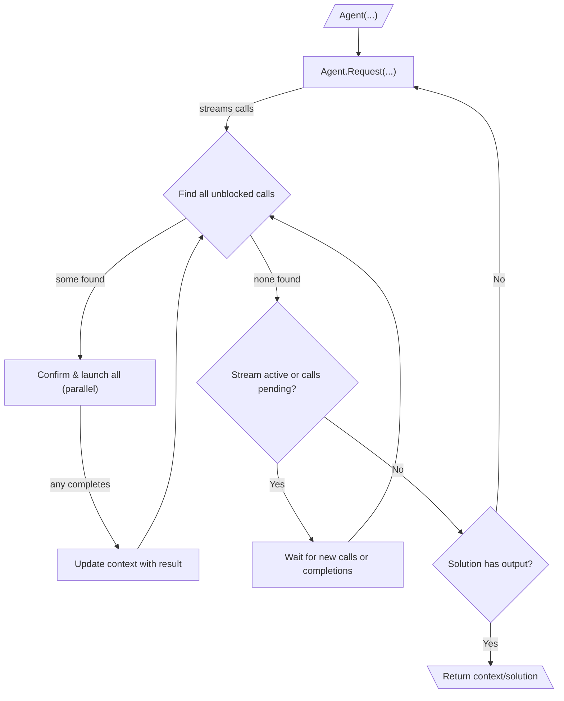

# 010: Агент/Цикл

> [!DEFINITION] [Цикл](./000_glossary.md)
> Итеративная последовательность :term[Запросов]{canonical="Request"}, направленная на достижение цели. Агент продолжает вызывать :term[Запросы]{canonical="Request"}, обрабатывать результирующие :term[Вызовы]{canonical="Call"} и возвращать результат в контекст до тех пор, пока LLM не сгенерирует :term[Финальный Результат]{canonical="Final Output"}, сигнализируя о завершении задачи.

> Sidenote:
> - Требуется:
>   - :term[001: Агент/Запрос]{href="./001_agent_request.md"}
>   - :term[008: Агент/Вывод]{href="./008_agent_output.md"}

:term[Цикл выполнения]{canonical="Execution Loop"} — это движок, который управляет всеми типами сообщений и протоколов из предыдущих глав. Он позволяет агенту выполнять многоэтапные задачи, итеративно создавая :term[Запросы]{canonical="Request"}. Этот итеративный процесс сборки контекста, использования инструментов и обратной связи — это то, что обычно подразумевается под «агентом».

## Цикл выполнения

Цикл выполнения является основным механизмом для автономного, многоэтапного исполнения. Он работает на основе вложенной структуры циклов:

::::columns
:::column

1.  **Внешний цикл (Генерация запросов):** Жизненный цикл агента — это последовательность :term[Запросов]{canonical="Request"}. Он начинается с начального контекста и входит в цикл.
2.  **Потоковая передача запросов и вызовов:** Внутри цикла он инициирует один :term[Запрос]{canonical="Request"}. :term[Запрос]{canonical="Request"} передает :term[Вызовы]{canonical="Call"} по мере их генерации, которые собираются в очередь ожидания.
3.  **Внутренний цикл (Оркестрация вызовов):** Для каждого :term[Запроса]{canonical="Request"} внутренний цикл оркестрации отвечает за выполнение связанных с ним :term[Вызовов]{canonical="Call"}. Этот процесс представляет собой реактивный, управляемый событиями цикл, который запускается двумя событиями: новый :term[Вызов]{canonical="Call"} передается из LLM, или ранее запущенный :term[Вызов]{canonical="Call"} завершается. Этот процесс является высококонкурентным:
    - Оркестратор непрерывно сканирует очередь ожидающих :term[Вызовов]{canonical="Call"}, чтобы найти все, которые в данный момент не заблокированы (т. е. их зависимости удовлетворены).
    - Все незаблокированные :term[Вызовы]{canonical="Call"} могут быть представлены для подтверждения, а затем выполнены параллельно. Это обеспечивает высокую пропускную способность, но требует тщательного управления состоянием. Если несколько одновременных :term[Вызовов]{canonical="Call"} записывают данные в один и тот же путь в :term[Состоянии]{canonical="State"}, окончательное значение будет определено последним завершившимся вызовом, что может привести к недетерминированным результатам. Система использует подход «last-write-wins» (побеждает последняя запись) для разрешения этих конфликтов.

    - По мере завершения каждого :term[Вызова]{canonical="Call"} его результат обновляет общий контекст, потенциально разблокируя другие ожидающие :term[Вызовы]{canonical="Call"}.
    - Это реактивное, параллельное выполнение продолжается до тех пор, пока поток для текущего :term[Запроса]{canonical="Request"} не будет закрыт и все его ожидающие :term[Вызовы]{canonical="Call"} не будут обработаны. Эта модель значительно снижает задержку, так как агент может начать работать над несколькими независимыми шагами одновременно, даже до того, как станет известен полный план.

4.  **Завершение и продолжение:** Как только внутренний цикл для данного :term[Запроса]{canonical="Request"} завершается, агент проверяет итоговое :term[Решение]{canonical="Solution"}. Решение о продолжении основывается на поле `output`:
    - **Если `output` равен `null`**, агент определяет, что его задача еще не завершена. Он возвращается к шагу 2, вызывая новый :term[Запрос]{canonical="Request"} с обогащенным контекстом, который теперь содержит результаты выполненных :term[Вызовов]{canonical="Call"}.
    - **Если `output` не равен `null`**, цель агента считается достигнутой. Внешний цикл завершается, и значение `output`, соответствующее определенной пользователем схеме вывода, возвращается в качестве окончательного результата. Агент может генерировать как `calls`, так и финальный `output` за один шаг; наличие `output` является окончательным сигналом для остановки.

      > Sidenote:
      > - [008: Агент/Вывод](./008_agent_output.md)

:::
:::column

:::
::::

## :term[Человек-в-цикле]{canonical="HITL"}

Новый :term[Цикл выполнения]{canonical="Execution Loop"} обеспечивает надежную поддержку человеческого контроля, помещая шаг подтверждения непосредственно перед выполнением. Это гарантирует, что пользователю предлагается действовать только в отношении тех вызовов, которые готовы к запуску:

- **Подтверждение:** Прежде чем незаблокированный :term[Вызов]{canonical="Call"} будет выполнен, система может представить его пользователю для подтверждения. Это эффективный подход, так как он избавляет пользователя от необходимости просматривать и подтверждать вызовы, которые могут быть заблокированы зависимостями и никогда не запустятся.
- **Корректировка:** Пользователь может изменять параметры :term[Вызова]{canonical="Call"} или даже заменять его на другой.

Важно отметить, что эти конкретные механизмы :term[HITL]{canonical="HITL (Human-in-the-Loop)"} не являются частью основного протокола. Архитектура просто обеспечивает необходимое разделение между предложением действий и их выполнением, предоставляя разработчикам гибкость для реализации любого вида вмешательства, от простого ручного подтверждения до сложной автоматизированной системы с тайм-аутами.

Эта возможность критически важна для безопасности и совместных задач, где агент выступает в роли помощника. Корректировки и обратная связь от пользователя могут быть использованы :term[Планом]{canonical="Plan"}, позволяя агенту уточнять свою стратегию на основе человеческого ввода.

## Обработка ошибок и самокоррекция

Цикл выполнения спроектирован так, чтобы быть устойчивым, предоставляя реактивную систему безопасности, которая позволяет агенту обрабатывать и восстанавливаться как после собственных ошибок планирования, так и после непредвиденных сбоев во время выполнения. Это достигается путем перехвата ошибок и их возвращения в LLM в виде структурированной контекстуальной информации.

### Сообщение об ошибке

Для этого система использует специализированное **`Сообщение об ошибке`**, основанное на `Сообщении с данными`. При перехвате ошибки цикл генерирует `Сообщение об ошибке` и добавляет его в контекст для следующей итерации. Его свойство `data` содержит две критически важные части информации:

- **`call`**: Полный, сериализованный объект `call`, который завершился с ошибкой.
- **`error`**: Объект или строка, детализирующие причину сбоя.

### Цикл самокоррекции

Цикл перехватывает два основных типа необработанных сбоев:

1.  **Структурные ошибки**: Перехватываются _до_ выполнения. Сюда входят ошибки валидации схемы параметров вызова, несоответствие типов или недействительные :term[Ссылки на переменные]{canonical="Variable Reference"}.
2.  **Ошибки времени выполнения**: Перехватываются _во время_ выполнения. Это происходит, когда явное :term[Действие]{canonical="Activity"} генерирует необработанное исключение (например, из-за сбоя API или внутренней логической ошибки).

Когда перехватывается ошибка любого из этих типов, цикл генерирует `Сообщение об ошибке` и добавляет его во временный список. В конце такта выполнения (когда больше нет незаблокированных вызовов), все собранные за этот ход `Сообщения об ошибках` добавляются в контекст.

Это предоставляет LLM прямую и действенную обратную связь. На следующем шаге он видит неудавшийся вызов и конкретную ошибку, которую он вызвал, что позволяет ему отладить и сгенерировать исправленный план.

> [!HEADSUP] Проактивная и реактивная обработка ошибок
>
> Способность цикла перехватывать ошибки и сообщать о них LLM — это **реактивная** система безопасности для незапланированных сбоев. Однако самые надежные рабочие процессы изначально проектируются с учетом возможных сбоев.
>
> Используя систему :term[Планов]{href="./012_agent_plan.md"} с ветвящимися :term[Выражениями]{href="./011_agent_expressions.md"}, вы можете создавать явные «успешные» и «неудачные» пути для ваших инструментов. :term[Действие]{canonical="Activity"} может обрабатывать свои собственные ошибки внутренне и, вместо генерации исключения, возвращать определенное `Сообщение с данными`, которое направляет рабочий процесс по заранее спланированной ветке обработки ошибок. Этот **проактивный** подход подробно описан в главе о Планах.

## От простых циклов к стратегическим планам

:term[Цикл выполнения]{canonical="Execution Loop"} предоставляет динамическую структуру для поведения агента, но его сила заключается в выполнении тактических, одноразовых :term[Запросов]{canonical="Request"}. Для управления сложными, многоэтапными рабочими процессами с зависимостями требуется более продвинутая система стратегического планирования.

Следующий документ, :term[011: Агент/Выражения]{href="./011_agent_expressions.md"}, представляет протокол для определения этих долгосрочных стратегий в виде графа взаимосвязанных :term[Вызовов инструментов]{canonical="Call"}.
