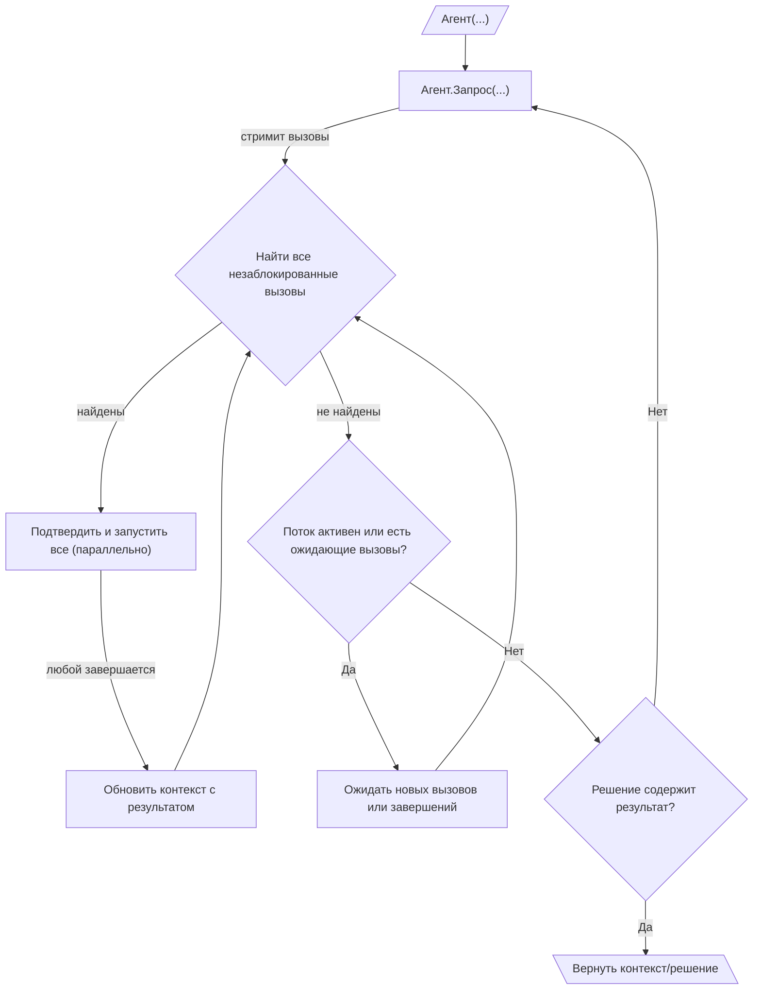

# 010: Агент/Цикл

> [!DEFINITION] [Цикл](./000_glossary.md)
> Итеративная последовательность :term[Запросов]{canonical="Request"}, направленная на достижение цели. Агент продолжает вызывать :term[Запросы]{canonical="Request"}, обрабатывать результирующие :term[Вызовы]{canonical="Call"} и возвращать результат обратно в контекст до тех пор, пока LLM не сгенерирует :term[Финальный Результат]{canonical="Final Output"}, сигнализируя о завершении задачи.

> Sidenote:
> - Требуется:
>   - :term[001: Агент/Запрос]{href="./001_agent_request.md"}
>   - :term[008: Агент/Вывод]{href="./008_agent_output.md"}

:term[Цикл выполнения]{canonical="Execution Loop"} — это механизм, который управляет всеми типами сообщений и протоколов из предыдущих глав. Он позволяет агенту выполнять многошаговые задачи, итеративно создавая :term[Запросы]{canonical="Request"}. Этот итеративный процесс сборки контекста, использования инструментов и обратной связи — это то, что обычно подразумевается под «агентом».

## Цикл выполнения

Цикл выполнения является основным механизмом для автономного, многошагового исполнения. Он работает через вложенную структуру циклов:

::::columns
:::column

1.  **Внешний цикл (Генерация запросов):** Жизненный цикл агента — это последовательность :term[Запросов]{canonical="Request"}. Он начинается с начального контекста и входит в цикл.
2.  **Стриминг запросов и вызовов:** Внутри цикла он инициирует один :term[Запрос]{canonical="Request"}. :term[Запрос]{canonical="Request"} передает :term[Вызовы]{canonical="Call"} по мере их генерации, которые собираются в очередь ожидания.
3.  **Внутренний цикл (Оркестрация вызовов):** Для каждого :term[Запроса]{canonical="Request"} внутренний цикл оркестрации отвечает за выполнение связанных с ним :term[Вызовов]{canonical="Call"}. Этот процесс представляет собой реактивный, управляемый событиями цикл, который запускается двумя событиями: новый :term[Вызов]{canonical="Call"} поступает от LLM, или завершается ранее запущенный :term[Вызов]{canonical="Call"}. Этот процесс высококонкурентный:
    - Оркестратор постоянно сканирует очередь ожидающих :term[Вызовов]{canonical="Call"}, чтобы найти все, которые в данный момент не заблокированы (т.е. их зависимости удовлетворены).
    - Все незаблокированные :term[Вызовы]{canonical="Call"} могут быть представлены для подтверждения, а затем выполнены параллельно. Это обеспечивает высокую пропускную способность, но требует тщательного управления состоянием. Если несколько одновременных :term[Вызовов]{canonical="Call"} записывают данные по одному и тому же пути в :term[Состоянии]{canonical="State"}, окончательное значение будет определяться последним завершившимся вызовом, что может привести к недетерминированным результатам. Система использует подход «побеждает последняя запись» для разрешения этих конфликтов.

    - По мере завершения каждого :term[Вызова]{canonical="Call"} его результат обновляет общий контекст, что потенциально разблокирует другие ожидающие :term[Вызовы]{canonical="Call"}.
    - Это реактивное, параллельное выполнение продолжается до тех пор, пока поток для текущего :term[Запроса]{canonical="Request"} не будет закрыт, и все его ожидающие :term[Вызовы]{canonical="Call"} не будут выполнены. Эта модель значительно снижает задержку, так как агент может начать работать над несколькими независимыми шагами одновременно, даже до того, как станет известен полный план.

4.  **Завершение и продолжение:** Как только внутренний цикл для данного :term[Запроса]{canonical="Request"} завершается, агент проверяет окончательное :term[Решение]{canonical="Solution"}. Решение о продолжении основывается на поле `output`:
    - **Если `output` равно `null`**, агент определяет, что его задача еще не завершена. Он возвращается к шагу 2, вызывая новый :term[Запрос]{canonical="Request"} с обогащенным контекстом, который теперь содержит результаты выполненных :term[Вызовов]{canonical="Call"}.
    - **Если `output` не равно `null`**, цель агента считается достигнутой. Внешний цикл завершается, и значение `output`, которое соответствует определенной пользователем схеме вывода, возвращается в качестве окончательного результата. Агент может генерировать как `calls`, так и финальный `output` за один шаг; наличие `output` является окончательным сигналом к остановке.

      > Sidenote:
      > - [008: Агент/Вывод](./008_agent_output.md)

:::
:::column

:::
::::

## :term[Человек-в-цикле]{canonical="HITL"}

Новый :term[Цикл выполнения]{canonical="Execution Loop"} обеспечивает надежную поддержку человеческого контроля, размещая шаг подтверждения непосредственно перед исполнением. Это гарантирует, что пользователю предлагается действовать только в отношении вызовов, готовых к выполнению:

- **Одобрение:** Перед выполнением незаблокированного :term[Вызова]{canonical="Call"} система может представить его пользователю для одобрения. Это эффективный подход, поскольку он избавляет пользователя от необходимости просматривать и подтверждать вызовы, которые могут быть заблокированы зависимостями и никогда не выполниться.
- **Коррекция:** Пользователь может изменять параметры :term[Вызова]{canonical="Call"} или даже заменять его другим

Важно отметить, что эти конкретные механизмы :term[HITL]{canonical="HITL (Human-in-the-Loop)"} не являются частью основного протокола. Архитектура просто обеспечивает необходимое разделение между предложением действий и их выполнением, предоставляя разработчикам гибкость для реализации любого вида вмешательства, от простого ручного одобрения до сложной автоматизированной системы с тайм-аутами.

Эта возможность критически важна для безопасности и для совместных задач, где агент выступает в роли помощника. Корректировки и обратная связь от пользователя могут быть использованы :term[Планом]{canonical="Plan"}, позволяя агенту уточнять свою стратегию на основе человеческого ввода.

## От простых циклов к стратегическим планам

:term[Цикл выполнения]{canonical="Execution Loop"} обеспечивает динамическую структуру для поведения агента, но его сила заключается в выполнении тактических, одноразовых :term[Запросов]{canonical="Request"}. Для управления сложными, многошаговыми рабочими процессами с зависимостями требуется более продвинутая система стратегического планирования.

Следующий документ, :term[011: Агент/Выражения]{href="./011_agent_expressions.md"}, представляет протокол для определения этих долгосрочных стратегий в виде графа взаимосвязанных :term[Вызовов инструментов]{canonical="Call"}.
