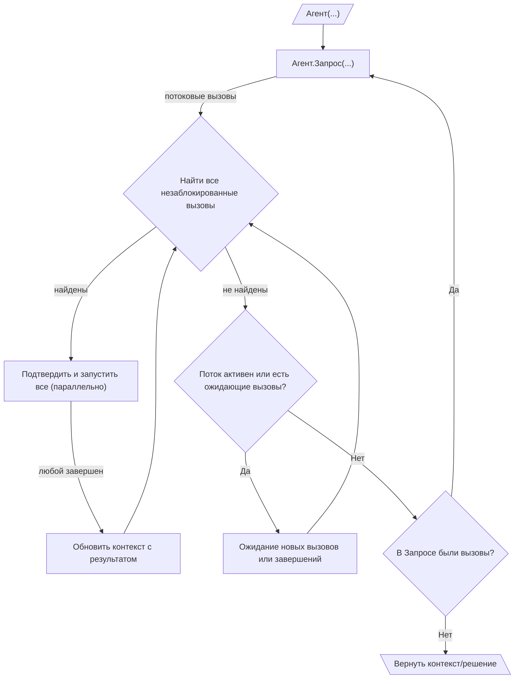

# 010: Агент/Цикл

> [!DEFINITION] [Цикл](./000_glossary.md)
> Последовательность :term[Запросов]{canonical="Request"}, направленная на достижение цели. Агент продолжает вызывать :term[Запросы]{canonical="Request"}, обрабатывать результирующие :term[Вызовы]{canonical="Call"} и передавать результат обратно в контекст следующего :term[Запроса]{canonical="Request"} до тех пор, пока не перестанут генерироваться новые :term[Вызовы]{canonical="Call"}.

> Sidenote:
> - Требуется:
>   - :term[001: Агент/Запрос]{href="./001_agent_request.md"}
>   - :term[008: Агент/Вывод]{href="./008_agent_output.md"}

:term[Цикл выполнения]{canonical="Execution Loop"} — это механизм, который организует все типы сообщений и протоколы из предыдущих глав. Он позволяет агенту выполнять многошаговые задачи, итеративно создавая :term[Запросы]{canonical="Request"}. Этот итеративный процесс сборки контекста, использования инструментов и обратной связи — это то, что обычно подразумевается под «агентом».

## Цикл выполнения

Цикл выполнения — это основной механизм для автономного, многошагового исполнения. Он работает через вложенную структуру циклов:

::::columns
:::column

1.  **Внешний цикл (Генерация Запросов):** Жизненный цикл агента — это последовательность :term[Запросов]{canonical="Request"}. Он начинается с начального контекста и входит в цикл.
2.  **Потоковая передача Запросов и Вызовов:** Внутри цикла агент вызывает один :term[Запрос]{canonical="Request"}. :term[Запрос]{canonical="Request"} в потоковом режиме возвращает :term[Вызовы]{canonical="Call"} по мере их генерации, которые собираются в очередь ожидания.
3.  **Внутренний цикл (Оркестрация Вызовов):** Для каждого :term[Запроса]{canonical="Request"} внутренний цикл оркестрации отвечает за выполнение связанных с ним :term[Вызовов]{canonical="Call"}. Этот процесс является высококонкурентным:
    - Оркестратор непрерывно сканирует очередь ожидающих :term[Вызовов]{canonical="Call"}, чтобы найти все, которые в данный момент не заблокированы (т.е. их зависимости удовлетворены).
    - Все незаблокированные :term[Вызовы]{canonical="Call"} могут быть представлены для подтверждения, а затем выполнены параллельно. Такая конкурентность безопасна, поскольку :term[Состояние]{canonical="State"} агента неизменяемо: как только значение записано по определенному пути через :term[Путь вывода]{canonical="Output Path"}, оно не может быть перезаписано. Это позволяет модели предлагать взаимоисключающие :term[Вызовы]{canonical="Call"}, например, разные ветви условного оператора, которые записывают данные в один и тот же путь вывода. Первый из этих вызовов, который выполнится успешно, установит значение, а любые другие альтернативные вызовы не будут выполнены, потому что их предварительные условия (путь должен быть пустым) больше не выполняются. Это обеспечивает детерминированный результат без конфликтов.

      > Sidenote:
      > - [008: Агент/Вывод](./008_agent_output.md)

    - По мере завершения каждого :term[Вызова]{canonical="Call"} его результат обновляет общий контекст, потенциально разблокируя другие ожидающие :term[Вызовы]{canonical="Call"}.
    - Это реактивное, параллельное выполнение продолжается до тех пор, пока поток для текущего :term[Запроса]{canonical="Request"} не будет закрыт и все его ожидающие :term[Вызовы]{canonical="Call"} не будут обработаны. Эта модель значительно снижает задержку, так как агент может начать работать над несколькими независимыми шагами одновременно, даже до того, как станет известен полный план.

4.  **Проверка завершения:** Как только внутренний цикл завершается, агент проверяет итоговое :term[Решение]{canonical="Solution"} из родительского :term[Запроса]{canonical="Request"}. Если оно не содержит :term[Вызовов]{canonical="Call"}, цель агента считается достигнутой, и внешний цикл завершается.
5.  **Продолжение:** Если :term[Решение]{canonical="Solution"} содержит :term[Вызовы]{canonical="Call"}, агент возвращается к шагу 2, вызывая новый :term[Запрос]{canonical="Request"} с обогащенным контекстом, который теперь содержит результаты предыдущего шага выполнения.
6.  **Генерация вывода:** По завершении поле `output` итогового :term[Решения]{canonical="Solution"} содержит результат, соответствующий определенной пользователем схеме вывода.

:::
:::column

:::
::::

## :term[Человек в цикле]{canonical="HITL"}

Новый :term[Цикл выполнения]{canonical="Execution Loop"} обеспечивает надежную поддержку для контроля со стороны человека, помещая шаг подтверждения непосредственно перед выполнением. Это гарантирует, что пользователю предлагается действовать только в отношении тех вызовов, которые готовы к выполнению:

- **Одобрение:** Перед выполнением незаблокированного :term[Вызова]{canonical="Call"} система может представить его пользователю для одобрения. Это эффективный подход, так как он избавляет пользователя от необходимости просматривать и подтверждать вызовы, которые могут быть заблокированы зависимостями и никогда не будут выполнены.
- **Коррекция:** Пользователь может изменять параметры :term[Вызова]{canonical="Call"} или даже заменять его другим.

Важно отметить, что эти конкретные :term[HITL]{canonical="HITL (Human-in-the-Loop)"} механизмы не являются частью основного протокола. Архитектура просто обеспечивает необходимое разделение между предложением действий и их выполнением, предоставляя разработчикам гибкость для реализации любого вида вмешательства, от простого ручного одобрения до сложной автоматизированной системы с таймаутами.

Эта возможность критически важна для безопасности и для совместных задач, где агент выступает в роли ассистента. Корректировки и обратная связь от пользователя могут быть использованы :term[Планом]{canonical="Plan"}, позволяя агенту совершенствовать свою стратегию на основе человеческого ввода.

## От простых циклов к стратегическим планам

:term[Цикл выполнения]{canonical="Execution Loop"} обеспечивает динамическую структуру для поведения агента, но его сила заключается в выполнении тактических, одноразовых :term[Запросов]{canonical="Request"}. Для управления сложными, многошаговыми рабочими процессами с зависимостями требуется более продвинутая система стратегического планирования.

Следующий документ, :term[011: Агент/План]{href="./012_agent_plan.md"}, представляет протокол для определения этих долгосрочных стратегий в виде графа взаимосвязанных :term[Вызовов инструментов]{canonical="Call"}.
