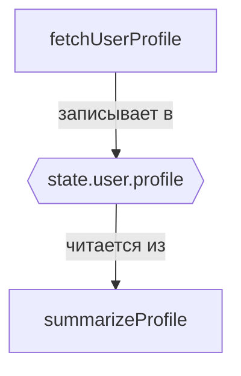

# 010: Агент/План

> [!DEFINITION] [План](./000_glossary.md)
> Структурированное представление рабочего процесса, видения или системы в виде графа. Это универсальный инструмент для создания любой сети — от исполняемой последовательности `Вызовов Инструментов` до концептуальной карты для мозгового штурма.

> Sidenote:
> - Требуется:
>   - [004: Агент/Вызов](./004_agent_call.md)
>   - [005: Агент/Цикл](./005_agent_loop.md)
>   - [008: Агент/Переменные](./008_agent_variables.md)
>   - [009: Агент/Состояние](./009_agent_state.md)
> - Дополняется:
>   - [011: Агент/Инстансинг](./011_agent_instancing.md)

Этот документ описывает **Протокол Плана**, который объединяет концепции `Состояния` и `Переменных` для создания сложных, многошаговых рабочих процессов. `План` — это структура данных, обычно массив `Вызовов Инструментов`, описывающая последовательность действий в виде графа потока данных.

Такой подход превращает объект `Состояния` в черновик для планирования, позволяя агенту создавать и выполнять сложные потоки данных для достижения цели.

## Как формируется План

Связи в графе создаются не с помощью явных указателей, а через простую и мощную конвенцию потока данных, использующую объект `Состояния`.

- **Узлы (`Вызовы Инструментов`):** Каждый шаг в рабочем процессе — это `Вызов Инструмента`, представляющий собой действие, которое нужно выполнить.
- **Рёбра (объект `Состояния`):** Связи между шагами создаются через запись и чтение из объекта `Состояния`. Один `Инструмент` записывает свой результат по определённому пути в `Состоянии` с помощью мета-свойства `_outputPath`. Следующий `Инструмент` может использовать этот результат в качестве входных данных, ссылаясь на тот же путь с помощью **Ссылки на Переменную**.

Это устанавливает чёткую зависимость: второй `Вызов Инструмента` не может быть выполнен, пока первый не завершится и не заполнит `Состояние`.

Например, `План` для получения профиля пользователя и его последующего обобщения будет состоять из двух `Вызовов Инструментов`:

:::div{.limited-width}

```json
[
  {
    "_tool": "fetchUserProfile",
    "userName": "Alice",
    "_outputPath": "†state.userProfileData"
  },
  {
    "_tool": "summarizeProfile",
    "profile": "†state.userProfileData",
    "_outputPath": "†state.profileSummary"
  }
]
```



:::

Здесь вызов `summarizeProfile` зависит от результата `fetchUserProfile`, создавая двухэтапный план. Эту взаимосвязь можно представить в виде простого графа.

## Что такое План?

`План` — это обобщённый и мощный инструмент для мышления в виде графов. Он предоставляет структурированный формат для представления любой системы взаимосвязанных идей, от высокоуровневого видения до детального технического черновика. Такая графовая структура — очень эффективный способ сжать сложный контекст в формат, который LLM могут понять гораздо легче, чем длинные тексты.

> `План` не ограничен линейными последовательностями. Он может представлять сложные рабочие процессы с условной логикой, где путь выполнения зависит от результата предыдущего шага:
> ```mermaid
> graph TD
>     A[Узнать погоду] --> B{Солнечно?};
>     B -- state.sunny --> C[Найти парк];
>     B -- state.notSunny --> D[Найти фильм];
>     C -- state.suggestion --> E[Предложить вариант];
>     D -- state.suggestion --> E[Предложить вариант];
> ```

Протокол `Плана` не ограничивается только выполнением задач. Его можно использовать для создания любого графа в ответ на запрос пользователя. Например, `Инструмент` может взять таблицу контактов и создать `План`, который визуализирует сеть друзей. Другой может сгенерировать `План`, представляющий собой полный рабочий процесс GitHub Actions или черновик новой схемы базы данных.

Хотя `План` может быть мощным инструментом для мозгового штурма, обсуждения и «размышлений вслух», его основное применение в этой системе — определение исполняемых рабочих процессов. Для этой цели мы используем определённый тип графа, называемый **Направленный Ациклический Граф (НАГ)**, где каждый узел — это `Вызов Инструмента`.

НАГ обладает несколькими ключевыми свойствами, которые делают его идеальным для исполнения:

- **Граф:** «Граф» — это весь `План` целиком, то есть совокупность всех `Вызовов Инструментов` (узлов) и зависимостей по данным, которые их соединяют (рёбер).
- **Направленный:** Связи однонаправленные и определяются потоком данных. Шаг, который создаёт данные, должен идти _перед_ шагом, который их использует.
- **Ациклический:** Рабочий процесс не может иметь циклических зависимостей, что гарантирует ему чёткое начало и конец.

## Разделение планирования и исполнения

Самая мощная особенность этой архитектуры — полное разделение планирования и исполнения. Поскольку `План` является просто декларативной структурой данных, агент может сгенерировать весь граф `Вызовов Инструментов` _до_ того, как будет запущен какой-либо код.

LLM выступает в роли планировщика, собирая массив `Вызовов`, представляющий предполагаемый рабочий процесс. Эту структуру данных затем можно:

- **Проверить:** Система может проверить граф на наличие циклических зависимостей или других структурных ошибок.
- **Сымитировать:** Можно выполнить «пробный запуск», чтобы предвидеть поведение рабочего процесса.
- **Представить на утверждение:** `План` можно показать человеку для проверки, изменения или утверждения перед выполнением, что создаёт важный уровень безопасности и взаимодействия.

Исполнение контролируется **[Циклом Агента](./005_agent_loop.md)**, который интерпретирует `План` и запускает `Вызовы Инструментов` в правильном порядке на основе их зависимостей, заполняя объект `Состояния` по ходу дела.

## План как развивающаяся стратегия

`План` не статичен; это живая стратегия, которая может адаптироваться на каждом шаге цикла исполнения. В типичном рабочем процессе сам `План` является сообщением внутри `контекста`, предоставляемого LLM.

- **`контекст`** содержит объект `Состояния` и `План` с предыдущего шага.
- **`решение`**, сгенерированное LLM, — это **новый `План`** для текущего шага.

Этот итеративный процесс позволяет агенту быть одновременно проактивным и реактивным. Он может следовать существующему `Плану`, но также может изменять его в ответ на результаты предыдущего шага. Например, если `Вызов Инструмента` завершается неудачей, агент может сгенерировать новый `План`, включающий шаги для обработки ошибок. Это делает систему устойчивой и адаптируемой.

Этот итеративный цикл планирования и исполнения является ядром [203: Идея/Процесс](./203_idea_process.md). Это автономный снимок рабочего процесса, включающий доступные `Инструменты`, текущее `Состояние` и сам `План`.

## От одиночного Плана к многоразовым рабочим процессам

`План` определяет последовательность действий для конкретной задачи. Чтобы сделать эти рабочие процессы по-настоящему мощными, нам нужен способ упаковать их в многоразовые компоненты, которые можно вызывать из других `Планов`.

Следующий документ, **[011: Агент/Инстансинг](./011_agent_instancing.md)**, описывает протокол для этого параллельного выполнения.