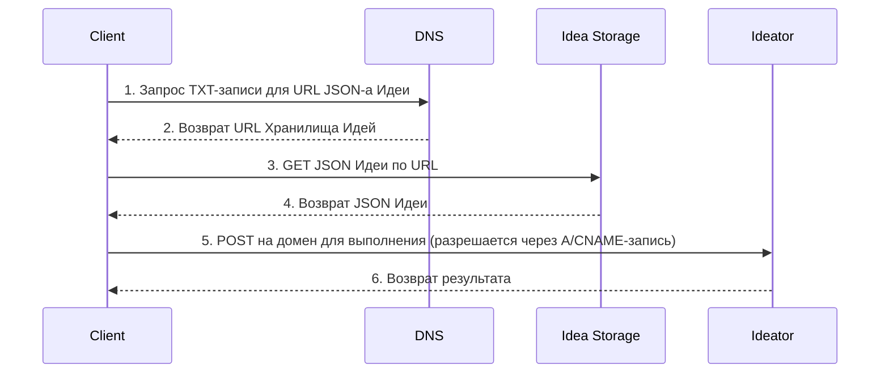

# 102: Концепция/Суверенитет

> [!DEFINITION] [Суверенитет](./000_glossary.md)
> Принцип, согласно которому идентичность и каноническое местоположение :term[Идеи]{canonical="Idea"} контролируются её владельцем через децентрализованный механизм, обычно DNS. Это устанавливает право собственности на пространство имён, в котором :term[Идеи]{canonical="Idea"} существуют и развиваются.

> Sidenote:
> - Требуется:
>   - [101: Концепция/Идея](./101_concept_idea.md)
>   - [103: Концепция/Идеатор](./103_concept_ideator.md)

Протокол :term[Суверенитета]{canonical="Sovereignty"} определяет спектр автономии, доступный создателям в экосистеме, описывая многоуровневую архитектуру для хостинга и исполнения. Это позволяет участникам выбирать желаемый уровень контроля: от использования полностью управляемых сервисов до самостоятельного хостинга полного, суверенного решения.

Эта модель — практический мост между абстрактным :term[Идеатором]{canonical="Ideator"} и конкретным, работающим сервисом.

## Децентрализованная идентичность через DNS

Архитектура экосистемы — это спектр автономии, построенный на одном основополагающем принципе: **децентрализованная идентичность через DNS**. Эта основа гарантирует, что :term[Идея]{canonical="Idea"} не привязана к какой-либо одной платформе или провайдеру, что делает возможным истинный суверенитет. :term[Идее]{canonical="Idea"} присваивается уникальное доменное имя, а `TXT`-запись для этого домена указывает на канонический JSON-документ :term[Идеи]{canonical="Idea"}. Контролируя эту DNS-запись, создатель обладает полной и окончательной властью над идентичностью и местоположением своей :term[Идеи]{canonical="Idea"}.

### Единый поток запросов: Суверенитет пользователя через DNS

Диаграмма ниже иллюстрирует два основных взаимодействия с :term[Идеей]{canonical="Idea"}: получение её определения (`GET`) и её выполнение в качестве сервиса (`POST`). Она показывает, как стандартные DNS-записи предоставляют пользователю полный контроль над маршрутизацией.

**DNS-запись пользователя — это плоскость управления.** `TXT`-запись домена указывает на местоположение JSON-файла с определением :term[Идеи]{canonical="Idea"} (`Хранилище Идей`). Основная `A`- или `CNAME`-запись домена указывает на конечную точку выполнения (:term[Идеатор]{canonical="Ideator"}). Контролируя эти две записи, пользователь направляет весь трафик, решая, использовать ли управляемые сервисы или собственную инфраструктуру.

> [!HEADSUP] На заметку
> Полезно рассматривать эту модель как спектр автономии. На одном конце находится управляемый сервис, обеспечивающий удобство. На другом — **полный суверенитет**: использование собственного домена и самостоятельный хостинг всех сервисов, что фактически означает становление собственным провайдером. Управляемые уровни служат необязательным, последовательным мостом между этими двумя состояниями.



## Многоуровневая архитектура

Поверх основополагающего принципа децентрализованной идентичности система предоставляет пять необязательных, последовательных уровней функциональности сервисов. Эти уровни позволяют создателям выбирать желаемый уровень контроля: от использования полностью управляемых сервисов для удобства до самостоятельного хостинга полного, суверенного решения.

### Уровень 1: Управляемый хостинг

Этот уровень предоставляет немедленное, простое решение для хостинга исходного файла :term[Идеатора]{canonical="Ideator"}.

- **Как это работает:** В качестве простой точки входа мы предлагаем хостинг исходного файла :term[Идеатора]{canonical="Ideator"} пользователя в нашем S3-бакете. `TXT`-запись, которую мы создаем для их управляемого поддомена, будет указывать на этот URL в S3. В любой момент пользователь может разместить файл в другом месте и обновить свою `TXT`-запись, чтобы она указывала на новое местоположение (например, собственный сервер, IPFS и т. д.).
- **Цель:** Избавить создателей от необходимости организовывать собственный хостинг файлов только для того, чтобы начать работу.

---

### Уровень 2: Генерация статического UI

Этот уровень делает :term[Идеаторы]{canonical="Ideator"} доступными и полезными для людей без каких-либо вычислений на стороне сервера.

- **Как это работает:** Для всех доменов :term[Идеаторов]{canonical="Ideator"}, которые подключаются к этой услуге, предоставляется общая статическая веб-страница. Когда пользователь заходит на домен :term[Идеатора]{canonical="Ideator"} в браузере, клиентский JavaScript на этой странице выполняет запрос DNS-over-HTTPS (DoH), чтобы получить `TXT`-запись для домена, извлекает исходный URL (с хостинга Уровня 1), загружает файл определения :term[Идеатора]{canonical="Ideator"} и динамически отображает пользовательский интерфейс.
- **Цель:** Предоставить бесплатное, готовое к использованию веб-приложение для любого :term[Идеатора]{canonical="Ideator"}, снижая порог входа.

---

### Уровень 3: `GET`-эндпоинт на базе CDN

Этот уровень улучшает межмашинное взаимодействие для чтения определения :term[Идеи]{canonical="Idea"}.

- **Как это работает:** Разместив CDN перед уровнем хостинга, мы можем использовать правила перезаписи запросов. `GET`-запрос к домену :term[Идеи]{canonical="Idea"} интеллектуально маршрутизируется CDN для предоставления JavaScript-модуля. Это позволяет разработчикам использовать **именованные экспорты** для прямого импорта определённых частей :term[Идеи]{canonical="Idea"}. Необработанный документ :term[Идеи]{canonical="Idea"} остаётся доступным через заголовок `Accept: application/json`.
- **Цель:** Обеспечить мощный и идиоматичный программный доступ с полной типобезопасностью.

```ts
// Заголовок X-Typescript-Types также предоставляется для сред, таких как Deno
const { default: run, schema } = await import('http://my-idea.com');
console.log(`Схема Идеи:`, schema);

// запустить идею как функцию напрямую
await run(input);
```

---

### Уровень 4: Публикация (`PUT`)

Этот уровень предоставляет возможность программно публиковать и обновлять :term[Идею]{canonical="Idea"}.

- **Как это работает:** Этот уровень обрабатывает аутентифицированные `PUT`-запросы к домену :term[Идеи]{canonical="Idea"}. Один запрос может загрузить новую версию исходного файла :term[Идеи]{canonical="Idea"} и атомарно обновить все необходимые записи, чтобы новая версия стала активной.
- **Цель:** Предоставить безопасный и простой API для создателей, чтобы управлять жизненным циклом своих :term[Идей]{canonical="Idea"}.

```ts
// опубликовать новую версию идеи
await fetch('http://my-idea.com', {
  method: 'PUT',
  data: JSON.stringify({ context, schema, solution }),
});
```

---

### Уровень 5: Полноценное выполнение через API (`POST`)

Это высший уровень функциональности, превращающий :term[Идеатор]{canonical="Ideator"} в настоящий, вызываемый веб-сервис.

- **Как это работает:** Этот уровень обрабатывает `POST`-запросы к домену :term[Идеатора]{canonical="Ideator"}, выполняя его логику. Это может быть реализовано через управляемую бессерверную функцию или путем самостоятельного хостинга конечной точки пользователем.
- **Цель:** Предоставить всю мощь бессерверной архитектуры, позволяя любому опубликовать полнофункциональный микросервис, имея лишь статический файл определения.

```ts
// вызвать идею как сервис с новым контекстом
const idea = await fetch('http://my-idea.com', {
  method: 'POST',
  data: JSON.stringify(context),
});
console.log('Новое решение для идеи', idea.solution, 'соответствует схеме', idea.schema);
```

### Идея против Сервиса: Заметка о выполнении

Ключевой принцип этой архитектуры — разделение публичного манифеста (:term[Идеи]{canonical="Idea"}) и её выполнения. :term[Идея]{canonical="Idea"} — это полный, самодостаточный :term[черновик]{canonical="Blueprint"}. Он содержит схему, контекст и :term[Решение]{canonical="Solution"} — всё, что нужно способному агенту для её запуска. Это даёт любому пользователю возможность получить :term[Идею]{canonical="Idea"} и выполнить её в своей локальной среде, что позволяет экспериментировать, переделывать и использовать её суверенно на своих условиях.

Таким образом, уровень «Полноценного выполнения через API» не является обязательным, а представляет собой мощное удобство и коммерческую возможность. Он позволяет создателю предлагать свою :term[Идею]{canonical="Idea"} в качестве надёжного управляемого сервиса. Именно здесь коммерция и коммерческая тайна могут процветать в открытой экосистеме. Создатель может опубликовать публичную :term[Идею]{canonical="Idea"} как прозрачный контракт — манифест того, что делает сервис и что он возвращает, — сохраняя при этом детали своей реализации в тайне.

Эта частная реализация — «секретный соус» создателя. Она может включать проприетарные модели, специализированное оборудование, уникальные источники данных или сложные методы обработки неполной или несовершенной информации. Сервис становится надёжным «чёрным ящиком», который выполняет публичное обещание :term[Идеи]{canonical="Idea"}, создавая рынок, где открытые, переносимые протоколы и ценные частные реализации могут сосуществовать и строиться друг на друге.

## От суверенной идеи к суверенному пространству имён

Хотя DNS обеспечивает суверенитет над одной :term[Идеей]{canonical="Idea"}, его истинная сила заключается в создании **Суверенного Пространства Имён**. Доменное имя, такое как `my-project.com`, не просто указывает на одну :term[Идею]{canonical="Idea"}; оно определяет корень цифрового владения, над которым у владельца есть полный контроль.

Это пространство имён можно структурировать с помощью путей, как на веб-сайте.

- Корень домена (`my-project.com`) может разрешаться в основную :term[Идею]{canonical="Idea"} (например, бота, процесс или обзор проекта).
- Пути внутри этого домена (`my-project.com/schemas/User`) могут разрешаться в другие, вложенные :term[Идеи]{canonical="Idea"}.

Это создаёт чёткую иерархию: **домен** устанавливает суверенитет над всем пространством имён, а **путь** обеспечивает структуру внутри него. Это позволяет одной суверенной идентичности размещать и управлять целой коллекцией взаимосвязанных :term[Идей]{canonical="Idea"}, от одного компонента до целого приложения. Эта модель адресации подробно описана в концепции :term[Адресации]{href="./110_concept_addressing.md"}.

## Спецификация API

Все HTTP-взаимодействия происходят в корне домена :term[Идеи]{canonical="Idea"} (`/`).

- **`GET /`**
  - С заголовком `Accept: text/html` (Уровень 2): возвращает загрузчик статического UI или перенаправляет на URL `page`.
  - С заголовком `Accept: application/json` (Уровень 3): возвращает исходный JSON-файл :term[Идеи]{canonical="Idea"}.
- **`PUT /`** (Уровень 4)
  - Требует аутентификации. Один `PUT`-запрос одновременно загружает новый исходный файл :term[Идеи]{canonical="Idea"} и атомарно обновляет URL `code` в `TXT`-записи, чтобы новая версия стала активной.
- **`POST /`** (Уровень 5)
  - Требует аутентификации/авторизации. Выполняет :term[Идеатор]{canonical="Ideator"}.
  - Тело запроса — это JSON-объект, содержащий полезную нагрузку, например, `{"context": "Входные данные от пользователя для обработки"}`.

Теперь, когда принцип :term[Суверенитета]{canonical="Sovereignty"} установил право собственности и контроль над :term[Идеей]{canonical="Idea"} и её пространством имён, следующий логический шаг — исследовать, что делает :term[Идею]{canonical="Idea"} исполнимой. Это приводит нас к концепции :term[Идеатора]{canonical="Ideator"} — специализированного типа :term[Идеи]{canonical="Idea"}, который может действовать как функция.

```

```

```

```
