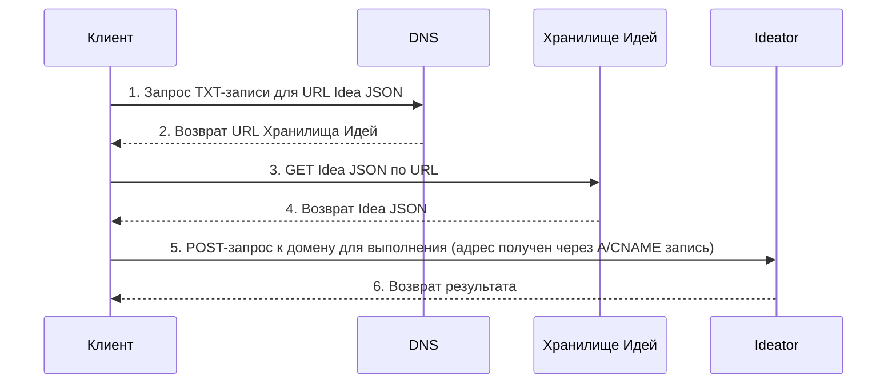

# 102: Концепция/Суверенитет

> Sidenote:
> - Требуется:
>   - [101: Концепция/Идея](./101_concept_idea.md)
>   - [103: Концепция/Ideator](./103_concept_ideator.md)

## Введение

Этот документ описывает протокол **Суверенитета**, который определяет спектр автономии, доступный создателям в экосистеме. Он описывает многоуровневую архитектуру для хостинга и исполнения, позволяя участникам выбирать желаемый уровень контроля: от использования полностью управляемых сервисов до самостоятельного развертывания полного, суверенного решения.

Эта модель — практический мост между абстрактным `Ideator` и конкретным, работающим сервисом.

## Децентрализованная идентификация через DNS

Архитектура экосистемы — это спектр автономии, построенный на одном основополагающем принципе: **децентрализованная идентификация через DNS**. Эта основа гарантирует, что `Idea` не привязана к какой-либо одной платформе или провайдеру, что делает возможным истинный суверенитет. `Idea` получает уникальное доменное имя, а `TXT`-запись для этого домена указывает на канонический JSON-документ `Idea`. Контролируя эту DNS-запись, создатель имеет полную и окончательную власть над идентификацией и местоположением своей `Idea`.

### Единый поток запросов: Суверенитет пользователя через DNS

Приведенная ниже диаграмма иллюстрирует два основных взаимодействия с Идеей: получение ее определения (`GET`) и ее выполнение в качестве сервиса (`POST`). Она показывает, как стандартные DNS-записи дают пользователю полный контроль над маршрутизацией.

**DNS-запись пользователя — это плоскость управления.** `TXT`-запись домена указывает на местоположение файла определения `Idea` (`Idea Storage`). Основная `A`- или `CNAME`-запись домена указывает на конечную точку выполнения (`Ideator`). Управляя этими двумя записями, пользователь направляет весь трафик, решая, использовать ли управляемые сервисы или собственную инфраструктуру.

> [!TIP]
> Эту модель полезно рассматривать как спектр автономии. На одном конце находится управляемый сервис, обеспечивающий удобство. На другом конце — **полный суверенитет**: использование собственного домена и самостоятельный хостинг всех сервисов, что фактически делает вас собственным провайдером. Управляемые уровни служат необязательным, прогрессивным мостом между этими двумя состояниями.



## Многоуровневая архитектура

Поверх основополагающего принципа децентрализованной идентификации система предоставляет пять необязательных, прогрессивных уровней функциональности сервисов. Эти уровни позволяют создателям выбирать желаемую степень контроля: от использования полностью управляемых сервисов для удобства до самостоятельного развертывания полного, суверенного решения.

### Уровень 1: Управляемый хостинг

Этот уровень предоставляет немедленное и простое решение для хостинга самого исходного файла Ideator.

- **Как это работает:** В качестве простой точки входа мы предлагаем хостинг исходного файла Ideator пользователя в нашем S3-бакете. `TXT`-запись, которую мы создаем для их управляемого поддомена, будет указывать на этот URL в S3. В любой момент пользователь может разместить файл в другом месте и обновить свою `TXT`-запись, чтобы она указывала на новое местоположение (например, на собственный сервер, IPFS и т.д.).
- **Цель:** Избавить создателей от необходимости организовывать собственный хостинг файлов только для того, чтобы начать работу.

---

### Уровень 2: Генерация статического UI

Этот уровень делает Ideator'ы доступными и полезными для людей без каких-либо вычислений на стороне сервера.

- **Как это работает:** Для всех доменов Ideator, выбравших эту услугу, предоставляется общая статическая веб-страница. Когда пользователь заходит на домен Ideator в браузере, клиентский JavaScript на этой странице выполняет запрос DNS-over-HTTPS (DoH) для получения `TXT`-записи домена, получает исходный URL (с хостинга Уровня 1), загружает файл определения Ideator и динамически отрисовывает пользовательский интерфейс.
- **Цель:** Предоставить бесплатное, готовое к использованию веб-приложение для любого Ideator, снижая порог входа.

---

### Уровень 3: Конечная точка GET на базе CDN

Этот уровень улучшает межмашинное взаимодействие для чтения определения Идеи.

- **Как это работает:** Размещая CDN перед уровнем хостинга, мы можем использовать правила перезаписи запросов. `GET`-запрос к домену Идеи интеллектуально маршрутизируется CDN для предоставления JavaScript-модуля. Это позволяет разработчикам использовать **именованный экспорт** для прямого импорта определенных частей `Idea`. Исходный документ `Idea` остается доступным через заголовок `Accept: application/json`.
- **Цель:** Обеспечить мощный и идиоматичный программный доступ с полной типобезопасностью.

```ts
// Заголовок X-Typescript-Types также предоставляется для сред, таких как Deno
const { default: run, schema } = await import('http://my-idea.com');
console.log(`Схема Идеи:`, schema);

// запустить идею как функцию напрямую
await run(input);
```

---

### Уровень 4: Публикация (PUT)

Этот уровень предоставляет возможность программно публиковать и обновлять Идею.

- **Как это работает:** Этот уровень обрабатывает аутентифицированные `PUT`-запросы к домену Идеи. Один запрос может загрузить новую версию исходного файла Идеи и атомарно обновить все необходимые записи, чтобы новая версия стала активной.
- **Цель:** Предоставить безопасный и простой API для создателей, чтобы управлять жизненным циклом своих Идей.

```ts
// опубликовать новую версию идеи
await fetch('http://my-idea.com', {
  method: 'PUT',
  data: JSON.stringify({ context, schema, solution }),
});
```

---

### Уровень 5: Полноценное выполнение через API (POST)

Это самый высокий уровень функциональности, превращающий Ideator в настоящий, вызываемый веб-сервис.

- **Как это работает:** Этот уровень обрабатывает `POST`-запросы к домену Ideator, выполняя его логику. Это может быть реализовано через управляемую бессерверную функцию или путем самостоятельного хостинга конечной точки пользователем.
- **Цель:** Предоставить всю мощь бессерверной архитектуры, позволяя любому опубликовать полнофункциональный микросервис, имея лишь статический файл определения.

```ts
// вызвать идею как сервис с новым контекстом
const idea = await fetch('http://my-idea.com', {
  method: 'POST',
  data: JSON.stringify(context),
});
console.log('Новое решение для идеи', idea.solution, 'соответствует схеме', idea.schema);
```

### Идея против Сервиса: Заметка о выполнении

Ключевой принцип этой архитектуры — разделение публичного манифеста (`Idea`) и его выполнения. `Idea` — это полный, самодостаточный черновик. Он содержит схему, контекст и решение — все, что необходимо компетентному агенту для его запуска. Это позволяет любому пользователю получить `Idea` и выполнить ее в своей локальной среде, что открывает возможности для экспериментов, переработки и суверенного использования на собственных условиях.

Поэтому уровень «Полноценное выполнение через API» является не требованием, а мощным удобством и коммерческой возможностью. Он позволяет создателю предлагать свою `Idea` как надежный, управляемый сервис. Именно здесь в открытой экосистеме могут процветать коммерция и коммерческие тайны. Создатель может опубликовать общедоступную `Idea` как прозрачный контракт — манифест того, что делает сервис и что он возвращает, — сохраняя при этом свои конкретные детали реализации в тайне.

Эта частная реализация — «секретный ингредиент» создателя. Она может включать проприетарные модели, специализированное оборудование, уникальные источники данных или сложные методы обработки неполной или несовершенной информации. Сервис становится надежным «черным ящиком», который выполняет публичное обещание `Idea`, создавая рынок, где открытые, переносимые протоколы и ценные частные реализации могут сосуществовать и развиваться на основе друг друга.

## Спецификация API

Все HTTP-взаимодействия происходят в корне домена Идеи (`/`).

- **`GET /`**
  - С заголовком `Accept: text/html` (Уровень 2): Возвращает загрузчик статического UI или перенаправляет на URL `page`.
  - С заголовком `Accept: application/json` (Уровень 3): Возвращает исходный JSON-файл Идеи.
- **`PUT /`** (Уровень 4)
  - Требуется аутентификация. Один `PUT`-запрос одновременно загружает новый исходный файл Идеи и атомарно обновляет URL `code` в `TXT`-записи, чтобы новая версия стала активной.
- **`POST /`** (Уровень 5)
  - Требуется аутентификация/авторизация. Выполняет Ideator.
  - Тело запроса — это JSON-объект, содержащий полезную нагрузку, например: `{"context": "Входные данные от пользователя для обработки"}`.

```

```

```

```
