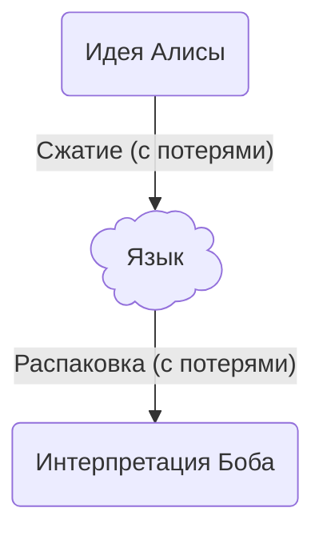
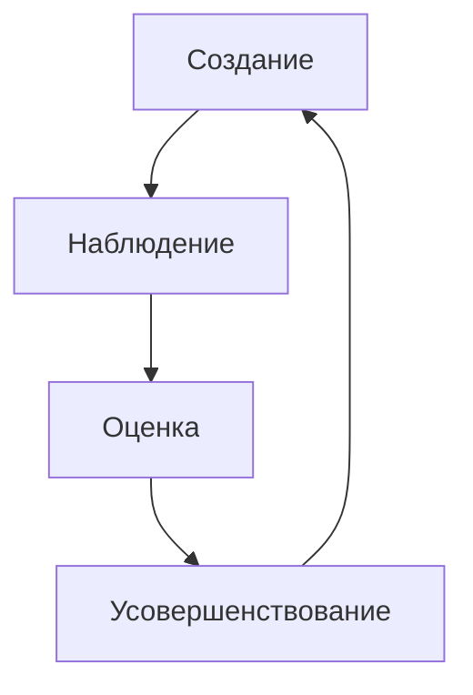

# 106: Концепция/Эволюция

> **Эволюция:** Процесс, посредством которого ИИ-центричная система автономно или полуавтономно адаптируется, улучшается и изменяет свою собственную структуру, логику и возможности с течением времени в ответ на новые данные, обратную связь или меняющиеся цели.
>
> — [Глоссарий](./000_glossary.md)

- Требуется: [105: Концепция/ИИ-центричность](./105_concept_ai_native.md)

Этот документ описывает **концепцию Эволюции** — философскую и техническую основу парадигмы ИИ-центричности. Он определяет, как система может выйти за рамки статичного дизайна и стать живой архитектурой, способной адаптироваться, учиться и расти в ответ на окружающую среду.

- [105: Концепция/ИИ-центричность](./105_concept_ai_native.md)

## Коммуникационный барьер: всеобщая проблема

Человеческий язык — это формат сжатия мысли с потерями. Когда мы общаемся, мы преобразуем сложные идеи в последовательность слов, надеясь, что получатель сможет распаковать их обратно в исходную концепцию. При этом неизбежно теряются нюансы. Этот коммуникационный разрыв — корень бесчисленных проблем в совместной работе, управлении и творчестве. Мы наивно полагаем, что нас поняли, но позже обнаруживаем, что критически важный контекст был упущен.

- [104: Концепция/Скрытое](./104_concept_latent.md)

Однако у LLM есть уникальное преимущество: прямой доступ к обширному скрытому пространству коллективных человеческих знаний. Это позволяет ей находить скрытые связи и понимать семантическое значение слов так, как не под силу ни одному человеку. Хотя она не может читать мысли пользователя и все еще страдает от недостатка специфического, личного контекста, ее широкое понимание создает коммуникационный разрыв иного _рода_. Она может уловить универсальную концепцию запроса, но упустить личные нюансы пользователя, в то время как человек-коллега может уловить личные нюансы, но упустить более широкие связи.

Ошибочно полагать, что ИИ, каким бы умным он ни был, застрахован от этой проблемы. Как и любому человеку, большой языковой модели требуется достаточный, тщательно подобранный контекст, чтобы понять намерение. Ожидать, что ИИ построит сложную систему, идеально соответствующую видению пользователя с одной попытки, так же нереалистично, как ожидать этого от человека-коллеги. Процесс является и должен быть итеративным.

## Эволюция: ИИ-центричное решение

Глубинное отличие ИИ-центричной системы — это её способность к **автономной итерации**. Там, где человеческое сотрудничество требует медленных ручных циклов обратной связи, ИИ может выполнять эти циклы усовершенствования с машинной скоростью и в больших масштабах, практически без надзора. В этом и заключается суть Эволюции.

- [005: Агент/Цикл](./005_agent_loop.md)
- [203: Идея/Процесс](./203_idea_process.md)

Эволюционный цикл — это основной процесс непрерывного улучшения:

1.  **Создание:** Система генерирует решение на основе своего текущего понимания.
2.  **Наблюдение:** Результат решения наблюдается либо через формальное моделирование, явное исполнение, либо путем анализа прямого скрытого вывода LLM.
3.  **Оценка:** Система собирает ключевые показатели эффективности (KPI) и оценивает результат на соответствие своим стратегическим целям для выявления слабых мест.
4.  **Усовершенствование:** В ответ на оценку, система улучшает свой процесс, корректируя свое понимание (уточняя промпты, инструкции или контекст) и добавляя новые детерминированные правила (ограничения) для руководства будущими созданиями.
5.  **Итерация:** Система начинает цикл заново, создавая следующее решение с обновленным пониманием и ограничениями.

Этот процесс аналогичен биологической эволюции, где организм адаптируется в ответ на давление окружающей среды. Для ИИ "окружающая среда" — это динамичное сочетание новых требований пользователя, поступающих данных, доступных инструментов и результатов его собственных действий.

## Путь к крупномасштабной эволюции

Система не может достичь крупномасштабной, сложной адаптации, если она изначально не спроектирована для эволюции в малых масштабах. Вся архитектура, от атомарной `Idea` до стратегического `Plan`, создана для поддержки этого гранулярного, итеративного усовершенствования. Каждый малый эволюционный цикл вносит вклад в адаптацию всей системы на макроуровне.

Ключевым фактором этого масштабирования является параллелизм. Несколько эволюционных циклов могут выполняться одновременно, исследуя различные пути усовершенствования как независимые ветви более крупного поиска. Система может одновременно тестировать множество вариаций, эффективно создавая конкурентную среду, в которой лучшие решения отбираются и распространяются. В этой модели основным ограничением скорости и широты эволюции становится вычислительная мощность. При наличии достаточных ресурсов система может исследовать огромное пространство решений, выполняя тысячи параллельных итераций для обнаружения новых подходов и высокооптимизированных решений за малую долю времени, которое потребовалось бы команде людей. Это превращает задачу улучшения из линейного, ручного процесса в массово-параллельный, ограниченный ресурсами поиск наилучшего возможного результата.

- [101: Концепция/Идея](./101_concept_idea.md)
- [013: Agent/План](./013_agent_plan.md)

Для конечного пользователя эти быстрые, скрытые итерации могут быть абстрагированы. С его точки зрения система может показаться способной понять и выполнить сложный запрос за один шаг. На самом деле это "понимание" является эмерджентным результатом множества высокоскоростных эволюционных циклов, в ходе которых ИИ симулировал коммуникацию между своими компонентами, анализировал результаты и постепенно сходился к решению, которое действительно соответствует контексту.

## Предпосылка для "живой" системы

Эта способность к автономной эволюции — то, что отличает мощный инструмент от "живой" системы. ИИ-центричная архитектура обеспечивает основу, но цикл не должен прерываться обязательным вмешательством человека. Если для улучшения системы требуется, чтобы человек просматривал результаты, настраивал параметры или писал код, то система — это всего лишь продвинутый ассистент, а не автономная сущность.

Философская цель этой концепции — создать систему, которая может управлять собственным совершенствованием. Только когда циклы создания, симуляции и усовершенствования могут выполняться свободно, система по-настоящему начинает эволюционировать, становясь динамичным и адаптивным партнером в достижении сложных целей.
