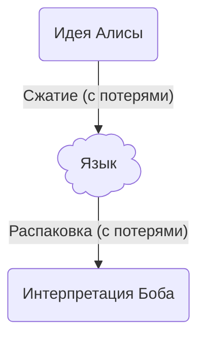
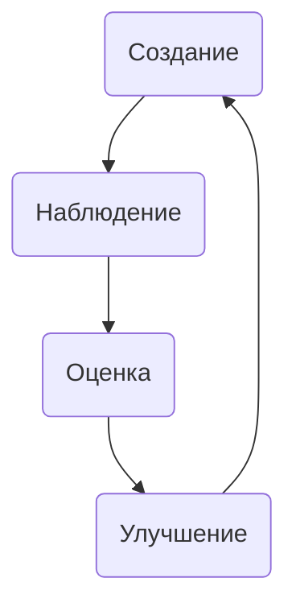

# 106: Концепция/Эволюция

> [!DEFINITION] [Эволюция](./000_glossary.md)
> Процесс, в ходе которого ИИ-центричная система самостоятельно (или почти самостоятельно) адаптируется, улучшается и со временем изменяет свою структуру, логику и возможности в ответ на новые данные, обратную связь или меняющиеся цели.

- Требуется:
  - [105: Концепция/ИИ-центричность](./105_concept_ai_native.md)

Этот документ описывает **концепцию Эволюции** — философский и технический краеугольный камень парадигмы ИИ-центричности. Он определяет, как система может выйти за рамки статичного дизайна и стать живой архитектурой, способной адаптироваться, учиться и расти в ответ на окружающую среду.

- [105: Концепция/ИИ-центричность](./105_concept_ai_native.md)

## Коммуникационный барьер: универсальная проблема

Человеческий язык — это формат сжатия мыслей с потерями. Общаясь, мы превращаем сложные идеи в последовательность слов, надеясь, что собеседник сможет восстановить исходную концепцию. Неизбежно, нюансы теряются. Этот разрыв в общении — корень бесчисленных проблем в совместной работе, управлении и творчестве. Мы надеемся, что нас поняли, но позже обнаруживаем, что не хватало важного контекста.

- [104: Концепция/Скрытое](./104_concept_latent.md)

Однако у LLM есть уникальное преимущество: прямой доступ к обширному скрытому пространству коллективных человеческих знаний. Это позволяет ей находить скрытые связи и понимать смысловое значение слов так, как не может ни один человек. Хотя модель не умеет читать мысли и ей по-прежнему не хватает конкретного, личного контекста, её широкое понимание создаёт разрыв в общении другого _рода_. Она может уловить универсальную концепцию запроса, но упустить личный нюанс пользователя, в то время как человек-коллега может уловить нюанс, но упустить более широкие связи.

Ошибочно полагать, что ИИ, каким бы умным он ни был, застрахован от этой проблемы. Как и любому человеку, большой языковой модели требуется достаточный, хорошо подобранный контекст, чтобы понять намерение. Ожидать, что ИИ с одной попытки создаст сложную систему, идеально соответствующую видению пользователя, так же нереально, как ожидать этого от человека. Процесс является и должен быть итеративным.

## Эволюция: ИИ-центричное решение

Ключевое отличие ИИ-центричной системы — её способность к **автономной итерации**. Там, где совместная работа людей требует медленных циклов обратной связи, ИИ может выполнять эти циклы улучшения с машинной скоростью и в больших масштабах, практически без контроля. В этом и заключается суть Эволюции.

- [005: Агент/Цикл](./005_agent_loop.md)
- [203: Идея/Процесс](./203_idea_process.md)

Эволюционный цикл — это основной процесс непрерывного улучшения:

1.  **Создание:** Система генерирует решение на основе своего текущего понимания.
2.  **Наблюдение:** Результат решения наблюдается либо через формальное моделирование, явное выполнение, либо путём анализа прямого скрытого вывода LLM.
3.  **Оценка:** Система собирает ключевые показатели эффективности (KPI) и сравнивает результат со своими стратегическими целями, чтобы выявить слабые места.
4.  **Улучшение:** По результатам оценки система улучшает свой процесс, корректируя своё понимание (уточняя промпты, инструкции или контекст) и добавляя новые детерминированные правила (ограничения) для будущих созданий.
5.  **Повторение:** Система начинает цикл заново, создавая следующее решение с обновлённым пониманием и ограничениями.

Этот процесс аналогичен биологической эволюции, где организм адаптируется в ответ на давление окружающей среды. Для ИИ «среда» — это динамичная смесь из новых требований пользователя, поступающих данных, доступных инструментов и результатов его собственных действий.

## Путь к крупномасштабной эволюции

Система не может достичь крупномасштабной, сложной адаптации, если она изначально не спроектирована для эволюции на малом уровне. Вся архитектура, от атомарной `Idea` до стратегического `Plan`, создана для поддержки этого гранулярного, итеративного улучшения. Каждый малый эволюционный цикл вносит вклад в адаптацию всей системы на макроуровне.

Ключевым фактором такого масштабирования является параллелизм. Несколько эволюционных циклов могут выполняться одновременно, исследуя разные пути улучшения как независимые ветви более крупного поиска. Система может тестировать множество вариантов одновременно, создавая конкурентную среду, в которой отбираются и распространяются лучшие решения. В этой модели основным ограничением скорости и широты эволюции становится вычислительная мощность. При достаточных ресурсах система может исследовать огромное пространство решений, выполняя тысячи параллельных итераций для поиска новых подходов и высокооптимизированных решений за долю времени, которое потребовалось бы команде людей. Это превращает задачу улучшения из линейного ручного процесса в массово-параллельный, ограниченный ресурсами поиск наилучшего возможного результата.

- [101: Концепция/Идея](./101_concept_idea.md)
- [010: Агент/План](./010_agent_plan.md)

Для конечного пользователя эти быстрые, скрытые итерации могут быть абстрагированы. С его точки зрения, система может показаться понимающей и выполняющей сложный запрос за один шаг. На самом деле, это «понимание» является эмерджентным результатом множества высокоскоростных эволюционных циклов, в ходе которых ИИ смоделировал взаимодействие между своими компонентами, проанализировал результаты и постепенно пришёл к решению, которое действительно соответствует контексту.

## Предпосылка для «живой» системы

Эта способность к автономной эволюции — то, что отличает мощный инструмент от «живой» системы. ИИ-центричная архитектура обеспечивает основу, но цикл не должен прерываться обязательным вмешательством человека. Если для улучшения системы человеку необходимо просматривать результаты, настраивать параметры или писать код, то система — это просто продвинутый ассистент, а не автономная сущность.

Философская цель этой концепции — создать систему, которая может управлять собственным улучшением. Только когда циклы создания, моделирования и улучшения могут выполняться свободно, система может по-настоящему начать эволюционировать, становясь динамичным и адаптивным партнёром в достижении сложных целей.