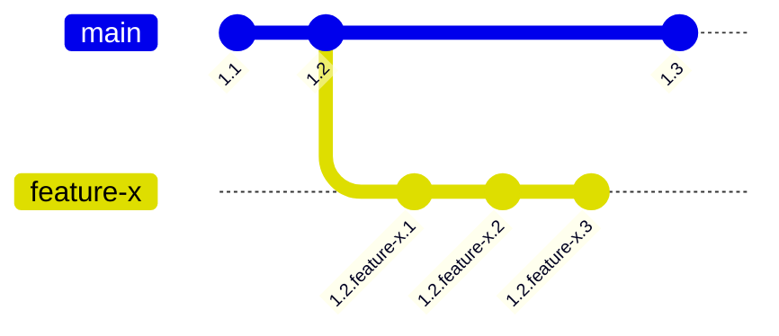

# 108: Концепция/Видимость

> [!DEFINITION] [Видимость](./000_glossary.md)
> Набор механизмов, контролирующих, какая версия :term[Идеи]{canonical="Idea"} будет выбрана в определённом контексте. :term[Видимость]{canonical="Visibility"} определяется сочетанием истории версий :term[Идеи]{canonical="Idea"}, её связей с ветками и путём поиска запрашивающего.

> Sidenote:
> - Требуется:
>   - :term[107: Концепция/Идентичность]{href="./107_concept_identity.md"}
> - Открывает возможности для:
>   - :term[015: Агент/Мета]{href="./016_agent_meta.md"}
>   - :term[110: Концепция/Адресация]{href="./110_concept_addressing.md"}

Чтобы система развивающихся, взаимосвязанных :term[Идей]{canonical="Idea" href="./101_concept_idea.md"} была полезной, должен существовать ясный и предсказуемый способ определять, какая версия :term[Идеи]{canonical="Idea" href="./101_concept_idea.md"} будет отображаться — то есть **видимой** — в любом заданном контексте. Двухкомпонентная модель, управляющая :term[видимостью]{canonical="Visibility"}, включает в себя систему версионирования, которая создаёт возможные состояния :term[Идеи]{canonical="Idea" href="./101_concept_idea.md"}, и механизм выбора, который определяет, какое состояние станет видимым.

## Версионирование: создание состояний для отображения

Прежде чем выбрать версию, её нужно создать. :term[Иерархическое версионирование]{canonical="Hierarchical Versioning"} — это механизм для создания и отслеживания различных состояний :term[Идеи]{canonical="Idea" href="./101_concept_idea.md"} с течением времени. Версия — это не просто число, а сложная, разделённая точками иерархия, которая рассказывает историю эволюции :term[Идеи]{canonical="Idea" href="./101_concept_idea.md"}.

Версии состоят из **целочисленных ревизий** для последовательных публичных выпусков (например, `1.2`) и **ревизий в ветках** для именованных линий разработки (например, `feature-x`). Например, версия вида `1.2.feature-x.3` говорит нам, что это третья ревизия ветки `feature-x`, созданной из версии `1.2`.
::::columns
:::column
Версии состоят из **целочисленных ревизий** для последовательных публичных выпусков (например, `1.2`) и **ревизий в ветках** для именованных линий разработки (например, `feature-x`). Например, версия вида `1.2.feature-x.3` говорит нам, что это третья ревизия ветки `feature-x`, созданной из версии `1.2`.
:::
:::column

:::
::::

Правила развития версии:

- **Совместимые изменения**: Неломающее редактирование, при котором новую версию можно безопасно использовать как полную замену старой. Примеры включают изменение данных в `context` или `solution`, или добавление нового поля в `schema`. Такие изменения создают новую минорную ревизию (например, `1.2` становится `1.2.1`).
- **Ломающие изменения**: Изменение, при котором новую версию нельзя использовать как замену старой. Обычно это связано с удалением или изменением существующих полей в `schema`. Такие изменения должны «подниматься» на более высокий уровень иерархии версий (например, изменение, нарушающее совместимость с `1.2`, приведёт к созданию `1.3`). Система может автоматически обнаруживать ломающие изменения на основе схемы.

## Выбор: определение видимого состояния

При наличии богатой истории версий необходим механизм выбора для определения правильной. Эта задача решается чётким разделением между тем, как :term[Идея]{canonical="Idea" href="./101_concept_idea.md"} публикуется, и тем, как она извлекается. Процесс имеет два измерения извлечения: **пространственное** (в каких разделах искать) и **временное** (на какой момент времени).

### Ветки: публикация и разделение

> [!DEFINITION] [Ветка](./000_glossary.md)
> Именованная метка, которая разделяет пространство видимости, создавая параллельную, изолированную среду для разработки и экспериментов. Связывание :term[Идеи]{canonical="Idea"} с веткой является актом публикации.

Например, каждая версия :term[Идеи]{canonical="Idea" href="./101_concept_idea.md"} в базе данных связана с одной или несколькими :term[ветками]{canonical="Branch"}, например `["main", "feature/new-billing"]`. Этот акт публикации делает :term[Идею]{canonical="Idea" href="./101_concept_idea.md"} доступной в этих конкретных разделах, обеспечивая безопасный рабочий процесс.

Это даёт два основных преимущества:

- **Изоляция**: Работа над новой функцией (например, в :term[ветке]{canonical="Branch"} `feature/new-billing`) не мешает стабильной :term[ветке]{canonical="Branch"} `main`. Это предотвращает попадание незавершённой или ошибочной работы в производственные системы.
- **Экспериментирование**: :term[Ветки]{canonical="Branch"} легко и быстро создавать. Это поощряет эксперименты, позволяя разработчикам отбрасывать :term[ветку]{canonical="Branch"}, если эксперимент не удался, без какого-либо влияния на основную систему.

### Путь поиска: приоритетное извлечение

> [!DEFINITION] [Путь поиска](./000_glossary.md)
> Упорядоченный список имён веток, который определяет механизм извлечения. Он указывает распознавателю, в каких разделах и в каком порядке приоритета искать, создавая каскадную систему наложения.

Этот механизм извлечения является ключевым для рабочего процесса разработки и отвечает на **пространственный** вопрос. Например, типичный :term[путь поиска]{canonical="Search Path"} разработчика может быть установлен как `['feature/my-new-idea', 'staging', 'main']`.

Эта конфигурация создаёт каскадную систему наложения для извлечения:

1.  Сначала искать соответствующую :term[Идею]{canonical="Idea" href="./101_concept_idea.md"} в разделе `feature/my-new-idea`.
2.  Если не найдено, искать в разделе `staging`.
3.  В конечном итоге, искать в разделе `main`.

Это позволяет разработчику видеть определённую, желаемую реальность, состоящую из его локальных изменений, бесшовно наложенных поверх стабильной системы.

### Время отсечки: временное извлечение

> [!DEFINITION] [Время отсечки](./000_glossary.md)
> Метка времени, которая сопровождает запрос на разрешение, указывая распознавателю найти версию :term[Идеи]{canonical="Idea"}, которая считалась последней на тот конкретный момент времени.

Второе измерение извлечения — **временное**. Каждый запрос на разрешение выполняется относительно состояния системы, каким оно было в определённый момент. Это контролируется :term[Временем отсечки]{canonical="Cutoff Time"}.

Если :term[время отсечки]{canonical="Cutoff Time"} не указано, по умолчанию используется текущее время (`now()`), извлекая самые последние видимые версии. Однако, указав метку времени из прошлого, вы можете выполнить «запрос в прошлое». Это указывает распознавателю найти версию :term[Идеи]{canonical="Idea" href="./101_concept_idea.md"} — и все её зависимости — которая была последней согласно :term[пути поиска]{canonical="Search Path"} в тот самый момент. Эта возможность является технической основой для идеальной воспроизводимости.

> Sidenote:
> - :term[107: Концепция/Идентичность]{href="./107_concept_identity.md"}

## От модели к применению

Эта глава определила теоретическую модель :term[видимости]{canonical="Visibility"} — механизмы создания различных состояний и выбора между ними. Имея эту модель, последним элементом является практический язык для взаимодействия с ней.

Следующий документ, :term[110: Концепция/Адресация]{href="./110_concept_addressing.md"}, представляет схему URI :term[idea:]{canonical="idea:"} — конкретный синтаксис, используемый для запроса определённого представления и навигации по этой богатой, версионированной и разветвлённой реальности.
