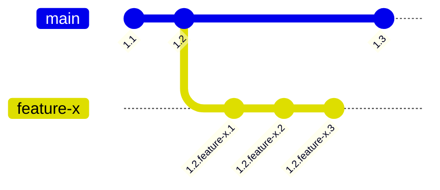

# 108: Концепция/Видимость

> [!DEFINITION] :term[Видимость]{canonical="Visibility"}
> Набор механизмов, контролирующих, какая версия :term[Идеи]{canonical="Idea"} будет разрешена в данном контексте. :term[Видимость]{canonical="Visibility"} определяется комбинацией истории версий :term[Идеи]{canonical="Idea"}, её ассоциаций с ветками и путём поиска запрашивающего.

> Sidenote:
> - Требуется:
>   - :term[107: Концепция/Идентичность]{href="./107_concept_identity.md"}
> - Открывает возможности для:
>   - :term[109: Концепция/Адресация]{href="./109_concept_addressing.md"}

Чтобы система развивающихся, взаимосвязанных :term[Идей]{canonical="Idea" href="./101_concept_idea.md"} была полезной, должен существовать ясный и предсказуемый способ определять, какая версия :term[Идеи]{canonical="Idea" href="./101_concept_idea.md"} видна — или **видима** — в любом заданном контексте. Этот документ описывает двухчастную модель, управляющую :term[видимостью]{canonical="Visibility"}: систему версионирования, которая создает возможные состояния :term[Идеи]{canonical="Idea" href="./101_concept_idea.md"}, и механизм выбора, который определяет, какое состояние становится видимым.

## Версионирование: Создание состояний для отображения

Прежде чем выбрать версию, она должна существовать. :term[Иерархическое Версионирование]{canonical="Hierarchical Versioning"} — это механизм для создания и отслеживания различных состояний :term[Идеи]{canonical="Idea" href="./101_concept_idea.md"} с течением времени. Версия — это не просто число, а сложная, разделенная точками иерархия, которая рассказывает историю эволюции :term[Идеи]{canonical="Idea" href="./101_concept_idea.md"}.

Версии состоят из **целочисленных ревизий** для последовательных публичных выпусков (например, `1.2`) и **ревизий в ветках** для именованных линий разработки (например, `feature-x`). Например, версия вроде `1.2.feature-x.3` говорит нам, что это третья ревизия ветки `feature-x`, созданной из версии `1.2`.
::::columns
:::column
Версии состоят из **целочисленных ревизий** для последовательных публичных выпусков (например, `1.2`) и **ревизий в ветках** для именованных линий разработки (например, `feature-x`). Например, версия вроде `1.2.feature-x.3` говорит нам, что это третья ревизия ветки `feature-x`, созданной из версии `1.2`.
:::
:::column

:::
::::

Правила эволюции версии:

- **Совместимые изменения**: Неломающее редактирование, при котором новую версию можно безопасно использовать как полную замену старой. Примеры включают изменение данных `context` или `solution`, или добавление нового поля в `schema`. Такие изменения создают новую минорную ревизию (например, `1.2` становится `1.2.1`).
- **Ломающие изменения**: Изменение, при котором новую версию нельзя использовать как замену старой. Обычно это связано с удалением или изменением существующих полей в `schema`. Эти изменения должны "подниматься" на более высокий уровень иерархии версий (например, изменение, нарушающее совместимость с `1.2`, создаст `1.3`). Система может автоматически обнаруживать ломающие изменения на основе схемы.

## Выбор: Определение видимого состояния

При наличии богатой истории версий необходим механизм выбора для определения правильной. Это достигается за счет четкого разделения между тем, как :term[Идея]{canonical="Idea" href="./101_concept_idea.md"} публикуется, и тем, как она извлекается. Процесс имеет два измерения извлечения: **пространственное** (в каких разделах искать) и **временное** (на какой момент времени).

### Ветки: Публикация и разделение

> [!DEFINITION] :term[Ветка]{canonical="Branch"}
> Именованный тег, который разделяет пространство видимости, создавая параллельную, изолированную среду для разработки и экспериментов. Ассоциирование :term[Идеи]{canonical="Idea"} с веткой является актом публикации.

Например, каждая версия :term[Идеи]{canonical="Idea" href="./101_concept_idea.md"} в базе данных связана с одной или несколькими :term[ветками]{canonical="Branch"}, например, `["main", "feature/new-billing"]`. Этот акт публикации делает :term[Идею]{canonical="Idea" href="./101_concept_idea.md"} доступной в этих конкретных разделах, обеспечивая безопасный рабочий процесс.

Это дает два фундаментальных преимущества:

- **Изоляция**: Работа над новой функцией (например, в :term[ветке]{canonical="Branch"} `feature/new-billing`) не мешает стабильной :term[ветке]{canonical="Branch"} `main`. Это предотвращает влияние незавершенной или содержащей ошибки работы на производственные системы.
- **Экспериментирование**: :term[Ветки]{canonical="Branch"} легко и дешево создавать. Это поощряет эксперименты, позволяя разработчикам отбрасывать :term[ветку]{canonical="Branch"}, если эксперимент не удался, без какого-либо влияния на основную систему.

### Путь Поиска: Приоритетное извлечение

> [!DEFINITION] :term[Путь Поиска]{canonical="Search Path"}
> Упорядоченный список имен веток, который определяет механизм извлечения. Он указывает резолверу, в каких разделах искать и в каком порядке приоритета, создавая каскадную систему наложения.

Этот механизм извлечения является ключевым для рабочего процесса разработки и отвечает на **пространственный** вопрос. Например, типичный :term[путь поиска]{canonical="Search Path"} разработчика может быть установлен как `['feature/my-new-idea', 'staging', 'main']`.

Эта конфигурация создает каскадную систему наложения для извлечения:

1.  Сначала ищем соответствующую :term[Идею]{canonical="Idea" href="./101_concept_idea.md"} в разделе `feature/my-new-idea`.
2.  Если не найдено, ищем в разделе `staging`.
3.  Наконец, ищем в разделе `main`.

Это позволяет разработчику видеть конкретную, предполагаемую реальность, состоящую из его локальных изменений, бесшовно наложенных поверх стабильной системы.

### Время Отсечки: Временное извлечение

> [!DEFINITION] :term[Время Отсечки]{canonical="Cutoff Time"}
> Временная метка, сопровождающая запрос на разрешение, которая указывает резолверу найти версию :term[Идеи]{canonical="Idea"}, считавшуюся последней на этот конкретный момент времени.

Второе измерение извлечения — **временное**. Каждый запрос на разрешение выполняется относительно состояния системы, существовавшего в определенный момент. Это контролируется :term[Временем Отсечки]{canonical="Cutoff Time"}.

Если :term[время отсечки]{canonical="Cutoff Time"} не указано, оно по умолчанию равно текущему времени (`now()`), извлекая самые последние видимые версии. Однако, указав временную метку из прошлого, вы можете выполнить "запрос в прошлое". Это указывает резолверу найти версию :term[Идеи]{canonical="Idea" href="./101_concept_idea.md"} — и все ее зависимости — которая была последней согласно :term[пути поиска]{canonical="Search Path"} на тот самый момент. Эта возможность является технической основой для идеальной воспроизводимости.

> Sidenote:
> - :term[107: Концепция/Идентичность]{href="./107_concept_identity.md"}

## От модели к применению

В этой главе была определена теоретическая модель :term[видимости]{canonical="Visibility"} — механизмы для создания различных состояний и выбора между ними. Когда эта модель готова, последним элементом является практический язык для взаимодействия с ней.

Следующий документ, :term[109: Концепция/Адресация]{href="./109_concept_addressing.md"}, представляет схему URI :term[idea:]{canonical="idea:"} — конкретный синтаксис, используемый для запроса определенного представления и навигации по этой богатой, версионированной и разветвленной реальности.
