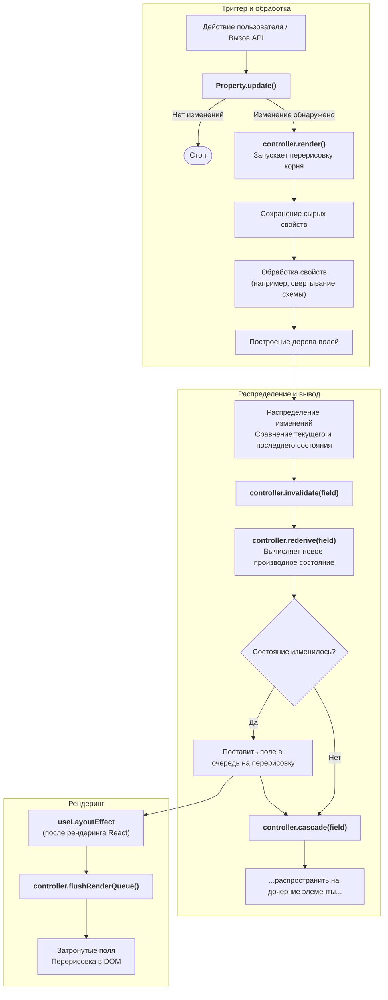

# 802: Пакет/UI

> [!DEFINITION] [Архитектура древовидного стиля](./000_glossary.md)
> Движок, управляемый схемой, для создания динамичных, адаптируемых пользовательских интерфейсов непосредственно из структур данных. Он рассматривает **:term[Схему]{canonical="Schema"}** как основу дизайна, позволяя стилизовать и перенастраивать UI с помощью декларативных таблиц стилей и рендерить их через сменные адаптеры.

> Sidenote:
>
> - Требуется:
>   - :term[800: Пакет/Схимия]{href="./800_package_schemistry.md"}

**Пакет UI** реализует движок рендеринга, где **Структура — это Дизайн**. Вместо ручного создания шаблонов для каждого типа данных, он генерирует интерфейс автоматически на основе базовой JSON :term[Схемы]{canonical="Schema"}. Это гарантирует, что UI всегда синхронизирован с моделью :term[данных]{canonical="Data"} — измените схему, и интерфейс обновится мгновенно.

## Основная философия: Структура как источник истины

В традиционной разработке модель :term[данных]{canonical="Data"} и UI часто расходятся. Этот :term[пакет]{canonical="Package"} решает эту проблему, делая **:term[Схему]{canonical="Schema"}** единственным источником истины для интерфейса.

- **Динамическая генерация**: UI не закодирован жестко; он выводится. Изменение в структуре :term[схемы]{canonical="Schema"} (например, добавление поля, изменение типа) немедленно отражается в отображаемом результате.
- **Всегда актуально**: Поскольку UI является прямой проекцией :term[схемы]{canonical="Schema"}, это исключает класс ошибок, при которых интерфейс отстает от модели :term[данных]{canonical="Data"}.

## Декларативная стилизация и реконфигурация

В то время как :term[Схема]{canonical="Schema"} диктует, _что_ отображается, **Таблица стилей** диктует, _как_ это выглядит. Такое разделение позволяет кардинально менять дизайн, не затрагивая базовую структуру.

- **Декларативный слой**: Таблицы стилей действуют как конфигурационный слой, который сопоставляет узлы :term[схемы]{canonical="Schema"} с визуальными свойствами.
- **Реконфигурируемость**: Вы можете полностью изменить макет, отступы и визуальную иерархию, меняя таблицы стилей, фактически «натягивая обложки» на сырую структуру :term[данных]{canonical="Data"}.

## Адаптеры и совместимость

Движок не зависит от конечной цели рендеринга. Он использует **паттерн Адаптер**, чтобы преобразовывать абстрактное дерево компонентов в конкретные элементы UI.

- **Поддержка систем дизайна**: Адаптеры могут быть нацелены на конкретные системы дизайна (например, Material UI, Ant Design), сопоставляя абстрактные типы :term[схем]{canonical="Schema"} с многофункциональными, готовыми компонентами.
- **Резервный HTML**: Стандартный HTML-адаптер гарантирует, что любая :term[схема]{canonical="Schema"} может быть отображена как семантический, доступный веб-контент «из коробки».

## Мультимодальные представления

Одна и та же :term[схема]{canonical="Schema"} и :term[данные]{canonical="Data"} могут быть спроецированы в разные контексты с помощью **режимов просмотра**.

- **Режим редактирования**: Генерирует полностью интерактивные формы для ввода и валидации :term[данных]{canonical="Data"}.
- **Режим просмотра**: Отображает оптимизированные представления только для чтения для потребления :term[данных]{canonical="Data"}.

Это позволяет одному определению служить нескольким целям в приложении, сокращая дублирование кода и обеспечивая согласованность между созданием и просмотром :term[данных]{canonical="Data"}.

## Основные концепции

### Динамическая система свойств с выводами

Система построена на основе саморасширяющегося контроллера, где модульные свойства регистрируют себя и свои взаимозависимости, создавая мощный и расширяемый граф вывода.

- **Свойства саморегистрируются**: Каждый модуль свойства (например, для `data`, `schema`, `vars`) автоматически регистрируется при импорте.
- **Объявление зависимостей**: Свойства могут объявлять зависимости от других свойств (например, `styles` зависит от `vars` и `settings`).
- **Цепочки выводов**: Когда базовое свойство изменяется, контроллер автоматически пересчитывает все зависимые свойства в правильном порядке, обеспечивая постоянную согласованность :term[состояния]{canonical="State"} UI.
- **Типобезопасность**: TypeScript выводит типы контроллера и полей из объединенных зарегистрированных свойств.
- **Модульная архитектура**: Новые свойства вместе с их логикой вывода можно добавлять, не изменяя существующий код.

### Пользовательские свойства

Динамическая система свойств является ключом к этой расширяемости. Вы можете создавать и регистрировать свои собственные свойства для добавления новых функций и управления любым аспектом поведения поля. Это позволяет встраивать мощную, специфичную для домена функциональность непосредственно в движок рендеринга. Например, вы можете реализовать:

- Свойство `slots`, которое зависит от `styles` для определения, какие компоненты UI отображать.
- Свойство `errors`, которое зависит от `data` и `schema` для выполнения валидации.
- Пользовательские свойства стилизации, которые реагируют на определенные условия :term[данных]{canonical="Data"}.

### Темизируемая система компонентов

Второй ключ к расширяемости — это система `Theme`. Она позволяет полностью отделить движок рендеринга от любого конкретного UI-фреймворка. Эта система организует четкий поток информации от абстрактных :term[данных]{canonical="Data"} к конкретному UI:

1.  **Схема предоставляет структуру**: `schema` определяет форму :term[данных]{canonical="Data"} и общую иерархию дерева UI.
2.  **Контроллер создает состояние**: Контроллер обрабатывает :term[схему]{canonical="Schema"} и :term[данные]{canonical="Data"}, создавая конкретное :term[состояние]{canonical="State"} для каждого поля в дереве.
3.  **Переменные (`vars`) объявляют атомы**: CSS-переменные используются для декларативного назначения компонентов-`атомов` именованным `слотам` (например, `--slot-title: 'TitleAtom'`).
4.  **Атомы — это строительные блоки**: `Атомы` — это компоненты конечного уровня (например, `<Input />`, `<Button />`), которые привязываются к :term[состоянию]{canonical="State"} поля для отображения :term[данных]{canonical="Data"}.
5.  **Поля организуют рендеринг**: Компонент `Field` действует как организатор, проверяя, какие `атомы` назначены его именованным слотам через переменные.
6.  **Рендеринг управляется данными**: `Field` отображает `атом` только в том случае, если в его `:term[состоянии]{canonical="State"}` существуют соответствующие :term[данные]{canonical="Data"} для этого слота, обеспечивая минималистичный UI.
7.  **Поля как листья**: Представляет одну точку :term[данных]{canonical="Data"} (например, строку), составляя несколько `атомов` в полный элемент ввода (метка, виджет, описание).
8.  **Поля как ветви (Fieldsets)**: `Field` также может представлять «ветвь» (объект/массив), действуя как «fieldset», который обеспечивает макет для своих дочерних `полей`.

Такое четкое разделение ответственности позволяет осуществлять глубокую настройку на каждом уровне, от логики обработки :term[данных]{canonical="Data"} до конечного отрисованного пикселя.

### Управление состоянием и структурное разделение

Контроллер централизованно управляет :term[состоянием]{canonical="State"} дерева, различая сырые свойства, обработанное :term[состояние]{canonical="State"} и последнее отрисованное :term[состояние]{canonical="State"}, чтобы обеспечить эффективное обнаружение изменений.

- **Сырые свойства (`controller.props`, `controller.data` и т. д.)**: Исходные свойства, переданные корневому компоненту. Они служат источником истины и никогда не изменяются в процессе обработки. Это обеспечивает поддержку как управляемого, так и неуправляемого режимов.
  - **Управляемый режим**: Когда предоставляются свойства `data` или `vars`, система использует эти внешние значения. Обновления вызывают коллбэки `onChange`/`onVarsChange`.
  - **Неуправляемый режим**: Когда предоставляются только `initialData` или `initialVars`, контроллер управляет :term[состоянием]{canonical="State"} внутренне.
- **Текущее состояние (`controller.current`)**: Обработанное :term[состояние]{canonical="State"}. После фазы `store` свойства обрабатываются (например, :term[схема]{canonical="Schema"} сворачивается, :term[данные]{canonical="Data"} валидируются), и результат сохраняется в `controller.current`. Это :term[состояние]{canonical="State"}, которое распределяется по полям.
- **Последнее состояние (`controller.last`)**: Поверхностная копия `current` :term[состояния]{canonical="State"} из предыдущего цикла рендеринга. Используется для сравнения с новым `current` :term[состоянием]{canonical="State"} для точного определения того, какие свойства и пути изменились.

**Структурное разделение:**

Архитектура использует единое, разделяемое дерево :term[состояния]{canonical="State"} (`controller.current`) для минимизации использования памяти и обеспечения согласованности :term[состояния]{canonical="State"}.

- **Нулевое дублирование**: Поля не получают собственных копий :term[данных]{canonical="Data"}. Вместо этого они хранят ссылки на срезы дерева :term[состояния]{canonical="State"} `controller.current`.
- **Согласованность состояния**: Поскольку поля напрямую ссылаются на срезы `controller.current`, :term[данные]{canonical="Data"} :term[состояния]{canonical="State"} дерева всегда согласованы. Обновления UI затем пакетируются и отрисовываются на следующем тике для повышения производительности.
- **Видимость потомков**: Родительские поля (например, для объекта) имеют доступ ко всему своему поддереву, включая все вложенные :term[данные]{canonical="Data"} и :term[схему]{canonical="Schema"}.

### Конвейер обновления и вывода

Контроллер использует единый, унифицированный конвейер как для начального рендеринга, так и для всех последующих обновлений. Это обеспечивает последовательный и предсказуемый поток :term[состояния]{canonical="State"}. Вот пошаговое описание процесса:

- **Триггер**: Происходит внешнее событие (например, ввод пользователя, вызов API). Вызывается метод `update` соответствующего свойства, который проверяет наличие значимых изменений. Если их нет, процесс останавливается.

- **Перерисовка корня**: Если обнаружено изменение, запускается перерисовка корневого компонента `<Form>`. Это инициирует основной цикл обработки контроллера.

- **Сохранение сырых свойств**: Во время рендеринга контроллер сначала сохраняет сырые свойства из компонента `<Form>`.

- **Обработка свойств**: Затем сырые свойства обрабатываются в согласованное внутреннее :term[состояние]{canonical="State"} (`controller.current`). Например, `schema` сворачивается.

- **Построение дерева полей**: Контроллер обнаруживает все пути полей из обработанного :term[состояния]{canonical="State"} и обеспечивает существование объекта `field` для каждого из них.

- **Распределение изменений**: Контроллер сравнивает новое :term[состояние]{canonical="State"} `controller.current` с предыдущим :term[состоянием]{canonical="State"} (`controller.last`), чтобы определить, какие именно поля и свойства изменились.

- **Инвалидация и вывод**: Для каждого обнаруженного изменения вызывается `controller.invalidate()`. Это точка входа для реактивной системы вывода, которая запускает:
  - `controller.rederive()`: Вычисляет новые значения для всех зависимых свойств поля (например, `settings`, `styles`) в правильном топологическом порядке.
  - `controller.cascade()`: Разумно распространяет изменения на дочерние поля, запуская их собственные циклы перерасчета.
  - Любое поле, чье :term[состояние]{canonical="State"} изменяется в ходе этого процесса, ставится в очередь на перерисовку.

- **Пакетные обновления DOM**: После завершения цикла рендеринга React, хук `useLayoutEffect` очищает очередь рендеринга. Все поля, поставленные в очередь на этапе вывода, обновляются в DOM одним эффективным пакетом.

## Производительность и эффективность

### Эффективный рендеринг

Архитектура спроектирована для высокой производительности за счет минимизации согласования React и накладных расходов на перерисовку.

- **Точное обнаружение изменений**: Сравнивая `controller.current` и `controller.last` для сырых свойств и используя глубокие проверки на равенство в цикле вывода, система точно знает, какие поля и свойства изменились, избегая ненужных обновлений.
- **Выборочная инвалидация и вывод**: Инвалидируются только поля, затронутые изменением. Цепочка вывода гарантирует, что пересчитываются только зависимые свойства.
- **Отложенный и пакетный рендеринг**: Запросы на рендеринг полей ставятся в очередь во время цикла обработки. Затем контроллер очищает эту очередь одним пакетом внутри `useLayoutEffect`, минимизируя вызовы рендеринга.
- **Дедупликация рендеринга**: Если несколько изменений затрагивают одно и то же поле в одном цикле, оно все равно рендерится только один раз.

### Умное каскадирование и вывод

Система эффективно распространяет изменения переменных вниз по дереву полей, подобно наследованию CSS-переменных, минимизируя при этом пересчет.

- **Кэшированный граф зависимостей**: Отношения зависимости между всеми свойствами вычисляются один раз и кэшируются. Процесс `rederive` использует этот кэш для запуска выводов в правильном порядке без его пересчета при каждом изменении.
- **Ленивое наследование**: Переменные наследуются вверх по дереву по требованию, когда поле вычисляет свои стили, используя `controller.inherit()`.
- **Выборочное каскадирование**: Когда CSS-переменная (`var`) изменяется в поле, метод `cascade` распространяет изменение на его потомков. Каскадирование останавливается на любом потомке, который определяет собственное локальное переопределение для этой конкретной переменной.
- **Дифференциальные обновления**: Чтобы избежать ненужных перерисовок, логика `rederive` выполняет глубокую проверку на равенство результата каждой функции `derive`. Поле помечается для перерисовки только в том случае, если каскадное изменение `var` действительно привело к другому конечному :term[состоянию]{canonical="State"} (например, другому объекту `style`), предотвращая избыточные рендеры.
- **Рендеринг на основе последствий**: Это означает, что внешнее изменение (например, обновление `var`) вызовет перерисовку только в том случае, если оно действительно вызовет значимое изменение в производном свойстве, влияющем на UI. Если изменение `var` переопределяется более специфичным правилом и приводит к тому же конечному результату `style`, избыточного рендеринга не произойдет.

## Пример потока обновления

Единый конвейер обрабатывает все обновления. Цикл вывода является неотъемлемой частью фазы «Распределение».

```typescript
// Пользователь обновляет CSS-переменную в поле 'user.name'
await controller.update('user.name', 'vars', { '--field-color': 'red' });
```

Что происходит внутри:

- `controller.update()` вызывает метод `update` у `VarsProperty`.
- Метод `update` обнаруживает изменение и вызывает `controller.render()`, запуская перерисовку корневого компонента.
- Контроллер запускает свой цикл обработки: он **сохраняет** сырые свойства, **обрабатывает** их в новое :term[состояние]{canonical="State"} `controller.current` и **строит** дерево полей.
- На шаге **распределения** контроллер обнаруживает, что `vars` в `user.name` изменился, и вызывает `controller.invalidate('user.name', 'vars')`.
- `controller.invalidate()` — это точка входа для логики вывода:
  - Обновляет `field.vars` в поле 'user.name'.
  - Вызывает `controller.rederive(field, ['vars'])`.
  - Вызывает `controller.cascade(field, ['vars'])`.
- **Вывод и каскадирование**: `rederive()` запускает цепочку зависимостей для поля 'user.name', обновляя его производные `styles` и ставя его в очередь на рендеринг. `cascade()` рекурсивно распространяет изменение дочерним элементам, запуская их процесс `rederive`.
- **`useLayoutEffect`** запускается, очищая очередь рендеринга и обновляя DOM.

## Диаграмма архитектуры: Жизненный цикл обновления



## Справочник API

### Методы контроллера

```typescript
// Обновить свойство поля
controller.update(path: string, property: string, value: any): Promise<boolean>

// Слить с существующим значением свойства
controller.merge(path: string, property: string, value: object): Promise<boolean>

// Получить значение свойства
controller.get(property: string, path?: string): any

// Унаследовать значение свойства вверх по дереву
controller.inherit(property: string, path: string, key?: string): any

// Зарегистрировать подписчика поля
controller.register(path: string, forceRender: () => void): () => void
```

### Пример регистрации свойства

Свойства — это автономные объекты, определяющие методы жизненного цикла для управления определенным аспектом :term[состояния]{canonical="State"} дерева.

```typescript
const StylesProperty = {
  priority: 50,
  fieldDefaults: { styles: {} },

  // Объявляем, что это свойство зависит от 'vars' и 'settings'
  dependencies: ['vars', 'settings'],

  // --- Методы жизненного цикла ---

  // Вычисляет объект 'styles' на основе текущего состояния поля.
  // Запускается автоматически при изменении 'vars' или 'settings'.
  derive: field => {
    const newStyles = getComputedFieldStyles(
      field.mode,
      varName => field.controller.inherit('vars', field.path, varName),
      field.type
    );
    return { styles: newStyles };
  },

  // Обрабатывает обновления от поля, например, controller.update('path', 'styles', ...)
  // Это менее распространено для чисто производного свойства.
  update: (field, controller, value) => {
    return false; // Обычно производные свойства не обновляются вручную.
  },

  // Вызывается controller.update() для запуска процесса вывода.
  invalidate: (field, controller, newValue, oldValue) => {
    // Инвалидация проще для производных свойств. Основная логика находится в `derive`.
    // Логика перерасчета контроллера обработает повторное вычисление.
    // Для базового свойства, такого как 'vars', это запустит цепочку.
    controller.rederive(field, ['styles']);
    controller.cascade(field, ['styles']);
  },
};

Property.register('styles', StylesProperty);
```

Эта архитектура обеспечивает надежную основу для рендеринга сложных UI, сохраняя при этом превосходную производительность и удобство для разработчиков.
