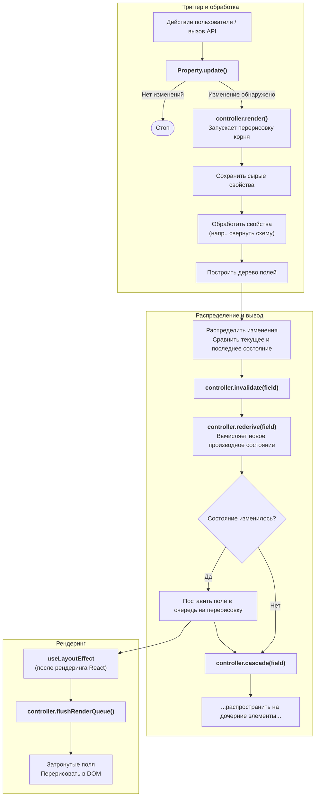

# 802: Пакет/UI

> [!DEFINITION] :term[Древовидная архитектура]{canonical="Tree Style Architecture"}
> Высокопроизводительная и гибкая система рендеринга UI, которая работает эффективно благодаря специальной архитектуре контроллера, проверке каждого свойства и умной системе вывода на основе зависимостей.

> Sidenote:
> - Требования:
>   - :term[800: Пакет/Схимия]{href="./800_package_schemistry.md"}

**:term[Пакет UI]{canonical="UI Package"}** реализует **:term[Древовидную архитектуру]{canonical="Tree Style Architecture"}** — движок рендеринга, разработанный для расширения концепции форм, управляемых :term[схемой]{canonical="Schema"}, в универсальный **:term[движок авто-дизайна]{canonical="Auto-Design Engine"}**.

## Видение: Больше, чем просто формы

Хотя изначально библиотека была вдохновлена такими проектами, как `react-jsonschema-form`, она выходит за рамки простой привязки данных. Она работает как система шаблонов, где **:term[Схема]{canonical="Schema"}** (структура) и **:term[Данные]{canonical="Data"}** (содержимое) подаются в движок, который автоматически отображает соответствующий UI.

Эта возможность «Авто-дизайна» позволяет представлять одну и ту же базовую модель в различных режимах:

- **Режим редактирования**: полностью интерактивная форма для ввода данных.
- **Режим просмотра**: стилизованное представление только для чтения.

Такая универсальность гарантирует, что единый источник истины — :term[Схема]{canonical="Schema"} — управляет как вводом данных, так и их представлением.

## Ключевая архитектура

### Динамическая система свойств с выводами

Система построена вокруг саморасширяющегося контроллера. Вместо фиксированного набора функций модульные **:term[Свойства]{canonical="Properties"}** регистрируют себя и свои взаимозависимости, создавая мощный граф вывода.

- **Саморегистрация**: :term[Свойства]{canonical="Properties"} (например, `data`, `schema`, `vars`) являются модульными и регистрируются автоматически при импорте.
- **Объявление зависимостей**: :term[Свойства]{canonical="Properties"} объявляют свои потребности (например, `styles` зависит от `vars` и `settings`).
- **Цепочки выводов**: Когда базовое свойство изменяется, контроллер автоматически пересчитывает зависимые свойства в топологическом порядке, обеспечивая согласованность :term[состояния]{canonical="state"}.
- **Типобезопасность**: Определение типа контроллера выводится из объединения всех зарегистрированных свойств.

### Пользовательские свойства

Динамическая система свойств обеспечивает глубокую расширяемость. Разработчики могут регистрировать пользовательские свойства для реализации специфической для домена логики, такой как:

- **Слоты**: Определение, какие компоненты UI отображать на основе `styles`.
- **Ошибки**: Выполнение валидации на основе `data` и `schema`.
- **Пользовательская логика**: Реакция на определенные условия данных для изменения поведения UI.

### Темизируемая система компонентов

Движок рендеринга отделен от конкретных UI-фреймворков с помощью системы **:term[Тем]{canonical="Theme"}**. Это организует поток от абстрактных данных к конкретным пикселям:

1.  **:term[Схема]{canonical="Schema"}**: Определяет структуру и иерархию.
2.  **Контроллер**: Обрабатывает схему и данные в определенное `state` для каждого поля.
3.  **Vars**: Переменные, похожие на CSS, декларативно назначают компоненты `Atom` именованным `slots`.
4.  **Атомы**: Компоненты самого нижнего уровня (например, `<Input />`), которые привязываются к состоянию поля.
5.  **Поля**: Оркестраторы, которые составляют `Atoms` на основе текущих `vars`.

Такое разделение позволяет настраивать каждый уровень, от обработки данных до финального рендеринга.

## Управление состоянием

Контроллер централизованно управляет :term[состоянием]{canonical="state"} дерева, используя **:term[Структурное разделение]{canonical="Structural Sharing"}**, чтобы минимизировать использование памяти и максимизировать производительность.

- **Сырые свойства (Raw Props)**: Источник истины (`data`, `vars`), который никогда не изменяется. Поддерживает как управляемый, так и неуправляемый режимы.
- **Текущее состояние (`controller.current`)**: Обработанное, производное состояние, распределяемое по полям.
- **Последнее состояние (`controller.last`)**: Снимок, используемый для дифференциальных обновлений.

Поля не хранят локальные копии данных; они ссылаются на срезы центрального дерева состояний `controller.current`. Это обеспечивает согласованность во всем UI.

## Конвейер обновлений и выводов

Контроллер использует единый конвейер для всех обновлений, обеспечивая предсказуемый поток :term[состояния]{canonical="state"}.

1.  **Триггер**: Событие (ввод пользователя, вызов API) запускает метод `update` свойства.
2.  **Обработка**: Сырые свойства обрабатываются в согласованное внутреннее состояние (`controller.current`).
3.  **Распределение**: Контроллер сравнивает `current` и `last`, чтобы определить измененные поля.
4.  **Инвалидация и вывод**:
    - **`rederive()`**: Пересчитывает зависимые свойства (например, `styles`) для затронутых полей.
    - **`cascade()`**: Распространяет изменения (например, CSS-переменные) вниз по дочерним элементам.
5.  **Рендеринг**: Обновления ставятся в очередь и выполняются одним пакетом через `useLayoutEffect`.

### Диаграмма архитектуры: Жизненный цикл обновления



## Производительность

Архитектура минимизирует накладные расходы на сверку (reconciliation) в React за счет:

- **Точное обнаружение изменений**: Глубокие проверки на равенство и сравнение состояний гарантируют, что обновляются только действительно измененные поля.
- **Выборочная инвалидация**: Граф вывода гарантирует, что пересчитываются только зависимые свойства.
- **Пакетный рендеринг**: Множественные изменения объединяются в один цикл обновления DOM.
- **Умное каскадирование**: Наследование переменных кэшируется и вызывает перерисовку только тогда, когда итоговый результат (например, объект `style`) действительно меняется, что эффективно устраняет дублирование обновлений.

## Справочник API

### Методы контроллера

```typescript
// Обновить свойство поля
controller.update(path: string, property: string, value: any): Promise<boolean>

// Объединить с существующим значением свойства
controller.merge(path: string, property: string, value: object): Promise<boolean>

// Получить значение свойства
controller.get(property: string, path?: string): any

// Унаследовать значение свойства вверх по дереву
controller.inherit(property: string, path: string, key?: string): any

// Зарегистрировать подписчика поля
controller.register(path: string, forceRender: () => void): () => void
```

### Пример регистрации свойства

```typescript
const StylesProperty = {
  priority: 50,
  fieldDefaults: { styles: {} },
  dependencies: ['vars', 'settings'],

  derive: field => {
    const newStyles = getComputedFieldStyles(
      field.mode,
      varName => field.controller.inherit('vars', field.path, varName),
      field.type
    );
    return { styles: newStyles };
  },

  invalidate: (field, controller, newValue, oldValue) => {
    controller.rederive(field, ['styles']);
    controller.cascade(field, ['styles']);
  },
};

Property.register('styles', StylesProperty);
```
