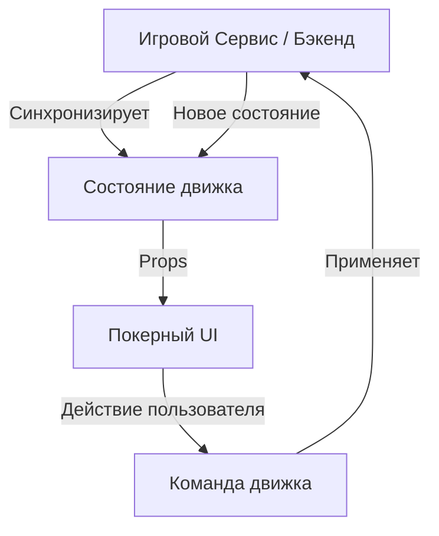

# 851: Пакет/Покерный UI

> [!DEFINITION] Покерный UI
> Чисто функциональная React UI-библиотека для Движка Покера. Она строго следует парадигме "контролируемого компонента", отображая предоставленное ей состояние игры и отправляя действия обратно потребителю, не содержа при этом никакой бизнес-логики.

> Sidenote:
> - Требуется:
>   - :term[851: Пакет/Движок Покера]{href="./851_package_poker_engine.md"}
> - Совместим с:
>   - :term[850: Пакет/Игровой Сервис]{href="./850_package_game_service.md"}

Пакет **Покерный UI** демонстрирует идеальную архитектуру для игровых интерфейсов в современной экосистеме с общим бэкендом. Он предоставляет полный, настраиваемый интерфейс покерного стола, который делегирует всю доменную логику :term[Движку Покера]{canonical="Poker Engine" href="./851_package_poker_engine.md"}.

## Философия

Этот проект обеспечивает строгое разделение между представлением и логикой:

1.  **Чистое Представление**: UI не содержит **никакой игровой логики**. Он не вычисляет победителей, не следит за соблюдением правил и не управляет очередностью ходов. Он просто отображает `Состояние`, предоставленное движком.
2.  **Контролируемый Ввод**: Следуя паттерну React "контролируемый компонент" (например, `<input value={...} onChange={...} />`), основной компонент `<PokerGame />` принимает свойство `state` и вызывает `onStateChange` (или отправляет команды) при взаимодействии с пользователем.
3.  **Регистрируемый Движок**: Он полностью полагается на :term[Движок Покера]{canonical="Poker Engine" href="./851_package_poker_engine.md"} для доменной логики, гарантируя, что фронтенд и бэкенд используют один и тот же набор правил.
4.  **Готовность к Сервису**: Он сразу совместим с :term[Игровым Сервисом]{canonical="Game Service" href="./850_package_game_service.md"}, что обеспечивает бесшовную многопользовательскую интеграцию.

## Архитектура

Архитектура основана на однонаправленном потоке данных, где бэкенд (или локальный экземпляр движка) является единственным источником истины.



Такое разделение ответственности открывает ключевые возможности:

- **Оптимистичные Обновления**: Действия могут применяться локально для мгновенной обратной связи в ожидании подтверждения от сервера.
- **Повторяемость**: В UI можно передать историю состояний, чтобы в точности воспроизвести раздачу.
- **Тестируемость**: UI можно тестировать со статическими JSON-фикстурами, не имитируя сложную игровую логику.

## Использование

Основной абстракцией является компонент `<PokerGame />`. Ему требуется объект `state` (соответствующий интерфейсу `State` Движка) и обработчик событий.

```tsx
import React, { useState } from 'react';
import * as Poker from '@idealic/poker-engine';
import { PokerUI } from '@idealic/poker-ui';
import '@idealic/poker-ui/src/style.scss';

const App = () => {
  // 1. Инициализация состояния (обычно с бэкенда)
  const [state, setState] = useState<Poker.State>(initialState);

  const handleStateChange = (newState: Poker.State) => {
    // 2. Оптимистичное обновление локального состояния
    setState(newState);

    // 3. Отправка действия на бэкенд (концептуально)
    // api.sendAction(newState.lastAction);
  };

  return (
    <PokerUI
      state={state}
      onStateChange={handleStateChange}
      author="Player1" // Перспектива для рендеринга (карманные карты и т. д.)
      options={{
        buyIn: 1000,
      }}
    />
  );
};
```

### Интеграция с Игровым Сервисом

При совместном использовании с :term[Игровым Сервисом]{canonical="Game Service" href="./850_package_game_service.md"} поток делегирует обработку бэкенду:

```tsx
// ... внутри вашего компонента
const handleStateChange = async (newState: Poker.State) => {
  // Сервис обрабатывает состояние (проверяя логику, переходя к следующим улицам)
  const processed = await Service.process(newState);
  setState(processed);
};
```

## Кастомизация

UI разработан с учетом расширяемости. Отдельные подкомпоненты можно переопределить через свойство `components`, сохраняя при этом общую структуру и логику.

```tsx
import { PokerUI, Card } from '@idealic/poker-ui';

// Пользовательский компонент карты
const MyCustomCard = props => <div className="my-fancy-card">{props.card}</div>;

<PokerUI
  state={state}
  components={{
    Card: MyCustomCard, // Переопределить компонент Card
    // Chips, Player, Board и др. также могут быть переопределены
  }}
/>;
```

## Стилизация

Стили по умолчанию предоставляются в файле `src/style.scss` и используют BEM-нотацию (например, `.poker-player`, `.poker-card`) для упрощения переопределения с помощью стандартного CSS.
