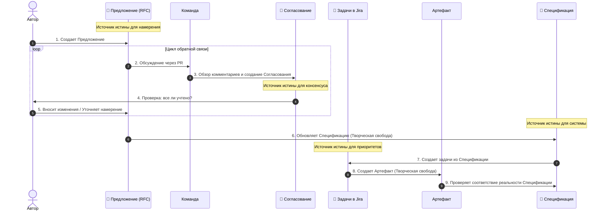

# 02: Компания/Процесс

> [!DEFINITION] Стандартный Процесс
> Операционный протокол для преобразования абстрактного видения в конкретное исполнение через разделение ответственности, итеративный синтез и высокочастотную синхронизацию.
>
> Sidenote:
> - Связано с: :term[00: Компания/Истина]{href="./50_prompt_truth.md" canonical="Company/Truth"}

Мы стоим на распутье. Чтобы выйти за рамки исследований и по-настоящему достигать, открывать и развиваться, мы должны изобрести и придерживаться строгого процесса.

## 1. Видение

Мы действуем, опираясь на ключевое убеждение: **При наличии правильной :term[Спецификации]{canonical="Specification"} исполнение становится тривиальным.**

В настоящее время мы вручную «внедряем» документы в код/презентации, одновременно создавая инструменты для автоматизации этого процесса. :term[Спецификация]{canonical="Specification"} выступает в роли централизованного источника истины. **Наличие этой истины делает финальную работу тривиальной и устраняет необходимость в микроменеджменте.**

Как только :term[Предложение]{canonical="Proposal"} одобрено, исполнение переходит в фазу **Творческой Свободы**. Инженер волен решать задачу так, как считает нужным, будучи ограниченным только рамками :term[Спецификации]{canonical="Specification"} и задачами, вытекающими из :term[Предложения]{canonical="Proposal"}.

**Важно: мы никогда не редактируем :term[Спецификацию]{canonical="Specification"} напрямую.** Процесс :term[Предложения]{canonical="Proposal"} не является опциональным; это необходимый шаг для внесения любых изменений в Источник Истины.

> [!DANGER] НЕ НАЧИНАТЬ РАБОТУ БЕЗ ОДОБРЕНИЯ
> Не начинайте «делать» (кодировать, проектировать в Figma), пока :term[Предложение]{canonical="Proposal"} не будет одобрено.
>
> - **Быстрый провал в проектировании:** Переписать :term[Предложение]{canonical="Proposal"} дёшево. Переписать код или переделать 20 слайдов — дорого.
> - **Сначала высокий уровень:** Решайте задачу на уровне замысла и направления, прежде чем исправлять симптомы.

## 2. Артефакты

Мы разделяем нашу работу на три конкретных этапа для обеспечения ясности, безопасности и согласованности.

### :term[20: Спецификация]{href="./20_document_spec.md" canonical="Specification"} (Истина)

Постоянное место назначения. Это строгая, постоянно развивающаяся спецификация нашей системы. Это единственный источник истины.

- **Следование Истине:** Она строго следует стандартам, определенным в :term[00: Компания/Истина]{href="./50_prompt_truth.md" canonical="Company/Truth"}. Она должна быть самодостаточной и свободной от двусмысленности.
- **Корректность важнее скорости:** В отличие от временных документов, :term[Спецификация]{canonical="Specification"} должна быть абсолютно корректной. Лучше оставить раздел неопределенным, чем определить его неверно.
- **Карта:** Она описывает, _куда мы идем_. Это позволяет каждому члену команды понимать общую картину, не держа весь план в голове.
- **Работа со сложностью:** Для больших систем с «большой площадью поверхности» невозможно удержать весь контекст в памяти. :term[Спецификация]{canonical="Specification"} позволяет системе развиваться, сохраняя при этом единый источник истины.
- **Вечнозеленая:** Это абсолютный **Источник Истины для Системы** (Код, Презентация, Архитектура).

### :term[21: Предложение]{href="./21_document_proposal.md" canonical="Proposal"} (Предложение)

Временное предложение (RFC). Здесь мы безопасно формулируем то, что _хотим_ сделать. Это позволяет нам исследовать изменения, не нарушая истину.

- **Источник задач:** Этот документ является основой, из которой создаются конкретные инженерные задачи. Это **Источник Истины для Намерения** (и, следовательно, для Jira).
- **Разделение ответственности:** Он разделяет «Что мы хотим» и «Как мы это реализуем». Это позволяет нам обсуждать ценность идеи, не увязая в синтаксисе.
- **Безопасное исследование:** Это позволяет нам предлагать радикальные изменения, не нарушая источник истины. Если :term[Предложение]{canonical="Proposal"} отклонено, теряется только текстовый файл.
- **Контекст для машины:** LLM требуют точного контекста. Этот документ предоставляет «инструкцию-промпт» для машины.

### :term[22: Согласование]{href="./22_document_alignment.md" canonical="Alignment"} (Контракт)

Синтезированное соглашение. Это автоматически сгенерированное резюме нашего обсуждения. Оно гарантирует, что каждый голос услышан, и каждое решение явно зафиксировано перед началом исполнения.

- **Синтезированная мудрость:** Оно превращает ветвящееся обсуждение в плоский список технических требований. Оно отфильтровывает шум и сохраняет сигнал.
- **Динамический консенсус:** Это не просто лог; это рабочее пространство, где автор и рецензент согласовывают _новый_ план, возникший в ходе обсуждения.
- **Инструкция для машины:** Оно служит проверенным вводом для ИИ для выполнения изменений.
- **Локальная проверка:** Оно действует как локальный тест для автора, чтобы убедиться, что машина (а значит, и команда) полностью поняла обратную связь перед переходом к исполнению.
- **Одноразовый:** Это одноразовый артефакт, который служит **Источником Истины для Ревью**. Он **никогда не коммитится** в репозиторий.

## 3. Цикл Консенсуса

Мы не просто «пишем код». Мы следуем циклу:

1.  **Составление Предложения:** Автор создает :term[Документ Предложения]{href="./21_document_proposal.md" canonical="Proposal Document"}, описывающий проблему и предлагаемое решение.
2.  **Обсуждение:** Команда рецензирует :term[Предложение]{canonical="Proposal"} через Pull Request. Здесь происходят комментарии, вопросы и дебаты.
3.  **Синтез Согласования:** Мы используем ИИ для генерации :term[Документа Согласования]{href="./22_document_alignment.md" canonical="Alignment Document"} из обсуждения. Это превращает «комментарии» в «требования».
4.  **Ревью и регенерация:** Автор проверяет :term[Документ Согласования]{canonical="Alignment Document"}. Если он неточен, **не редактируйте его**. Добавьте уточняющие комментарии в PR и регенерируйте документ, пока он не пройдет «Тест на понимание».
5.  **Обновление Спецификации:** После согласования мы обновляем :term[Спецификацию]{href="./20*document_spec.md" canonical="Specification"}, чтобы отразить новый дизайн, \_прежде* чем писать код. Это творческий шаг, где «Что» превращается в «Как».
6.  **Создание задач:** Мы создаем **Задачи в Jira** на основе обновленной :term[Спецификации]{canonical="Specification"}.
7.  **Создание Артефакта:** Мы создаем конечный продукт (Код, Презентация и т.д.).

> [!NOTE] Не Бюрократия, а Ясность
> Этот процесс не про ограничения; он про сохранение.
>
> - **:term[Предложение]{canonical="Proposal"}** сохраняет намерение (Источник Истины для Намерения).
> - **:term[Согласование]{canonical="Alignment"}** сохраняет консенсус (Источник Истины для Ревью).
> - **Jira** отслеживает приоритет (Источник Истины для Приоритетов).
> - **:term[Спецификация]{canonical="Specification"}** отслеживает реальность (Источник Истины для Системы).
>
> Налаживая коммуникацию и понимание _до_ начала исполнения, мы даем инженеру свободу работать с уверенностью.

> [!NOTE] Творческая Свобода и Планы Реализации
> На этапе **Исполнения** инженер/LLM может создать внутренний **План Реализации** (пошаговые технические инструкции). Это личный артефакт, используемый для преодоления разрыва между :term[Предложением]{canonical="Proposal"} и Кодом. Он **не** требует командного ревью. Пока результат соответствует согласованному :term[Предложению]{canonical="Proposal"}, «как» остается на усмотрение создателя.

> [!WARNING] Обработка Отклонений
> Если в ходе исполнения вы обнаружили недостаток в плане или необходимость отклониться от согласованного подхода, вы **ОБЯЗАНЫ** вернуться назад. Обновите :term[Предложение]{canonical="Proposal"} или создайте новое. Не отклоняйтесь от консенсуса молча.

## 4. Ритуал Синхронизации

> [!DEFINITION] Звонки 1-на-1
> Высокочастотные человеческие контакты, предназначенные для разблокировки исполнения, ответов на вопросы и поддержания взаимного доверия.

Мы ежедневно синхронизируемся, чтобы предотвратить расхождение, которое возникает, когда люди работают в изоляции.

- **Ежедневные 10-минутные 1-на-1:** Краткая, интенсивная встреча с руководством, чтобы убедиться, что компас все еще показывает верное направление.
- **Подготовка обязательна:** Участники должны приходить с подготовленными темами.
- **Безопасность процесса:** Этот ритуал устраняет тревогу перед неизвестностью.

## 5. Роль Машины

Мы используем ИИ не для замены нашего мышления, а для его усиления. Машина — это рычаг; :term[Документ Согласования]{canonical="Alignment Document"} — точка опоры.

- **Диктуйте для определения:** Мы часто диктуем наши сырые мысли, чтобы уловить нюансы намерения.
- **Ввод для исполнения:** :term[Документ Согласования]{canonical="Alignment Document"} служит основным вводом для LLM.
- **Проверка вывода:** Мы оцениваем вывод LLM по стандарту, определенному в наших документах.

## Итог

Мы меняем иллюзию свободы на реальность прогресса. Ограничивая _как_ мы принимаем решения, мы освобождаем _что_ мы можем достичь.
