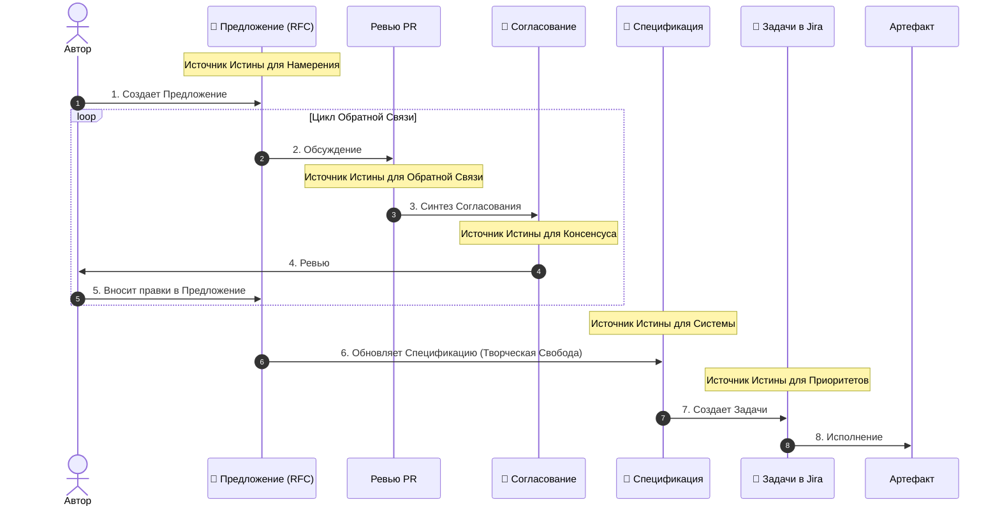

# 02: Компания/Процесс

> [!DEFINITION] Стандартный Процесс
> Операционный протокол, который превращает абстрактное видение в конкретные действия через совместную ответственность, постоянные улучшения и частую синхронизацию.

> Sidenote:
> - Связано с: :term[00: Компания/Истина]{href="./50_prompt_truth.md" canonical="Company/Truth"}

Мы стоим на распутье. Чтобы выйти из фазы исследования и по-настоящему достигать, открывать и двигаться вперёд, нам необходимо создать и придерживаться дисциплинированного процесса.

## 1. Видение

Мы работаем, исходя из ключевого убеждения: **При наличии правильной :term[Спецификации]{canonical="Specification"} исполнение становится тривиальным.**

Сейчас мы вручную «реализуем» документы в код или презентации, одновременно создавая инструменты для автоматизации этого процесса. :term[Спецификация]{canonical="Specification"} выступает централизованным :term[источником истины]{canonical="source of truth"}. **Наличие этой истины делает конечную работу тривиальной и устраняет необходимость в микроменеджменте.**

Как только :term[Предложение]{canonical="Proposal"} одобрено, исполнение переходит в фазу **Творческой Свободы**. Инженер волен решать задачу так, как считает нужным, будучи ограниченным только рамками :term[Спецификации]{canonical="Specification"} и задачами (тикетами), созданными на основе :term[Предложения]{canonical="Proposal"}.

**Важно: мы никогда не редактируем :term[Спецификацию]{canonical="Specification"} напрямую.** Процесс :term[Предложения]{canonical="Proposal"} не является необязательным; это необходимый шаг для внесения любых изменений в :term[Источник Истины]{canonical="Source of Truth"}.

> [!DANGER] НИКАКОЙ РАБОТЫ БЕЗ ОДОБРЕНИЯ
> Не начинайте «делать» (кодировать, проектировать в Figma), пока :term[Предложение]{canonical="Proposal"} не будет одобрено.
>
> - **Быстро ошибайтесь на этапе проектирования:** Переписать :term[Предложение]{canonical="Proposal"} дёшево. Переписывать код или переделывать 20 слайдов — дорого.
> - **Сначала решайте на высоком уровне:** Определите намерение и направление, прежде чем бороться с симптомами.

## 2. Артефакты

Мы разделяем нашу работу на три конкретных этапа, чтобы обеспечить ясность, безопасность и согласованность.

### :term[20: Спецификация]{href="./20_document_spec.md" canonical="Specification"} (Истина)

Постоянное место назначения. Это строгая, постоянно развивающаяся спецификация нашей системы. Это единственный :term[источник истины]{canonical="source of truth"}.

- **Следование Истине:** Она строго следует стандартам, определённым в :term[00: Компания/Истина]{href="./50_prompt_truth.md" canonical="Company/Truth"}. Она должна быть самодостаточной и свободной от двусмысленности.
- **Корректность важнее скорости:** В отличие от временных документов, :term[Спецификация]{canonical="Specification"} должна быть абсолютно точной. Лучше оставить раздел неопределённым, чем определить его неверно.
- **Карта:** Она описывает _куда мы идём_. Это позволяет каждому члену команды понимать общую картину, не держа весь план в голове.
- **Управление сложностью:** Для больших систем с «большой площадью поверхности» невозможно удержать весь контекст в памяти. :term[Спецификация]{canonical="Specification"} позволяет системе развиваться, сохраняя при этом согласованный :term[источник истины]{canonical="source of truth"}.
- **Вечно актуальная:** Это абсолютный **:term[Источник Истины для Системы]{canonical="Source of Truth for the System"}** (Кода, Презентации, Архитектуры).

### :term[21: Предложение]{href="./21_document_proposal.md" canonical="Proposal"} (Предложение)

Временное предложение (RFC). Здесь мы безопасно формулируем то, что мы _хотим_ сделать. Это позволяет нам исследовать изменения, не искажая истину.

- **Источник Задач:** Этот документ является зерном, из которого вырастают конкретные инженерные задачи (тикеты). Это **:term[Источник Истины для Намерения]{canonical="Source of Truth for Intent"}** (и, следовательно, для Jira).
- **Разделение Ответственности:** Он разделяет «Что мы хотим» и «Как мы это реализуем». Это позволяет нам обсуждать ценность идеи, не увязая в синтаксисе.
- **Безопасное Исследование:** Он позволяет нам предлагать радикальные изменения, не нарушая :term[источник истины]{canonical="source of truth"}. Если :term[Предложение]{canonical="Proposal"} отклонено, теряется только текстовый файл.
- **Контекст для Машины:** LLM требуют точного контекста. Этот документ предоставляет «инструкцию-промпт» для машины.

### :term[22: Согласование]{href="./22_document_alignment.md" canonical="Alignment"} (Контракт)

Синтезированное соглашение. Это автоматически сгенерированная сводка нашего обсуждения. Она гарантирует, что каждый голос услышан, и каждое решение явно зафиксировано до начала исполнения.

- **Синтезированная Мудрость:** Она превращает ветвистое обсуждение в плоский список технических требований. Она отсеивает шум и оставляет только полезный сигнал.
- **Динамический Консенсус:** Это не просто журнал; это рабочее пространство, где автор и рецензент приходят к согласию по _новому_ плану, возникшему в ходе обсуждения.
- **Инструкция для Машины:** Она служит проверенными входными данными для ИИ для выполнения изменений.
- **Локальная Проверка:** Она выступает в роли локального теста для автора, чтобы убедиться, что машина (и, следовательно, команда) полностью поняла обратную связь, прежде чем переходить к исполнению.
- **Одноразовый:** Это одноразовый артефакт, который служит **:term[Источником Истины для Ревью]{canonical="Source of Truth for the Review"}**. Он **никогда не коммитится** в репозиторий.

## 3. Цикл Консенсуса

Мы не просто «пишем код» или «делаем слайды». Мы следуем циклу, который ставит намерение выше реализации. Мы не перескакиваем сразу к последней главе.

1.  **Создание Предложения:** Автор создаёт :term[Документ Предложения]{href="./21_document_proposal.md" canonical="Proposal Document"}, описывая проблему и предлагаемое решение.
2.  **Обсуждение:** Команда рецензирует :term[Предложение]{canonical="Proposal"} через Pull Request. Здесь происходят комментарии, вопросы и дебаты.
3.  **Синтез Согласования:** Мы используем ИИ для генерации :term[Документа Согласования]{href="./22_document_alignment.md" canonical="Alignment Document"} из обсуждения. Это превращает «комментарии» в «требования».
4.  **Ревью:** Автор проверяет :term[Документ Согласования]{canonical="Alignment Document"}. Если он неточен, **не редактируйте его**. Добавьте уточняющие комментарии в PR и сгенерируйте документ заново, пока он не пройдет «Тест на Понимание».
5.  **Внесение правок в Предложение:** Автор применяет :term[Согласование]{href="./22_document_alignment.md" canonical="Alignment"} к :term[Предложению]{href="./21_document_proposal.md" canonical="Proposal"}. Это гарантирует, что :term[Предложение]{canonical="Proposal"} отражает **конечное согласованное намерение**, а не только первоначальную идею. Затем :term[Предложение]{canonical="Proposal"} «Замораживается».
6.  **Обновление Спецификации:** Используя замороженное :term[Предложение]{canonical="Proposal"} в качестве руководства, мы обновляем :term[Спецификацию]{href="./20_document_spec.md" canonical="Specification"}, чтобы отразить новый дизайн, _прежде чем_ писать код. Это творческий шаг, где «Что» превращается в «Как».
7.  **Создание Задач:** Мы создаём **Задачи в Jira** на основе **Намерений**, изложенных в :term[Предложении]{href="./21_document_proposal.md" canonical="Proposal"}, и нового состояния :term[Спецификации]{href="./20_document_spec.md" canonical="Specification"}.
8.  **Исполнение:** Мы создаём конечный продукт (Код, Презентация и т.д.).

> [!NOTE] Не Бюрократия, а Ясность
> Этот процесс не про ограничения, а про сохранение.
>
> | Артефакт | Источник Истины для... | Роль |
> | :---------------- | :--------------------- | :---------------------------------------- |
> | **Предложение** | **Намерения** | Сохраняет авторское видение. |
> | **Ревью PR** | **Обратной связи** | Предоставляет исходные данные и критику. |
> | **Согласование** | **Консенсуса** | Синтезирует соглашение. |
> | **Jira** | **Приоритетов** | Отслеживает порядок исполнения. |
> | **Спецификация** | **Системы** | Отслеживает реальность. |
>
> Налаживая коммуникацию и понимание _до_ начала исполнения, мы даём инженеру свободу работать с уверенностью.

> [!NOTE] Творческая Свобода и Планы Реализации
> На этапе **Исполнения** инженер/LLM может создать внутренний **План Реализации** (пошаговые технические инструкции). Это личный артефакт, используемый для преодоления разрыва между :term[Предложением]{canonical="Proposal"} и Кодом. Он **не** требует командного ревью. До тех пор, пока результат соответствует согласованному :term[Предложению]{canonical="Proposal"}, «как» его достичь — остаётся на усмотрение исполнителя.

> [!WARNING] Обработка Отклонений (Микро-Цикл)
> Если во время исполнения вы обнаружили недостаток в плане или необходимость отклониться от согласованного подхода (например, «Мне нужно ещё 5 слайдов», «Эта архитектура не сработает»), вы **ОБЯЗАНЫ** вернуться к предыдущим шагам.
>
> - **Открытый PR:** Если PR всё ещё открыт, обновите существующее :term[Предложение]{canonical="Proposal"} и запросите повторное ревью. (Вы можете перегенерировать :term[Документ Согласования]{canonical="Alignment Document"}, чтобы зафиксировать только новую обратную связь).
> - **Закрытый PR / Исполнение:** Если исполнение уже началось, **не открывайте заново :term[Предложение]{canonical="Proposal"}**. Создайте новое Микро-Предложение для конкретного дополнения.
>
> **Не отклоняйтесь от консенсуса молча.** Неодобренные отклонения искажают :term[Источник Истины]{canonical="Source of Truth"}.

## 4. Ритуал Синхронизации

> [!DEFINITION] Звонки 1-на-1
> Высокочастотные личные контакты, предназначенные для устранения препятствий в работе, ответов на вопросы и поддержания взаимного доверия.

Мы ежедневно синхронизируемся, чтобы предотвратить рассогласование, которое возникает, когда люди работают в изоляции.

- **Ежедневные 10-минутные 1-на-1:** Короткий, интенсивный контакт с руководством, чтобы убедиться, что мы всё ещё движемся в верном направлении.
- **Подготовка обязательна:** Участники должны приходить с подготовленными темами.
- **Безопасность процесса:** Этот ритуал устраняет тревогу перед неизвестностью.

## 5. Роль Машины

Мы используем ИИ не для того, чтобы заменить наше мышление, а чтобы его укрепить. Машина — это рычаг; :term[Документ Согласования]{canonical="Alignment Document"} — точка опоры.

- **Диктуйте, чтобы определить:** Мы часто диктуем наши сырые мысли, чтобы уловить нюансы намерения.
- **Входные данные для исполнения:** :term[Документ Согласования]{canonical="Alignment Document"} служит основными входными данными для LLM.
- **Проверяйте результат:** Мы оцениваем результат работы LLM в соответствии со стандартом, определённым в наших документах.

## Резюме

Мы меняем иллюзию свободы на реальность прогресса. Ограничивая то, _как_ мы принимаем решения, мы освобождаем то, _чего_ мы можем достичь.
