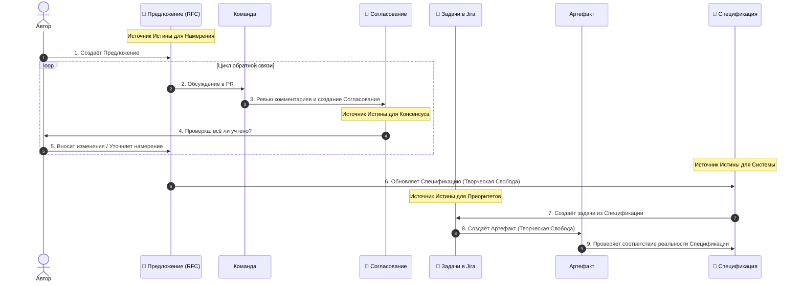

# 02: Компания/Процесс

> [!DEFINITION] Стандартный Процесс
> Это наш рабочий процесс, который превращает абстрактные идеи в конкретные результаты. Мы достигаем этого через общую ответственность, постоянное улучшение и частую синхронизацию.

> Sidenote:
> - В паре с: :term[00: Компания/Истина]{canonical="Company/Truth" href="./50_prompt_truth.md"}

Мы стоим на перепутье. Чтобы выйти за рамки исследований и начать по-настоящему достигать, открывать и двигаться вперёд, нам нужно разработать и придерживаться чёткого процесса.

## 1. Видение

Мы работаем, основываясь на ключевом убеждении: **При наличии правильной :term[Спецификации]{canonical="Specification"}, исполнение становится тривиальной задачей.**

Сейчас мы вручную «реализуем» документы в виде кода или презентаций, одновременно создавая инструменты для автоматизации этого процесса. **:term[Спецификация]{canonical="Specification"}** служит централизованным источником истины. **Наличие этой истины делает финальную работу тривиальной и устраняет необходимость в микроменеджменте.**

Как только :term[Предложение]{canonical="Proposal"} одобрено, исполнение переходит в фазу **Творческой Свободы**. Инженер волен решать проблему так, как считает нужным, будучи ограниченным лишь рамками **:term[Спецификации]{canonical="Specification"}** и задачами, вытекающими из :term[Предложения]{canonical="Proposal"}.

**Ключевой момент: мы никогда не редактируем :term[Спецификацию]{canonical="Specification"} напрямую.** Процесс создания :term[Предложения]{canonical="Proposal"} не является опциональным; это необходимый шаг для внесения любых изменений в Источник Истины.

> [!DANGER] НИКАКОЙ РАБОТЫ БЕЗ ОДОБРЕНИЯ
> Не начинайте «делать» (кодировать, проектировать в Figma) до тех пор, пока **:term[Предложение]{canonical="Proposal"}** не будет одобрено.
>
> - **Быстрые ошибки в проектировании:** Переписать :term[Предложение]{canonical="Proposal"} дёшево. Переписать код или переделать 20 слайдов — дорого.
> - **Сначала — высокий уровень:** Решите проблему на уровне намерения и направления, прежде чем бороться с симптомами.

## 2. Артефакты

Мы разделяем нашу работу на три отдельных этапа, чтобы обеспечить ясность, безопасность и согласованность.

### :term[20: Спецификация]{canonical="Specification" href="./20_document_spec.md"} (Истина)

Постоянный пункт назначения. Это строгая, постоянно развивающаяся спецификация нашей системы. Это единственный источник истины.

- **Следование Истине:** Она строго следует стандартам, определённым в :term[00: Компания/Истина]{canonical="Company/Truth" href="./50_prompt_truth.md"}. Она должна быть самодостаточной и не допускать двусмысленности.
- **Корректность важнее скорости:** В отличие от временных документов, :term[Спецификация]{canonical="Specification"} должна быть абсолютно точной. Лучше оставить раздел неопределённым, чем определить его неверно.
- **Карта:** Она описывает, _куда мы движемся_. Это позволяет каждому члену команды понимать общую картину, не держа весь план в голове.
- **Управление сложностью:** Для больших систем с «широкой зоной контакта» невозможно удержать весь контекст в памяти. :term[Спецификация]{canonical="Specification"} позволяет системе развиваться, сохраняя при этом целостный источник истины.
- **Вечно актуальна:** Это абсолютный **Источник Истины для Системы** (Кода, Презентаций, Архитектуры).

### :term[21: Предложение]{canonical="Proposal" href="./21_document_proposal.md"} (Предложение)

Временное предложение (RFC). Здесь мы безопасно формулируем, что мы _хотим_ сделать. Это позволяет нам исследовать изменения, не искажая истину.

- **Источник Задач:** Этот документ — основа, из которой создаются конкретные инженерные задачи. Это **Источник Истины для Намерения** (и, следовательно, для Jira).
- **Разделение ответственности:** Он разделяет «Что мы хотим» от «Как мы это реализуем». Это позволяет нам обсуждать ценность идеи, не увязая в деталях реализации.
- **Безопасное исследование:** Позволяет предлагать радикальные изменения, не нарушая источник истины. Если :term[Предложение]{canonical="Proposal"} отклонено, мы теряем только текстовый файл.
- **Контекст для машины:** LLM требуют точного контекста. Этот документ предоставляет «инструкцию-промпт» для машины.

### :term[22: Согласование]{canonical="Alignment" href="./22_document_alignment.md"} (Контракт)

Синтезированное соглашение. Это автоматически созданная сводка нашего обсуждения. Она гарантирует, что каждый голос услышан и каждое решение чётко зафиксировано до начала исполнения.

- **Синтезированная мудрость:** Преобразует ветвистую беседу в плоский список технических требований. Отфильтровывает шум и оставляет только суть.
- **Динамический консенсус:** Это не просто журнал; это рабочее пространство, где автор и рецензент согласовывают _новый_ план, возникший в результате обсуждения.
- **Инструкция для машины:** Служит проверенными входными данными для ИИ для выполнения изменений.
- **Локальная проверка:** Служит для автора локальным тестом, чтобы убедиться, что машина (а значит, и команда) полностью поняла обратную связь, прежде чем переходить к исполнению.
- **Одноразовый:** Это одноразовый артефакт, который служит **Источником Истины для Ревью**. Он **никогда не коммитится** в репозиторий.

## 3. Цикл достижения консенсуса

Мы не просто «пишем код». Мы следуем циклу:

1.  **Создание Предложения:** Автор создаёт :term[Документ Предложения]{canonical="Proposal Document" href="./21_document_proposal.md"}, описывающий проблему и предлагаемое решение.
2.  **Обсуждение:** Команда рецензирует :term[Предложение]{canonical="Proposal"} через Pull Request. Здесь происходят комментарии, вопросы и дебаты.
3.  **Синтез Согласования:** Мы используем ИИ для генерации :term[Документа Согласования]{canonical="Alignment Document" href="./22_document_alignment.md"} из обсуждения. Это превращает «комментарии» в «требования».
4.  **Ревью и регенерация:** Автор проверяет :term[Документ Согласования]{canonical="Alignment Document"}. Если он неточен, **не редактируйте его**. Добавьте уточняющие комментарии в PR и регенерируйте документ, пока он не пройдёт «Тест на понимание».
5.  **Обновление Предложения:** Автор применяет :term[Согласование]{canonical="Alignment" href="./22_document_alignment.md"} обратно к :term[Предложению]{canonical="Proposal" href="./21_document_proposal.md"}. Это гарантирует, что :term[Предложение]{canonical="Proposal"} отражает **конечное согласованное намерение**, а не только первоначальную идею. Затем :term[Предложение]{canonical="Proposal"} «замораживается».
6.  **Обновление Спецификации:** Используя замороженное :term[Предложение]{canonical="Proposal"} как руководство, мы обновляем :term[Спецификацию]{canonical="Specification" href="./20_document_spec.md"}, чтобы отразить новый дизайн, _до_ написания кода. Это творческий шаг, где «Что» превращается в «Как».
7.  **Создание Задач:** Мы создаём **задачи в Jira** на основе **намерений**, изложенных в :term[Предложении]{canonical="Proposal" href="./21_document_proposal.md"}, и нового состояния :term[Спецификации]{canonical="Specification" href="./20_document_spec.md"}.
8.  **Создание Артефакта:** Мы создаём конечный продукт (код, презентацию и т. д.).

> [!NOTE] Не бюрократия, а ясность
> Этот процесс не про ограничения, а про сохранение.
>
> - **:term[Предложение]{canonical="Proposal"}** сохраняет намерение (Источник Истины для Намерения).
> - **:term[Согласование]{canonical="Alignment"}** сохраняет консенсус (Источник Истины для Ревью).
> - **Jira** отслеживает приоритет (Источник Истины для Приоритетов).
> - **:term[Спецификация]{canonical="Specification"}** отслеживает реальность (Источник Истины для Системы).
>
> Налаживая коммуникацию и понимание _до_ исполнения, мы даём инженеру свободу работать уверенно.

> [!NOTE] Творческая свобода и планы реализации
> На этапе **Исполнения** инженер/LLM может создать внутренний **План Реализации** (пошаговые технические инструкции). Это личный артефакт, используемый для преодоления разрыва между :term[Предложением]{canonical="Proposal"} и кодом. Он **не** требует командного ревью. Пока результат соответствует согласованному :term[Предложению]{canonical="Proposal"}, «как» остаётся на усмотрение создателя.

> [!WARNING] Обработка отклонений (Микроцикл)
> Если во время исполнения вы обнаруживаете недостаток в плане или необходимость отклониться от согласованного подхода (например, «Мне нужно ещё 5 слайдов», «Эта архитектура не сработает»), вы **ОБЯЗАНЫ** вернуться назад.
>
> - **Открытый PR:** Если PR всё ещё открыт, обновите существующее :term[Предложение]{canonical="Proposal"} и запросите повторное ревью.
> - **Закрытый PR / Исполнение:** Если исполнение началось, **не открывайте заново :term[Предложение]{canonical="Proposal"}**. Создайте новое Микро-Предложение для конкретного дополнения.
>
> **Не отклоняйтесь от консенсуса молча.** Неодобренные отклонения искажают Источник Истины.

## 4. Ритуал синхронизации

> [!DEFINITION] Звонки 1 на 1
> Высокочастотные личные контакты, предназначенные для устранения препятствий в работе, ответов на вопросы и поддержания взаимного доверия.

Мы синхронизируемся ежедневно, чтобы предотвратить рассогласование, которое возникает, когда люди работают в изоляции.

- **Ежедневные 10-минутные встречи один на один:** Краткий, интенсивный контакт с руководством, чтобы убедиться, что компас всё ещё указывает верное направление.
- **Подготовка обязательна:** Участники должны приходить с подготовленными темами.
- **Безопасность процесса:** Этот ритуал устраняет тревогу неизвестности.

## 5. Роль машины

Мы используем ИИ не для замены нашего мышления, а для его укрепления. Машина — это рычаг; :term[Документ Согласования]{canonical="Alignment Document"} — точка опоры.

- **Диктуйте, чтобы определить:** Мы часто диктуем наши сырые мысли, чтобы уловить нюансы намерения.
- **Входные данные для исполнения:** :term[Документ Согласования]{canonical="Alignment Document"} служит основными входными данными для LLM.
- **Проверка результата:** Мы оцениваем результат работы LLM по стандарту, определённому в наших документах.

## Итог

Мы меняем иллюзию свободы на реальность прогресса. Ограничивая то, _как_ мы принимаем решения, мы освобождаем то, _что_ мы можем достичь.
