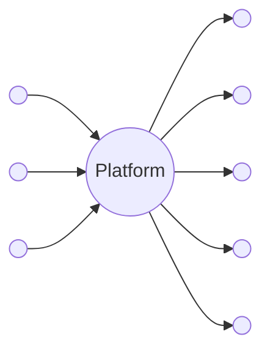
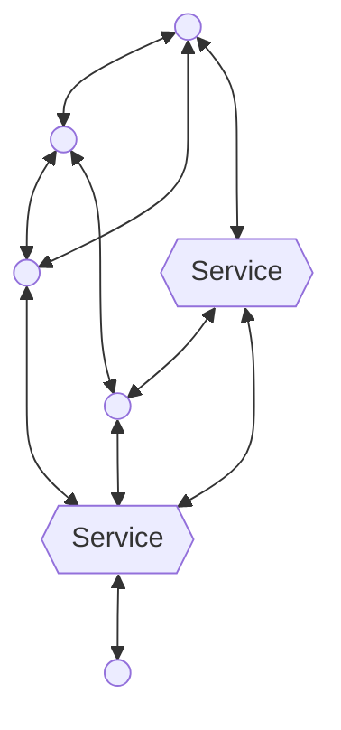

# Часть I: Видение

---

_Основная концепция — это глубокий философский и практический бунт против движения современного интернета к централизации. Наше видение — построить новую цифровую экосистему на основе децентрализации, вернув суверенную автономию личности и сообществу._

---

### (Глава 1) Основная Идея и Принципы

Вся экосистема построена на наборе простых, но мощных принципов, которые обеспечивают слаженность и компонуемость.

- **Всё есть Идея.** В основе системы лежит простой принцип: любой её элемент — будь то приложение, инструмент, документ или процесс — является Идеей. Это делает систему элегантной и целостной.

[RFC 101: Концепция/Идея](../acts/101_concept_idea.md)

- **Самодостаточность и самоописание.** Каждая Идея содержит собственную схему и контекст, что делает её полностью самоописываемой. Это позволяет любому клиенту или LLM понять её и взаимодействовать с ней без предварительных знаний.

[RFC 001: Агент/Запрос](../acts/001_agent_request.md)

- **У каждой Идеи может быть свой дом.** Любую Идею можно разместить на уникальном домене, предоставив ей постоянный адрес и интерфейс по умолчанию. Если это известный тип (например, статья), она получит специальный интерфейс. Если это Идеатор, она получит гибкий универсальный интерфейс.

[RFC 102: Концепция/Суверенитет](../acts/102_concept_sovereignty.md)

- **Идеаторы — это Идеи с вводом.** Идеатор — это Идея, настроенная на приём входных данных, что позволяет ей функционировать как вызываемый процесс.

- [RFC 103: Концепция/Идеатор](../acts/103_concept_ideator.md)
- [RFC 005: Агент/Ввод](../acts/005_agent_input.md)

- **Компонуемость по своей природе.** Система создана для компоновки. Поскольку некоторые Идеаторы (называемые Трансформаторами Идей) могут преобразовывать другие Идеи, их можно объединять в цепочки и организовывать в сложные рабочие процессы.

- **LLM как универсальный интерпретатор.** Опираясь на языковую модель для интерпретации и выполнения Идей на основе их самоописываемой структуры, вся система становится невероятно доступной и легко адаптируемой к новым сценариям использования.

[RFC 104: Концепция/Скрытое](../acts/104_concept_latent_.md)

- **Протокол живых Идей.** Мы обмениваемся не просто статичными данными, а живыми, развивающимися системами, которые могут расти и адаптироваться со временем через сотрудничество и компоновку.

---

### (Глава 2) Диагноз — Золотая клетка больших технологий

Основная проблема — это соблазнительная, но опасная сделка, которую предлагают крупные технологические компании. Сначала социальные сети обещали огромный охват и влияние, заманивая пользователей в свои закрытые экосистемы, где их данные собирались, а выбор ограничивался. Новейший этап этой сделки — мощные ИИ-инструменты, от которых многие не могут отказаться. Однако за это удобство приходится платить. Интегрируя эти платформы всё глубже в нашу жизнь, мы развиваем сильную зависимость, попадая в золотую клетку, построенную не вокруг личности, а вокруг нашего общего цифрового существования.

Типичная централизованная сеть, в которой платформа владеет всеми данными и контролирует каждого участника

---

### (Глава 3) Решение — Децентрализованный Ренессанс

Решение не в том, чтобы построить улучшенный «огороженный сад», а в том, чтобы полностью покинуть эти сады и освоить новый, открытый рубеж. Это возвращение к духу раннего, децентрализованного интернета, но адаптированного для эпохи ИИ. Этот ренессанс стоит на двух основах: новой архитектуре для идей и новой философии взаимодействия.

- **Видение автономии:** Мы предлагаем перейти от платформ к протоколу — открытому стандарту для обмена не просто статичным контентом, а живыми, функциональными идеями. Люди используют **локальные ИИ-модели** для вычислений и соединяются через **одноранговые сети**, сохраняя полный контроль над своими данными и цифровой жизнью. Цель — создать операционную систему для идей, где динамичные, интерактивные и интеллектуальные системы (например, саморегулирующийся бюджет или автоматически обновляемый план проекта) можно будет передавать так же легко, как документ, без центрального посредника.

В децентрализованной сети все участники и сервисы равны и соединяются друг с другом без посредников

- **Философия взаимодействия:** Эта архитектура позволяет кардинально изменить наше отношение друг к другу в сети. Акт обмена информацией перестаёт быть частью экономики бездумного, показного «овершеринга» и возвращается к своим истокам — **осознанному, намеренному дару** в кругу доверенных лиц. Это переход от глобального потока контента к значимым, локальным обменам, где главной валютой становятся доверие, качество и подлинная связь. Это позволяет людям создавать свои собственные «скрытые миры», давая им полный контроль над тем, как и с кем делиться своими идеями.