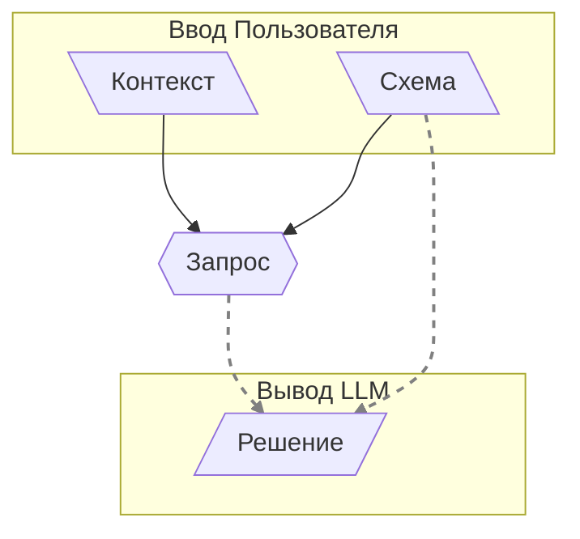

# 001: Агент/Запрос

> **Запрос:** Единичный, самодостаточный вызов LLM, который принимает `context` и `schema` и выдаёт `solution`. — [Глоссарий](./000_glossary.md)

- Позволяет: [101: Концепция/Идея](./101_concept_idea.md)

NPM: [https://www.npmjs.com/package/@augceo/agent](@idealic-ai/agent)

Этот документ описывает **Запрос**, который определяет фундаментальную единицу взаимодействия с LLM. `Request` — это механизм, который делает абстрактную [101: Концепция/Идея](./101_concept_idea.md) вычислимой, принимая её `context` и `schema` для генерации `solution`.

## Конвейер Запроса



`Request` — это не просто промпт. Это структурированный конвейер, который преобразует богатый, многосоставный контекст в единый, соответствующий схеме ответ от LLM.

### Контекст: Массив Сообщений

Основой `Request` является его `context`, который предоставляется в виде массива объектов `Message`. Это позволяет представить LLM сложный, многоэтапный или многоролевой диалог в структурированном виде.

Простой контекст может выглядеть так:

```json
[
  { "role": "system", "content": "Вы — полезный ассистент." },
  { "role": "user", "content": "Какая столица Франции?" }
]
```

### Пользовательские Типы Контента

Система расширяет эту базовую структуру, допуская **пользовательские типы контента** в сообщениях. Вместо обычной строки, `content` сообщения может быть структурированным объектом, например `{ "type": "state", "state": { ... } }`.

Эти пользовательские типы определяются и управляются системой `Content` (см. `agent/src/Content/Content.ts`). Каждый пользовательский тип регистрируется с обработчиком, и эти обработчики формируют конвейер обработки. По мере обработки каждого сообщения его обработчик может изменять три основных компонента `Request`:

- **Конфигурация LLM**: Настройка таких параметров, как модель, температура или другие опции.
- **Схема**: Изменение JSON-схемы, которой должен соответствовать конечный вывод.
- **Контекст**: Изменение итогового списка сообщений, который будет отправлен в LLM, например, путём преобразования пользовательского типа в текстовое представление или добавления новых сообщений.

Этот мощный механизм конвейера позволяет агенту работать с высокоуровневыми, структурированными концепциями, динамически создавая именно тот вызов LLM, который необходим для выполнения задачи.

### Схема: Направляя Решение

`schema` — это JSON Schema, которая определяет точную структуру желаемого `solution`. Это мощная система, позволяющая представлять любые типы данных, от простых строк до сложных вложенных объектов. LLM вынуждена генерировать `solution`, которое строго соответствует этой схеме, что гарантирует всегда хорошо структурированный и предсказуемый вывод.

По мере усложнения схем их можно проектировать так, чтобы они направляли не только конечный результат, но и процесс рассуждения LLM. Например, схема может включать поля для самих данных, а также отдельные поля, которые побуждают LLM изложить свои рассуждения, цепочку мыслей или оценку уверенности. Это превращает схему в активный инструмент для формирования процесса генерации.

Основным принципом этой архитектуры является композиция схем. Более сложные возможности создаются путём объединения более простых, повторно используемых компонентов схем, что обеспечивает модульный и масштабируемый подход к определению знаний и способностей агента.

### Выполнение и Решение

После обработки `context` итоговый массив сообщений и `schema` отправляются в LLM в одном запросе. Ответ LLM — это `solution`, структурированный документ на основе JSON, который строго соответствует предоставленной `schema`.

Этот процесс можно понимать как генерацию мини-повествования. Поскольку LLM работает как предсказатель следующего токена, она генерирует `solution` сверху вниз, следуя структуре `schema`. Порядок и дизайн полей схемы напрямую влияют на повествование, которое создаёт LLM.

Например, если схема сначала требует поле для мета-рассуждений (например, `"thought_process"`) перед полем для итоговых `data`, LLM вынуждена сначала сформулировать свои рассуждения, а затем выдать ответ. Первоначальное рассуждение становится частью контекста, который влияет на генерацию последующих данных. Этот мощный механизм позволяет нам направлять мышление LLM, давая значительный контроль над конечным результатом путём формирования самого пути к нему.

> [!TIP]
> Весь этот конвейер `Request` — `context`, `schema` и итоговый `solution` — образует самодостаточную, воспроизводимую единицу. При сохранении эта единица и есть то, что система называет [101: Концепция/Идея](./101_concept_idea.md).

## От Структурированного Вывода к Выбору Действий

`Request` предоставляет надёжный механизм для генерации единого, соответствующего схеме `solution`. Однако для создания сложных агентов нам нужно больше, чем просто структурированный вывод. Нам нужен способ представить LLM меню возможностей — отдельных действий, из которых она может выбирать для достижения цели. Это требует системы для определения этих действий как дискретных, выбираемых единиц.

- [002: Агент/Инструмент](./002_agent_tool.md)

Следующий документ, [002: Агент/Инструмент](./002_agent_tool.md), представляет протокол для определения этих возможностей.