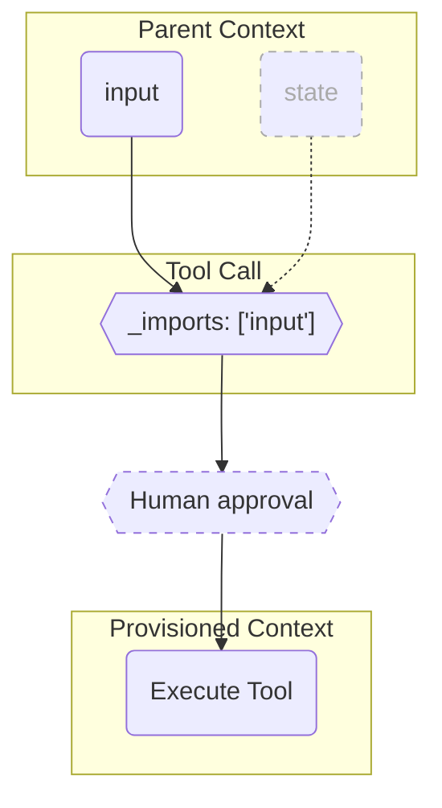

# 008: Агент/Импорты

> **Импорты:** Механизм, позволяющий сделать контролируемый набор данных из родительской среды доступным для исполнения. Свойство `_imports` работает как список разрешений, определяя сфокусированный и безопасный доступ к данным для `Call`. — [Глоссарий](./000_glossary.md)

> Sidenote: Требует: [002: Агент/Инструмент](./002_agent_tool.md), [004: Агент/Вызов](./004_agent_call.md).

**Протокол Импортов** — это основной механизм для управления контекстом, доступным для `Call`. В сложной агентной системе `Call` редко выполняется изолированно; ему часто требуется доступ к информации из родительской среды, например, к вводу пользователя, текущему состоянию или результатам предыдущих шагов. Протокол Импортов предоставляет безопасный и явный способ контролировать этот поток информации.

Ограничивая контекст, импорты повышают безопасность, предотвращают случайные утечки данных и фокусируют LLM, что делает исполнения более предсказуемыми и экономически эффективными. Этот контролируемый контекст также является ключом к модульности, позволяя таким компонентам, как `Ideas` и `Действия`, быть по-настоящему самодостаточными и повторно используемыми. Этот документ объясняет, как работает данный протокол и как он сочетается с другими возможностями агента.

## Предоставление и Запрос Контекста

Схема свойства `_imports` определяет, будет ли контекст статически **предоставлен** или динамически **запрошен** во время выполнения.

> Sidenote: 


- **Статические Импорты (Предоставление Контекста)**: Схема `_imports` может быть значением `const`, что означает, что контекст **предоставляется**. Разработчик жестко прописал точный контекст, который разрешено видеть инструменту.

  ```json
  {
    "_imports": {
      "const": ["input"]
    }
  }
  ```

- **Динамические Импорты (Запрос Контекста)**: Схема `_imports` может быть более гибкой, позволяя **запрашивать** контекст. LLM решает, какие из доступных импортов ей нужны для генерации `Call`.

  ```json
  {
    "_imports": {
      "type": "array",
      "items": {
        "enum": ["state", "input"]
      }
    }
  }
  ```

  Этот динамический подход особенно эффективен в сочетании с системой подтверждения человеком (human-in-the-loop), что обеспечивает важный уровень прозрачности и контроля.

## Роль Импортов в Композиции Call

Свойство `_imports` является основным механизмом для контроля контекста, доступного для `Call`. Оно работает как список разрешений, фильтруя родительскую среду, чтобы предоставить сфокусированное, ограниченное поле зрения для исполнения. Этот контролируемый контекст является основополагающим для обработки `Call`, и его роль адаптируется для поддержки композиционной модели исполнения, где могут сочетаться различные возможности, такие как явная логика, инстансинг и модульность.

- **Скрытое исполнение**: При скрытом исполнении по умолчанию `_imports` служат «подсказкой» для фокусировки внимания LLM на релевантных частях родительского контекста. Это скорее рекомендация, а не строгий фильтр, но она крайне важна для повышения надежности и экономической эффективности рассуждений LLM за счет уменьшения шума от нерелевантных данных.

  > Sidenote: [002: Агент/Инструмент](./002_agent_tool.md).

- **Явное исполнение (`_activity`)**: Когда `Call` основывается на детерминированном `Действии`, роль импортов становится более прямой. Импортированный контекст передается целиком в функцию `Действия` в качестве дополнительного параметра. Это дает `Действию` полный доступ к необходимым контекстуальным данным, даже если эти данные не были напрямую использованы LLM для генерации основных параметров `Call`.

  > Sidenote: [Акт 003: Агент/Действие](./003_agent_activity.md).

- **Инстансинг (`_instance`)**: В запросе с несколькими экземплярами, где агент обрабатывает пакет схожих объектов данных, импорты начинают учитывать конкретный экземпляр. Протокол гарантирует, что `Call`, нацеленный на определенный экземпляр, получит контекст только для _этого_ экземпляра. Это критически важно для поддержания целостности данных и предотвращения «утечки» контекста между параллельными исполнениями.

  > Sidenote: [011: Агент/Инстансинг](./011_agent_instancing.md)

- **Модульная Изоляция (`_module`)**: Когда `Call` делегируется внешнему `Модулю`, импорты выступают в роли стражей контекста. Они определяют _весь_ контекст для изолированного «чистого» исполнения модуля. Ничто из родительской среды не будет доступно модулю, если оно не было явно импортировано, что обеспечивает настоящую инкапсуляцию и возможность повторного использования.

  > Sidenote: [009: Агент/Модуль](./009_agent_module.md)

Свойство `_imports` — это мост, который позволяет `Call` получать контекст. Как показывает последний пример, когда этот механизм используется для предоставления _всего_ контекста для изолированного исполнения, он открывает возможности мощного **Протокола Модулей**. Следующий документ, [009: Агент/Модуль](./009_agent_module.md), подробно описывает этот протокол.