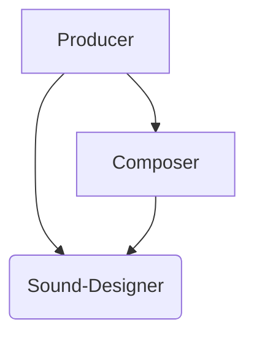

# 009: Агент/Модуль

> **Модуль**: протокол для изоляции контекста выполнения. Вызываемый свойством `_module` в `Call`, он выполняет `Activity` или новый `Request` в «чистой» среде, а свойство `_imports` обеспечивает контролируемый доступ к родительскому контексту. — [Глоссарий](./000_glossary.md)

> Sidenote: Требует [004: Агент/Вызов](./004_agent_call.md). Дополняется [008: Агент/Импорт](./008_agent_imports.md).

Хотя в предыдущих документах мы рассмотрели, как определяются и выполняются отдельные `Tools`, **Протокол Модулей** решает критическую задачу масштабирования и компоновки этих возможностей. Он предоставляет мощный механизм для выполнения `Tools` в изолированных «чистых» средах, предотвращая смешение контекстов и обеспечивая настоящую переиспользуемость. Делегируя `Call` внешнему модулю — будь то другая `Idea` или `Activity` в подзапросе — система может создавать сложное агентское поведение из самодостаточных, независимо разработанных компонентов.

## Проблема: Монолитные Инструменты и Смешение Контекста

По мере роста возможностей агента, определение всех `Tools` в едином, монолитном контексте становится непрактичным.

1.  **Большие схемы**: У LLM есть практические ограничения на сложность схем, которые они могут обработать в одном запросе. Объединение множества сложных `Tools` может превысить эти лимиты, не позволяя LLM правильно обработать доступные варианты.
2.  **Смешение контекста**: Когда все `Tools` работают в одном контексте, LLM может поддаться влиянию нерелевантной информации, что приводит к неправильному выбору `Tool` или заполнению его параметров.
3.  **Недостаток переиспользуемости**: `Tool`, определенный для одного агента, не так просто перенести на другой, не захватив с собой весь его контекст.

Протокол Модулей решает эти проблемы, вводя **Область Видимости Модуля** — способ делегировать `Call` во внешнюю, изолированную среду выполнения.

## Свойство `_module`

Область видимости модуля обозначается свойством `_module` в схеме `Tool`. Это свойство указывает системе рассматривать `Call` не как встроенную операцию, а как запрос к внешнему модулю.

Свойство `_module` является строкой (`string`) и может использоваться двумя способами:

- **Ссылка на `Idea`**: Строка может быть ссылкой на самодостаточную `Idea` — JSON-объект, содержащий свойства `context` и `schema`. Это позволяет `Tool` делегировать свое выполнение совершенно отдельному набору инструкций. Ссылка может быть предоставлена как:
  - Путь или URL к JSON-файлу (например, `../ideas/my-idea.json`).
  - Ссылка по протоколу `idea://`.

> Sidenote: Сохраненный, переиспользуемый [001: Агент/Запрос](./001_agent_request.md) является наиболее распространенной формой `Idea`. Протокол Модулей — это основной механизм для компоновки этих `Idea` в более сложные системы. Подробнее см. в [101: Концепция/Идея](./101_concept_idea.md).

- **Создание анонимного модуля**: Строковый литерал `'anonymous'` обозначает анонимный модуль. Он используется, когда вам нужна изолированная среда выполнения для `Activity` без накладных расходов на полный сохраненный контекст `Request`.

## Выполнение в «чистой» среде

Модуль предоставляет «чистую» среду для выполнения. Вместо того чтобы работать в оживленном контексте родительского агента, `Call` обрабатывается в новом, изолированном подзапросе. Контекст для этого подзапроса тщательно конструируется, а не наследуется.

Именно здесь [Протокол Импорта](./008_agent_imports.md) становится критически важным. Свойство `_imports` в схеме `Tool` действует как мост, явно объявляя, какие части родительского контекста должны быть «импортированы» в «чистую» среду модуля. Это дает родительскому агенту точный контроль над тем, что может видеть модуль, предотвращая смешение контекста и обеспечивая настоящую инкапсуляцию.

> Sidenote: [008: Агент/Импорт](./008_agent_imports.md)

## Обработка больших схем

Протокол Модулей также предлагает решение для управления `Tools` с очень большими или сложными схемами вывода. Вместо того чтобы включать громоздкую схему `_output` в основной запрос, — потенциально вытесняя другие инструменты, — можно определить `Tool` только с его входными параметрами (`input`) и указателем `_module`.

LLM может спланировать `Call`, имея только входные данные, а сложный вывод будет сгенерирован в изолированном подзапросе модуля. Это позволяет агенту рассуждать о последовательности сложных операций, не имея необходимости «видеть» всю подробную схему для каждого шага в одном контекстном окне. LLM доверяет, что модуль произведет правильный вывод, который она получит и использует на последующих шагах.

## Стратегии разрешения модулей

`Tool` становится `Module` простым добавлением свойства `_module` в его схему. Это сигнализирует о том, что `Call` должен быть делегирован. Ключевой вопрос в том, _когда_ это делегирование происходит. Система поддерживает две стратегии, позволяя найти компромисс между строгой безопасностью и динамической гибкостью.

### 1. Разрешение во время выполнения (по умолчанию)

Стандартный и наиболее гибкий подход — это разрешение модуля во **время выполнения**, после того как агент уже сгенерировал `Call`.

Этот метод открывает мощную парадигму, невозможную в традиционном программировании: **LLM действует как интеллектуальный «клей».** Агент может сгенерировать `Call` с параметрами, которые не идеально соответствуют ожидаемой `input` схеме модуля. Во время выполнения система собирает контекст модуля и предоставленные вызывающей стороной входные данные, а LLM в подзапросе получает задачу устранить этот разрыв.

Это существенное преимущество, так как оно позволяет модулям обновляться и развиваться независимо. Даже если модуль изменит свою входную структуру, вызывающие его агенты не сломаются сразу. LLM попытается адаптировать старый формат `Call` к новой `input` схеме, обеспечивая уровень устойчивости и слабой связанности, уникальный для этой архитектуры.

Процесс выглядит следующим образом:

1.  Агент генерирует `Call` к модульному `Tool`.
2.  Исполнитель видит свойство `_module` и запускает протокол.
3.  **Сборка контекста**: Исполнитель извлекает `Idea` модуля (если он не анонимный) и собирает базовый контекст. Затем он использует `_imports`, чтобы добавить контекст вызывающей стороны.
4.  **Отображение входа**: Параметры (`params`) из `Call` упаковываются во `Input Message` (Входное Сообщение) и добавляются в контекст. Именно здесь вступает в игру «клеящая» способность LLM, так как она будет использовать эти входные данные для выполнения логики модуля, даже если схемы не совпадают идеально.
5.  **Выполнение**: Создается новый, изолированный `Request` с объединенным контекстом. Результат возвращается как вывод исходного `Call`.

### 2. Предварительное разрешение (опционально)

Для сценариев, требующих более строгих гарантий, модуль может быть разрешен **предварительно**, до отправки начального `Request` агенту.

В этом режиме система предварительно загружает `Idea` модуля и объединяет его `input` схему со схемой параметров `Tool`. Это позволяет LLM агента видеть точные требования модуля с самого начала, гарантируя, что сгенерированный `Call` будет идеально сформирован и типобезопасен. Важно, что это предварительное слияние может также включать `_output` схему модуля, обеспечивая строгий контракт для ожидаемого результата.

Этот подход обеспечивает безопасность традиционных API-контрактов, где и входы, и выходы известны и проверены. Он жертвует гибкостью разрешения во время выполнения и лучше всего подходит для критически важных, четко определенных интеграций, где слабая связанность не является желательной чертой.

## Композиция и переиспользуемость: Композитор и Звукорежиссер

Модули обеспечивают мощную композицию, позволяя `Ideas` действовать как автономные сервисы, которые могут быть оркестрованы другими агентами. Это создает ясную, динамичную иерархию: высокоуровневые агенты могут сосредоточиться на оркестрации, делегируя специализированные задачи низкоуровневым, переиспользуемым модулям.

Рассмотрим рабочий процесс с двумя специализированными модулями: **`Composer`** (Композитор) и **`Sound-Designer`** (Звукорежиссер).

- **`Sound-Designer`** (Звукорежиссер) — это низкоуровневый эксперт. Это самодостаточная `Idea` (`idea://sound-designer`), сфокусированная на физике звука и знающая, как управлять синтезаторами для создания конкретных аудиоданных.
- **`Composer`** (Композитор) — это специалист среднего уровня. Его основная задача — создать песню. Он использует свои собственные встроенные инструменты для генерации мелодии и музыкальной структуры. Чтобы воплотить этот замысел, он затем делает `Calls` к модулю `Sound-Designer` для синтеза реальных звуков.

Эта двухуровневая иерархия — распространенный шаблон. Однако истинная мощь модулей заключается в их динамичной, управляемой задачами композиции.

Теперь давайте введем высокоуровневого агента-**`Producer`** (Продюсера). Цель `Producer` — создать готовую запись. В зависимости от конкретной задачи, `Producer` может оркестровать свои модули по-разному:

> Sidenote: Такая схема обеспечивает гибкую оркестрацию. Высокоуровневый `Producer` может делегировать задачу `Composer`, который, в свою очередь, использует `Sound-Designer`. Однако `Producer` также может обойти `Composer` и напрямую взаимодействовать с `Sound-Designer` для выполнения конкретных задач.

- **Иерархическая оркестрация**: для создания песни `Producer` может сделать один `Call` к модулю `Composer`. `Producer` дает общие указания («Мне нужна грустная баллада»), а `Composer` выполняет весь свой внутренний рабочий процесс, включая собственные вложенные `Calls` к `Sound-Designer`. В этом случае `Producer` не обязательно знать о существовании `Sound-Designer`.
- **Параллельная оркестрация**: если `Producer` также нужны конкретные звуковые эффекты для записи (например, шумы или эмбиент), он может делать `Calls` напрямую к модулю `Sound-Designer` для этих задач, параллельно с `Call` к `Composer`.

Это демонстрирует ключевой принцип: композиция не является фиксированной внутри самих инструментов. `Producer` может рассматривать `Composer` как черный ящик или взаимодействовать с его составными частями (`Sound-Designer`) напрямую, в зависимости от текущих потребностей. Эта гибкость позволяет комбинировать один и тот же набор экспертных модулей в различных аранжировках, создавая глубоко компонуемую и эмерджентную систему.

## От модулей к памяти

Модули обеспечивают мощную инкапсуляцию для отдельных возможностей, но сложные, многошаговые рабочие процессы требуют памяти. Агенту нужен способ поддерживать постоянное состояние между `Calls` для отслеживания прогресса, обучения на основе предыдущих результатов и выполнения долгосрочных планов. Это мост от изолированных действий к целостному, состоятельному выполнению.

Следующий документ, [010: Агент/Состояние](./010_agent_state.md), описывает протокол для управления этим постоянным состоянием.