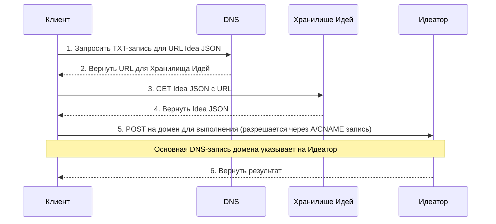

# 102: Концепция / Суверенитет

> Sidenote:
>
> - Требования:
>   - [101: Концепция / Идея](./101_concept_idea.md)
>   - [103: Концепция / Идеатор](./103_concept_ideator.md)

## 1. Введение

Этот документ описывает протокол **Суверенитета**, который определяет спектр автономии, доступный создателям в экосистеме. Он описывает многоуровневую архитектуру для хостинга и исполнения, позволяя участникам выбирать желаемый уровень контроля: от использования полностью управляемых сервисов до самостоятельного развертывания полного, суверенного решения.

Эта модель — практический мост между абстрактным `Ideator` и конкретным, работающим сервисом.

## 2. Многоуровневая Архитектура

Экосистема состоит из пяти отдельных уровней (1-5), каждый из которых строится на базовом уровне **Децентрализованной Идентичности**, определенном в [101: Концепция / Идея](./101_concept_idea.md). Эта модель позволяет создателям участвовать на том уровне, который соответствует их потребностям — от простой децентрализованной идентичности до полнофункционального, управляемого веб-сервиса.

> Эту модель полезно рассматривать как спектр автономии. На одном конце находится управляемый сервис, обеспечивающий удобство. На другом конце — **полный суверенитет**: использование собственного домена и самостоятельное размещение всех сервисов, что фактически делает вас собственным провайдером. Управляемые уровни служат необязательным, последовательным мостом между этими двумя состояниями.

#### Единый Поток Запросов: Суверенитет Пользователя через DNS

Диаграмма ниже иллюстрирует два основных взаимодействия с Идеей: получение её определения (`GET`) и её выполнение как сервиса (`POST`). Она показывает, как стандартные DNS-записи дают пользователю полный контроль над маршрутизацией.

**DNS-запись пользователя — это плоскость управления.** `TXT`-запись домена указывает на местоположение файла определения `Idea` в формате JSON (`Idea Storage`). Основная `A` или `CNAME` запись домена указывает на конечную точку выполнения (`Ideator`). Управляя этими двумя записями, пользователь направляет весь трафик, решая, использовать ли управляемые сервисы или собственную инфраструктуру.

### Уровень 1: Управляемый Хостинг

Этот уровень предоставляет немедленное и простое решение для хостинга исходного файла Ideator.

- **Как это работает:** В качестве простой точки входа мы предлагаем разместить исходный файл Ideator пользователя в нашем S3-бакете. Созданная нами `TXT`-запись для их управляемого поддомена будет указывать на этот S3 URL. В любой момент пользователь может разместить файл в другом месте и обновить свою `TXT`-запись, чтобы она указывала на новое местоположение (например, на собственный сервер, IPFS и т.д.).
- **Цель:** Избавить создателей от необходимости организовывать собственный хостинг файлов только для того, чтобы начать работу.

---

### Уровень 2: Генерация Статического UI

Этот уровень делает Ideator'ы доступными и полезными для людей без каких-либо вычислений на стороне сервера.

- **Как это работает:** Для всех доменов Ideator, которые подключают эту услугу, отдается общая статическая веб-страница. Когда пользователь заходит на домен Ideator в браузере, клиентский JavaScript на этой странице выполняет запрос DNS-over-HTTPS (DoH) для получения `TXT`-записи домена, извлекает исходный URL (с хостинга Уровня 1), получает файл определения Ideator и динамически отрисовывает пользовательский интерфейс.
- **Цель:** Предоставить бесплатное, готовое к использованию веб-приложение для любого Ideator, снижая порог входа.

---

### Уровень 3: Конечная точка GET на базе CDN

Этот уровень улучшает межмашинное взаимодействие для чтения определения Идеи.

- **Как это работает:** Размещая CDN перед уровнем хостинга, мы можем использовать правила перезаписи запросов. `GET`-запрос к домену Идеи интеллектуально маршрутизируется CDN для отдачи JavaScript-модуля. Это позволяет разработчикам использовать **именованный экспорт** для прямого импорта конкретных частей `Idea` (например, `import { schema } from '...'`). Ответ также может включать заголовок `X-TypeScript-Types`, указывающий на файл декларации TypeScript (`.d.ts`), для наилучшего опыта разработки. Исходный документ `Idea` остается доступным через заголовок `Accept: application/json`.
- **Цель:** Обеспечить мощный и идиоматичный программный доступ с полной типобезопасностью.

---

### Уровень 4: Публикация (`PUT`)

Этот уровень предоставляет возможность программно публиковать и обновлять Идею.

- **Как это работает:** Этот уровень обрабатывает аутентифицированные `PUT`-запросы к домену Идеи. Один запрос может загрузить новую версию исходного файла Идеи и атомарно обновить все необходимые записи, чтобы активировать новую версию.
- **Цель:** Предоставить безопасный и простой API для создателей, чтобы они могли управлять жизненным циклом своих Идей.

---

### Уровень 5: Полное Выполнение API (`POST`)

Это высший уровень функциональности, превращающий Ideator в настоящий, вызываемый веб-сервис.

- **Как это работает:** Этот уровень обрабатывает `POST`-запросы к домену Ideator, выполняя его логику. Это может быть реализовано через управляемую бессерверную функцию или путем самостоятельного размещения пользователем собственной конечной точки.
- **Цель:** Предоставить всю мощь бессерверной архитектуры, позволяя любому опубликовать полнофункциональный микросервис, имея лишь статический файл определения.

## 3. Спецификация API

Все HTTP-взаимодействия происходят в корне домена Идеи (`/`).

- **`GET /`**
  - С заголовком `Accept: text/html` (Уровень 2): Возвращает статический загрузчик UI или перенаправляет на URL `page`.
  - С заголовком `Accept: application/json` (Уровень 3): Возвращает исходный JSON-файл Идеи.
- **`PUT /`** (Уровень 4)
  - Требуется аутентификация. Один `PUT`-запрос одновременно загружает новый исходный файл Идеи и атомарно обновляет URL `code` в `TXT`-записи, чтобы активировать новую версию.
- **`POST /`** (Уровень 5)
  - Требуется аутентификация/авторизация. Выполняет Ideator.
  - Тело запроса представляет собой JSON-объект, содержащий полезную нагрузку, например: `{"context": "The user's input to be processed"}`.