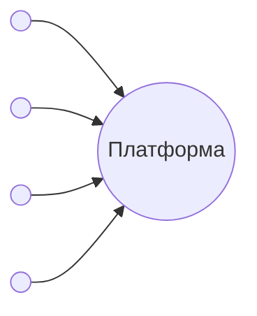
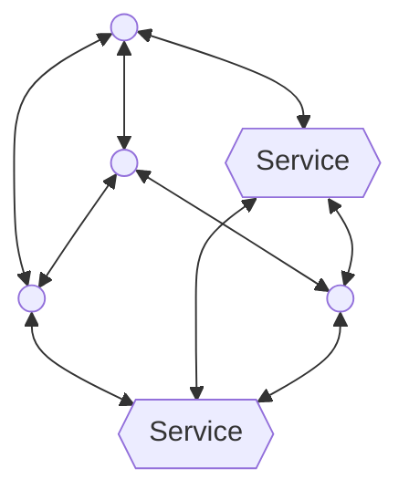

# Часть I: Видение

---

_Главная идея — это настоящий бунт, и философский, и практический, против современного интернета, который становится всё более централизованным. Представь, что весь интернет превращается в один огромный торговый центр, принадлежащий нескольким гигантским компаниям. Наша цель — построить новую цифровую систему, основанную на независимости. Мы хотим вернуть каждому человеку и сообществу контроль над своей цифровой жизнью._

---

### (Глава 1) Основная идея и принципы

Вся система построена на нескольких простых, но мощных правилах. Они помогают всему работать слаженно и легко соединяться друг с другом.

- **Всё — это Идея.** В самом сердце системы всё, что ты видишь — будь то приложение, инструмент, документ или какой-то процесс — это просто Идея. Это как будто всё сделано из кубиков Lego одного типа. Благодаря этому система остаётся простой и целостной.

  > Sidenote: [Акт 101: Концепция/Идея](../rfc/101_concept_idea.md)

- **Самодостаточные и самоописывающие.** Каждая Идея несёт в себе своё собственное описание и правила, как инструкцию по применению. Представь, что ты получаешь в подарок новую игрушку, и в коробке уже есть понятная инструкция. Так и здесь: любая программа или искусственный интеллект может сразу понять, что это за Идея и как с ней работать, без предварительной подготовки.

  > Sidenote: [Акт 001: Агент/Запрос](../rfc/001_agent_request.md)

- **У каждой Идеи может быть свой дом.** Любую Идею можно разместить по уникальному интернет-адресу, как будто у неё появляется свой собственный дом. Когда ты заходишь на этот адрес, ты видишь интерфейс для этой Идеи. Если это что-то знакомое, например статья, она будет выглядеть как статья. А если это «Идеатор» (особый тип Идеи), у него будет универсальный пульт для взаимодействия.

  > Sidenote: [Акт 102: Концепция/Суверенитет](../rfc/102_concept_sovereignty.md)

- **Идеаторы — это Идеи, которые принимают ввод.** «Идеатор» — это особая Идея, которая умеет принимать от тебя какую-то информацию (ввод) и что-то с ней делать. Это похоже на торговый автомат: ты даёшь ему команду и деньги (ввод), а он выполняет действие и выдаёт тебе напиток.

  > Sidenote:
  >
  > - [Акт 103: Концепция/Идеатор](../rfc/103_concept_ideator.md)
  > - [Акт 005: Агент/Ввод](../rfc/005_agent_input.md)

- **Созданы для соединения.** Система похожа на конструктор, где детали легко соединяются друг с другом. Некоторые Идеаторы (мы их называем «трансформерами Идей») могут изменять другие Идеи. Их можно выстраивать в цепочки, чтобы создавать сложные последовательности действий, где результат одного шага становится началом следующего.

- **ИИ — универсальный исполнитель.** Мы используем большую языковую модель (вроде умного помощника) как универсального переводчика и исполнителя. Поскольку каждая Идея сама себя описывает, этот ИИ может прочитать её «инструкцию» и понять, что нужно сделать. Благодаря этому система становится невероятно гибкой и может легко приспосабливаться к новым, ещё не придуманным задачам.

  > Sidenote: [Акт 104: Концепция/Скрытое](../rfc/104_concept_latent_.md)

- **Протокол живых Идей.** Мы делимся не просто данными, как фотографиями или текстами. Мы обмениваемся живыми, развивающимися системами. Это как если бы мы делились не семенами, а целыми растениями, которые могут расти и меняться со временем, особенно когда люди работают над ними вместе.

---

### (Глава 2) Диагноз — золотая клетка больших технологий

Главная проблема — это соблазнительная, но опасная сделка, которую нам предлагают гигантские технологические компании. Сначала социальные сети пообещали всем возможность быть услышанными и популярными, заманив нас в свои миры, где они собирали наши данные и ограничивали наш выбор. Теперь они предлагают нам мощные инструменты искусственного интеллекта, от которых трудно отказаться. Но за это удобство приходится платить. Мы всё глубже встраиваем их платформы в свою жизнь и становимся от них зависимыми. В итоге мы оказываемся в «золотой клетке»: она красивая и удобная, но это всё равно клетка, которая лишает нас свободы и контроля над нашей цифровой жизнью.

---

### (Глава 3) Решение — децентрализованное возрождение

Наше решение — не строить более красивый «сад за высоким забором», а полностью покинуть такие сады и осваивать новую, открытую территорию. Это возвращение к духу раннего, свободного интернета, но обновлённого для эпохи искусственного интеллекта. Это «возрождение» стоит на двух китах: новой архитектуре для идей и новой философии общения.

- **Видение независимости:** Мы предлагаем перейти от платформ (как Facebook или Google) к протоколу — открытому языку, который все могут использовать. На этом языке можно обмениваться не просто текстами и картинками, а живыми, работающими идеями. Каждый будет использовать **искусственный интеллект на своём компьютере** и соединяться с другими **напрямую (peer-to-peer)**, без посредников. Так все твои данные и твоя цифровая жизнь остаются под твоим полным контролем. Цель — создать операционную систему для идей, где умные, живые программы (например, бюджет, который сам себя ведёт, или план проекта, который сам обновляется) можно будет передавать так же легко, как сегодня мы делимся документами.

- **Философия общения:** Такая система меняет сам способ нашего общения в сети. Сегодня мы привыкли делиться всем подряд без разбора, чтобы произвести впечатление. Мы же хотим вернуть обмену его первоначальный смысл: это должен быть **осознанный и намеренный дар** для тех, кому ты доверяешь. Вместо того чтобы пить из «пожарного шланга» с бесконечным потоком контента со всего мира, мы предлагаем осмысленный обмен в небольших кругах общения, где главной валютой являются доверие, качество и настоящая связь. Это позволит каждому создавать свои «уютные миры» и полностью контролировать, с кем и какими идеями делиться.

Типичная централизованная сеть, в которой платформа владеет всеми данными и контролирует каждого участника

В децентрализованной сети все равны — и обычные участники, и сервисы. Они подключаются друг к другу напрямую, без главного сервера, который бы всем командовал.

