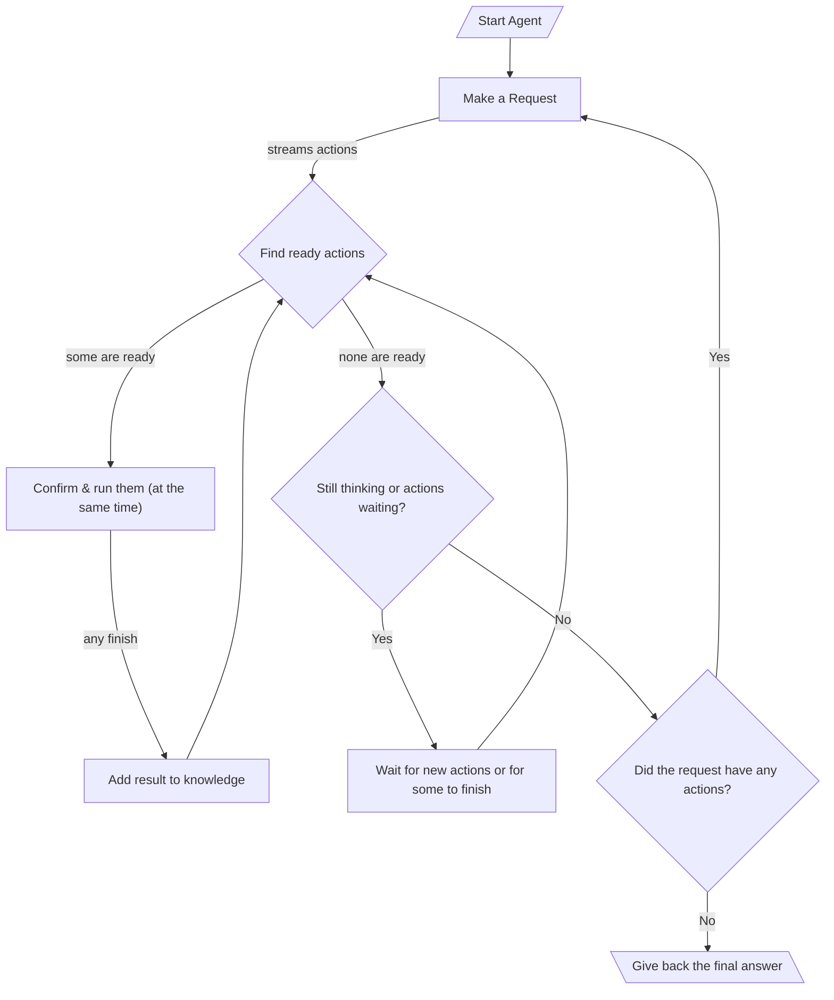

# 005: Agent/Loop

> [!DEFINITION] Loop
> Think of a loop as a series of steps an agent takes to reach a goal. The agent keeps making requests, carrying out the resulting actions (called "Calls"), and uses the results to figure out the next step. It continues this until there are no more actions to take.

> Sidenote:
> - This builds on:
>   - [001: Agent/Request](./001_agent_request.md)
>   - [002: Agent/Tool](./002_agent_tool.md)
>   - [004: Agent/Call](./004_agent_call.md)

This document explains the "Execution Loop," which is the process that lets an agent handle multi-step jobs. This back-and-forth process of figuring out what to do, using tools, and learning from the results is what people usually mean when they talk about an "agent."

## The Execution Loop

The execution loop is how an agent works on its own to complete a big task. It's like a big loop with a smaller loop running inside of it.

::::columns
:::column

1.  **Big Loop (Making a Request):** An agent's job is a series of requests. It starts with some information and enters a loop to figure out the first big step.
2.  **Getting Instructions:** Inside this loop, it makes a single `Request`. As it thinks, it sends back a stream of smaller actions, called `Calls`, which are lined up in a waiting list.
3.  **Small Loop (Doing the Actions):** For each `Request`, a smaller loop inside handles all the `Calls` that came with it. This part is super fast because it does things at the same time:
    - It constantly checks the waiting list for any `Calls` that are ready to go (meaning, any steps they depend on are already finished).
    - All the ready `Calls` can be shown to a human for an okay, and then they all run at once. This works because the agent's memory is set up so one action can't mess up another's results. It's like several cooks working in a kitchen, but each has their own cutting board and ingredients, so they don't get in each other's way.
    - As each `Call` finishes, its result is added to the shared knowledge. This might make other waiting `Calls` ready to start.
    - This system of reacting and working in parallel continues until the agent has sent all its `Calls` for the current step and the waiting list is empty. This makes everything much faster, because the agent can start working on different parts of a problem at the same time, even before it has the full plan.
4.  **Checking if it's Done:** Once the small loop is finished, the agent looks at the final answer. If the answer contains no more actions, it means the main goal is complete, and the big loop stops.
5.  **Continuing the Work:** If the answer did have more actions, the agent goes back to step 2. It makes a new `Request`, but this time with all the new knowledge it gained from the last round.
6.  **The Final Answer:** When the loop finally stops, the final answer is ready, formatted just the way the user asked for it.

:::
:::column



:::
::::

## Human-in-the-Loop (HITL)

The new execution loop is great for letting a person supervise the agent. The agent always asks for confirmation right before it acts. This makes sure the user is only asked about things that are actually ready to happen.

- **Approval:** Before a ready `Call` is run, the system can show it to a user to get an "okay." This is smart because the user doesn't waste time looking at actions that might never run because they are waiting on something else.
- **Correction:** The user can change the details of an action or even swap it out for a completely different one.

It’s important to know that these specific ways of getting human feedback aren't built into the core system. The system is just designed to separate *planning* an action from *doing* it. This gives builders the freedom to add any kind of human check they want, from a simple "yes/no" button to more complex safety systems.

This is really important for safety and for tasks where the agent is more like an assistant. The agent can use the human's changes and feedback to get smarter and adjust its plan.

## The Role of Data in the Loop

The execution loop gives the agent a way to behave, but its real power comes from the information that flows through it. This information is handled by a special `Data` message, which we'll explore in [006: Agent/Data](./006_agent_data.md).

```

```
