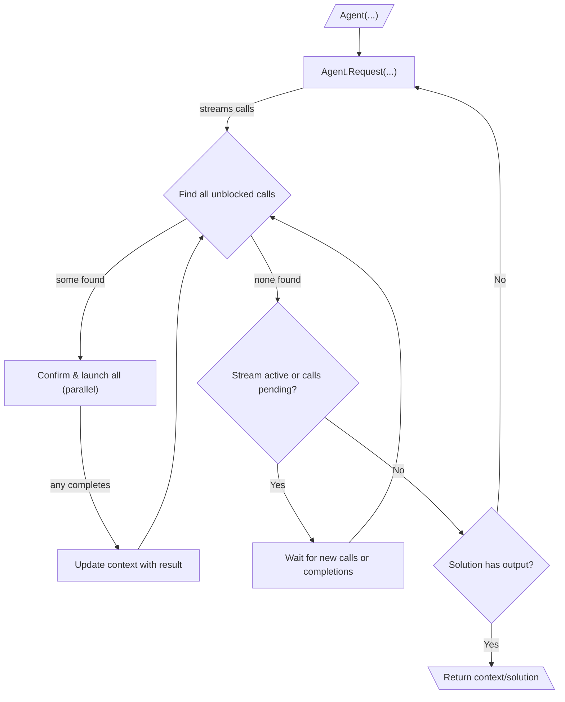

# 010: Agent/Loop

> [!DEFINITION] [Loop](./000_glossary.md)
> Imagine an AI working on a big problem. A :term[Loop]{canonical="Loop"} is like the AI repeatedly asking, "What should I do next?" to get closer to the goal. The AI keeps making :term[Requests]{canonical="Request"} (asking what to do), performing the :term[Calls]{canonical="Call"} it gets back (doing the small jobs), and adding the results to its memory. It keeps doing this until it comes up with a :term[Final Output]{canonical="Final Output"}, which means the main task is finished.

> Sidenote:
> - To understand this document, it helps to first read about:
>  - :term[001: Agent/Request]{href="./001_agent_request.md"}
>   - :term[008: Agent/Output]{href="./008_agent_output.md"}

The :term[Execution Loop]{canonical="Execution Loop"} is the engine that makes the whole AI system run. It uses all the ideas we've talked about before to let an AI (the "agent") handle big projects that need multiple steps. When people talk about an "AI agent," they're usually talking about this process of thinking, using tools, and learning from the results, over and over again.

## The Execution Loop

This loop is how the AI can work on its own to complete a task. It's like a computer program with a loop inside another loop.

::::columns
:::column

1.  **The Big Loop (Deciding What to Do):** The AI's entire job is a series of :term[Requests]{canonical="Request"}. It starts with what it already knows and enters this big loop to figure out the next steps.

2.  **Getting the To-Do List:** Inside the loop, it makes a single :term[Request]{canonical="Request"} to the main brain (the LLM). The brain streams back a list of small jobs, called :term[Calls]{canonical="Call"}, one by one. The AI collects these jobs in a "waiting" list.

3.  **The Small Loop (Doing the Work):** For each :term[Request]{canonical="Request"}, a smaller loop gets to work managing all the :term[Calls]{canonical="Call"}. Think of this like a busy chef in a kitchen who gets a new order.

    *   The chef constantly checks the list of waiting jobs to see which ones can be started *right now*. You can't frost a cake until it's been baked, so the chef looks for tasks that aren't waiting on anything else.
    *   The chef can start all the ready-to-go jobs at the same time. This is like cooking vegetables, boiling pasta, and grilling chicken all at once to get the meal ready faster. It's super efficient, but you have to be careful. If two jobs try to change the same piece of information, the one that finishes last gets the final say. This is known as a "last-write-wins" system.

       > Sidenote:
       > - [008: Agent/Output](./008_agent_output.md)

    *   As each small job finishes, its result is added to the AI's memory. This might unlock other jobs that were waiting for it to be done (like being able to frost the cake now that it's baked).
    *   This process of doing jobs at the same time continues until all the tasks for this step are complete. This approach makes the AI work much faster because it doesn't have to wait for a full plan before it starts working.

4.  **Stopping or Continuing:** Once all the small jobs for a step are done, the AI checks the final :term[Solution]{canonical="Solution"} to see if the main goal has been reached.
    *   **If the final answer spot (`output`) is empty (`null`),** the AI knows its work isn't done. It takes everything it just learned, goes back to the beginning of the big loop, and asks, "Okay, what's next?"
    *   **If the answer spot has something in it,** the AI knows it has achieved its goal. The big loop stops, and the AI presents this answer as the final result.

:::
:::column

:::
::::

## :term[Human-in-the-Loop]{canonical="HITL"}

This system makes it easy for a person to supervise the AI. The AI can pause and ask for permission right before it acts.

- **Approval:** Before the AI starts a job, it can show the job to a person and ask, "Is it okay to do this?" This is helpful because you only have to review actions that are actually ready to happen.
- **Correction:** The person can also step in and change the job's details, or even tell the AI to do something completely different.

It's important to know that these supervision tools aren't built into the basic rules. The system is just designed to create a gap between *planning* an action and *doing* it. This gives creators the freedom to add any kind of human checkpoint they want, from a simple "Yes/No" button to more complex safety systems.

This is essential for keeping the AI safe and for situations where the AI is acting as a helpful assistant. The AI can learn from the person's feedback and adjust its plan accordingly.

## From Simple Loops to Strategic Plans

The :term[Execution Loop]{canonical="Execution Loop"} is great for getting things done one step at a time. But for really big, complicated projects where one step depends on another, the AI needs a higher-level master plan.

The next document, :term[011: Agent/Expressions]{href="./011_agent_expressions.md"}, will explain how we can define these master plans as a map of connected tool actions.
