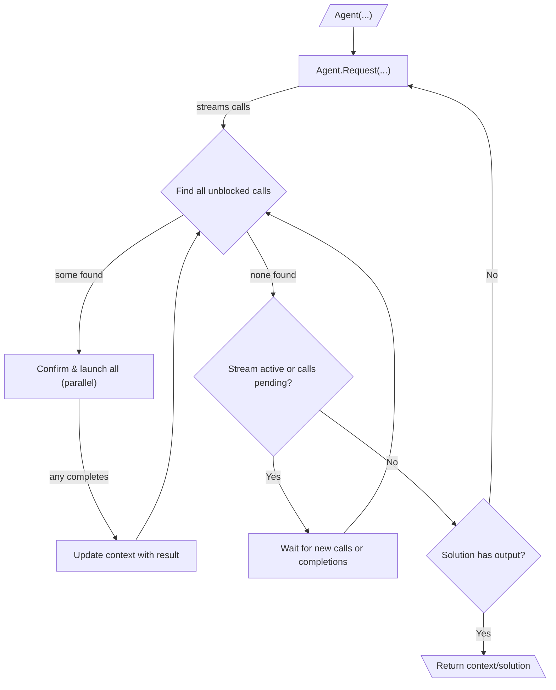

# 010: Agent/Loop

> [!DEFINITION] [Loop](./000_glossary.md)
> A loop is like taking turns in a game to reach a goal. The computer agent keeps making :term[Requests]{canonical="Request"}, carrying out the planned :term[Calls]{canonical="Call"}, and uses what it learns to decide its next move. It keeps doing this until it comes up with a :term[Final Output]{canonical="Final Output"}, which means the job is done.

> Sidenote:
> - Requires:
>   - :term[001: Agent/Request]{href="./001_agent_request.md"}
>   - :term[008: Agent/Output]{href="./008_agent_output.md"}

The :term[Execution Loop]{canonical="Execution Loop"} is the engine that makes the agent work. It brings together all the different message types and rules we've talked about before. This loop is what lets an agent tackle big problems by breaking them down into smaller :term[Requests]{canonical="Request"} and solving them one by one. When people talk about an "agent," they're usually talking about this process of thinking, using tools, and learning from the results over and over again.

## The Execution Loop

The execution loop is how an agent works on its own to complete a task that has many steps. It works like a loop inside of another loop.

::::columns
:::column

1.  **Outer Loop (Thinking of a Request):** An agent's job is basically a series of :term[Requests]{canonical="Request"}. It starts with what it already knows and enters the main loop to figure out what to do next.
2.  **Getting the Plan (Streaming Calls):** Inside the loop, it makes a :term[Request]{canonical="Request"}. As the AI thinks of steps (we call these :term[Calls]{canonical="Call"}), it sends them over right away. These steps line up in a queue, like people waiting for a ride.
3.  **Inner Loop (Doing the Work):** For each :term[Request]{canonical="Request"}, a smaller, faster loop takes over to actually perform the :term[Calls]{canonical="Call"}. Think of this as a dispatcher that reacts to two things: a new step joins the queue, or a step that was already running is finished. This process is very fast because it can do many things at once:
    - The dispatcher constantly checks the queue for any :term[Calls]{canonical="Call"} that are ready to run (meaning they aren't waiting for another step to finish first).
    - All the ready :term[Calls]{canonical="Call"} can be shown to a person for approval and then started at the same time. This saves a lot of time, but you have to be careful. If two different :term[Calls]{canonical="Call"} try to write to the same file or variable, the one that finishes last will be the one that sticks. We call this a "last-write-wins" system.

    - Every time a :term[Call]{canonical="Call"} finishes, its result is added to the agent's shared memory. This new information might unlock other :term[Calls]{canonical="Call"} that were waiting for it.
    - This system of doing many things at once continues until the AI is done thinking for the current :term[Request]{canonical="Request"} and all the steps in the queue are finished. This makes the agent much faster because it can start working on different parts of the problem at the same time, even before it has a complete plan.

4.  **Stopping or Continuing:** Once the inner loop is done with a :term[Request]{canonical="Request"}, the agent looks at the final :term[Solution]{canonical="Solution"} to decide what to do next. It looks at a special field called `output`:
    - **If `output` is empty (`null`)**, the agent knows the job isn't finished. It loops back to the beginning to make a new :term[Request]{canonical="Request"}, but this time with all the new information it just learned.
    - **If `output` has something in it**, the agent knows its goal has been reached. The main loop stops, and the value in `output` is returned as the final answer. An agent can produce both new `calls` and a final `output` in the same step; having an `output` is the clear signal to stop.

      > Sidenote:
      > - [008: Agent/Output](./008_agent_output.md)

:::
:::column

:::
::::

## :term[Human-in-the-Loop]{canonical="HITL"}

The new :term[Execution Loop]{canonical="Execution Loop"} makes it very easy for a person to supervise the agent. The system is designed to ask for permission right before it acts.

- **Approval:** Before a ready-to-go :term[Call]{canonical="Call"} is started, the system can show it to a user for a thumbs-up. This is very efficient because you don't waste time reviewing steps that might never even run because they're blocked.
- **Correction:** The user can change the details of a :term[Call]{canonical="Call"} or even swap it for a completely different one.

It's important to know that these specific ways of having a :term[human in the loop]{canonical="HITL (Human-in-the-Loop)"} are not built into the core rules. The system just gives developers a pause button between the agent's plan and its actions. This means they can build any kind of check they want, like a simple "Yes/No" pop-up or a more complex safety system.

This is essential for keeping the agent safe and for working with it as a helpful assistant. The agent can use feedback from a person to improve its plan as it works.

## From Simple Loops to Strategic Plans

The :term[Execution Loop]{canonical="Execution Loop"} is great for handling the immediate, step-by-step actions of an agent. But for really big, complicated jobs, the agent needs a better way to make a long-term plan.

The next document, :term[011: Agent/Expressions]{href="./011_agent_expressions.md"}, will explain how we can define these big strategies as a map of connected :term[Tool Calls]{canonical="Call"}.
