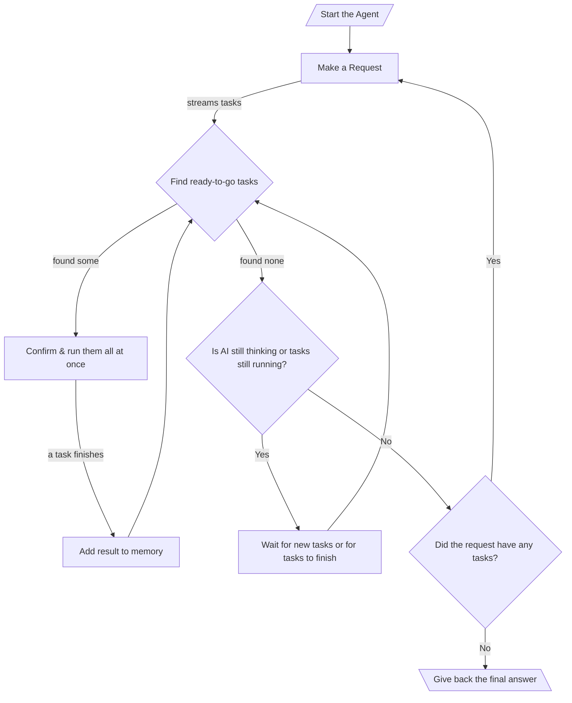

# 010: Agent/Loop

> [!DEFINITION] [Loop](./000_glossary.md)
> Think of a Loop as a series of steps an AI agent takes to reach a goal. The agent makes a :term[Request]{canonical="Request"} (like asking "what should I do next?"), performs the :term[Call]{canonical="Call"}s it gets back (the actual tasks), and uses the results to figure out its next :term[Request]{canonical="Request"}. It keeps doing this until there are no more tasks left to do.

> Sidenote:
> - You'll want to understand these first:
>   - :term[001: Agent/Request]{href="./001_agent_request.md"}
>   - :term[008: Agent/Output]{href="./008_agent_output.md"}

The :term[Execution Loop]{canonical="Execution Loop"} is the engine that makes the whole system work. It takes all the rules and message types we've talked about and puts them into action. This loop is what lets an AI agent handle big jobs that require many steps, by repeatedly making :term[Requests]{canonical="Request"} and acting on them. This cycle of figuring out what to do, using tools, and learning from the results is what we mean when we talk about an "agent."

## The Execution Loop

The execution loop is how the agent works on its own to complete a task with multiple steps. It's like a loop inside another loop:

::::columns
:::column

1.  **The Big Loop (Making Requests):** The agent's entire job is a sequence of :term[Request]{canonical="Request"}s. It starts with some initial information and then begins this main loop.
2.  **Asking and Getting Tasks:** Inside the loop, it makes a single :term[Request]{canonical="Request"}. As the AI model thinks, it sends back a stream of little tasks called :term[Call]{canonical="Call"}s, which are added to a to-do list.
3.  **The Small Loop (Doing the Tasks):** For each :term[Request]{canonical="Request"}, a smaller loop kicks in to manage and complete all its tasks. This part is designed to be very fast and handle many things at once:
    - It constantly checks the to-do list for any tasks that are ready to be worked on (meaning, any tasks they were waiting on are now finished).
    - All the ready-to-go tasks can be shown to a person for a quick check, and then they can all be started at the same time. This is safe because the agent's memory is read-only for each step. Once a result is saved, it can't be changed. This lets the AI suggest different options that might lead to the same result. Whichever task finishes first gets to save its answer, and the other options are automatically ignored because their condition (like "only run if this spot is empty") is no longer true. This prevents confusion and keeps the outcome predictable.

      > Sidenote:
      > - See: [008: Agent/Output](./008_agent_output.md)

    - As each task finishes, its result is added to the agent's shared knowledge. This might unlock other tasks on the to-do list that were waiting for this result.
    - This system of reacting and doing things in parallel continues until the AI is done sending tasks for the current :term[Request]{canonical="Request"} and every task on the to-do list is complete. This makes the agent much faster because it can work on many different parts of the problem at the same time, even before it has the full plan.

4.  **Checking if We're Done:** Once the small loop is finished, the agent looks at the final :term[Solution]{canonical="Solution"}. If there are no more tasks to do, it means the main goal has been reached, and the big loop stops.
5.  **Continuing the Work:** If the :term[Solution]{canonical="Solution"} *did* have tasks, the agent loops back to the beginning. It uses everything it just learned to make a new, smarter :term[Request]{canonical="Request"} and starts the process again.
6.  **Giving the Final Answer:** When the loop finally stops, the `output` field of the very last :term[Solution]{canonical="Solution"} holds the final answer, neatly formatted just the way the user wanted.

:::
:::column

:::
::::

## :term[Human-in-the-Loop]{canonical="HITL"}

The new :term[Execution Loop]{canonical="Execution Loop"} is great for letting people supervise the AI. It adds a confirmation step right before any task is performed, so a person is only asked to check things that are actually ready to happen.

- **Approval:** Before a ready-to-go :term[Call]{canonical="Call"} is run, the system can show it to a user to get an "OK." This is smart because it saves the user from wasting time reviewing tasks that might never even run because they're waiting on something else.
- **Correction:** The user can change the details of a :term[Call]{canonical="Call"} or even swap it out for a completely different one.

It's important to know that these specific ways for a human to jump in aren't built into the core rules. The system is just designed to separate the *planning* of tasks from the *doing* of tasks. This gives developers the freedom to add any kind of supervision they want, from a simple "click to approve" button to a more complex automated checking system.

This ability is very important for safety and for situations where the agent is acting like a helpful assistant. The agent can use the user's changes and feedback to adjust its strategy and learn from human guidance.

## From Simple Loops to Big Plans

The :term[Execution Loop]{canonical="Execution Loop"} gives the agent a powerful way to act and react, but it's best for handling one main :term[Request]{canonical="Request"} at a time. To manage really complex projects with many steps that depend on each other, we need a better system for long-term planning.

The next document, :term[011: Agent/Plan]{href="./011_agent_plan.md"}, explains the rules for creating these big-picture strategies as a map of connected :term[Tool Calls]{canonical="Call"}.