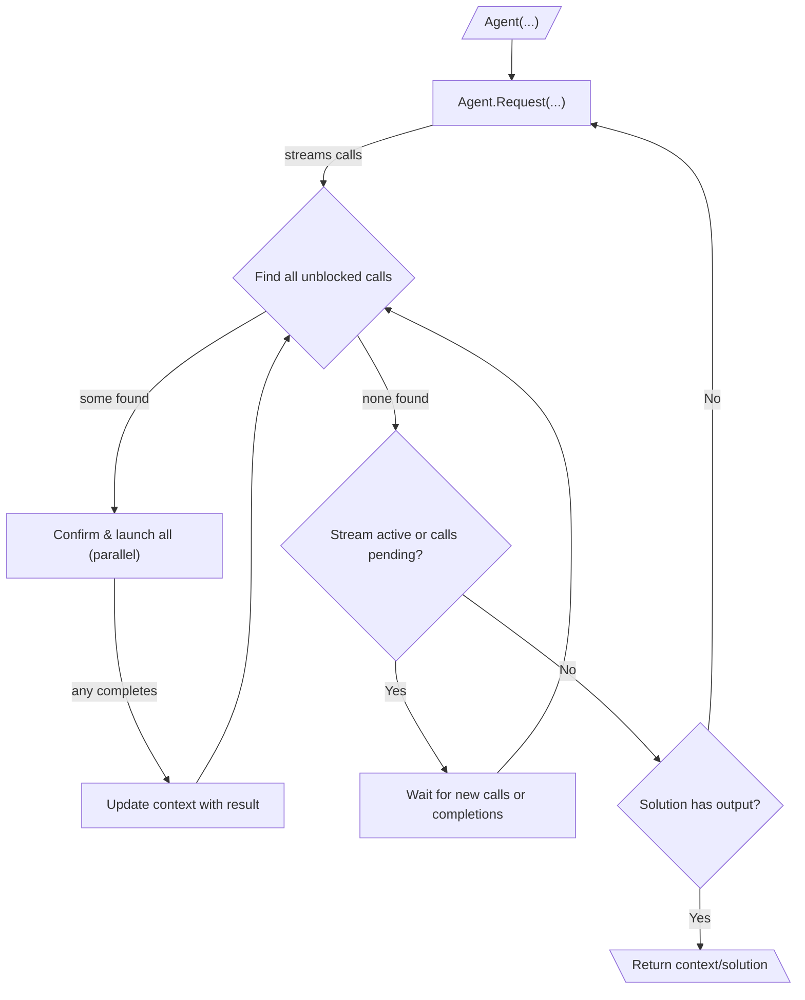

# 010: Agent/Loop

> [!DEFINITION] [Loop](./000_glossary.md)
> Think of a loop like a dog playing fetch. It keeps repeating the same actions—running, getting the ball, and bringing it back—over and over. In our system, a :term[Loop]{canonical="Loop"} is a repeating series of :term[Request]{canonical="Request"}s that an AI agent makes to reach a goal. The agent keeps making :term[Request]{canonical="Request"}s and using the tools it's given until the main brain (the LLM) creates a :term[Final Output]{canonical="Final Output"}, which is the signal that the job is done.

> Sidenote:
> - You'll need to know about:
>   - :term[001: Agent/Request]{href="./001_agent_request.md"}
>   - :term[008: Agent/Output]{href="./008_agent_output.md"}

The :term[Execution Loop]{canonical="Execution Loop"} is the engine that makes everything work together. It’s what allows an AI agent to tackle big jobs that have multiple steps by making one :term[Request]{canonical="Request"} after another. This cycle of gathering information, using tools, and getting feedback is what people usually mean when they talk about an "agent."

## The Execution Loop

The execution loop is how the agent works on its own to complete tasks with many steps. It works like a loop inside of another loop:

::::columns
:::column

1.  **Outer Loop (Big Steps):** The agent's entire job is a series of big steps, or :term[Request]{canonical="Request"}s. It starts with some initial information and then begins this main loop.
2.  **Asking for Actions:** Inside the loop, it makes a single :term[Request]{canonical="Request"}. This is like asking, "What should I do next?" The answer comes back as a stream of smaller actions, called :term[Call]{canonical="Call"}s, which are put into a waiting list.
3.  **Inner Loop (Doing the Actions):** For each big step (:term[Request]{canonical="Request"}), a smaller, faster loop takes over to manage all the little actions (:term[Call]{canonical="Call"}s). This little loop is very quick and efficient. It gets started whenever a new action appears or a running action finishes. It can do many things at once:
    - The system constantly checks the waiting list for any actions that are ready to run (meaning, anything they depend on is already finished).
    - All the ready-to-go actions can be shown to a human for a quick check-up and then started all at the same time. This makes things really fast, but you have to be careful. If two actions try to change the same piece of information, whichever one finishes last will be the one that sticks. We call this a "last-write-wins" system.

    - As each action finishes, its result is added to the agent's memory, which might unlock other waiting actions.
    - This super-fast process of running actions all at once continues until the stream of actions for the current :term[Request]{canonical="Request"} ends and every action on the waiting list has been completed. This helps the agent work much faster because it can start on several things at once without waiting for a complete plan.

4.  **Stopping or Continuing:** Once all the little actions for a big step are done, the agent looks at the result, called the :term[Solution]{canonical="Solution"}, to decide what to do next. It looks at a specific field called `output`:
    - **If `output` is empty (`null`)**, the agent knows its job isn't finished. It goes back to the beginning of the big loop (step 2) to make a new :term[Request]{canonical="Request"}, but this time with all the new information it just learned.
    - **If `output` has something in it**, the agent's main goal is complete. The big loop stops, and the value in `output` is returned as the final answer. An agent can produce actions (`calls`) and a final `output` in the same step; the `output` is the final signal to stop.

      > Sidenote:
      > - [008: Agent/Output](./008_agent_output.md)

:::
:::column

:::
::::

## :term[Human-in-the-Loop]{canonical="HITL"}

This system is great for letting a person supervise the AI. The confirmation step happens right before an action is performed, so the human is only asked to review things that are actually ready to go.

- **Approval:** Before a ready-to-go :term[Call]{canonical="Call"} is run, the system can show it to a user to get an "okay." This is efficient because the user doesn't waste time looking at actions that might never even run.
- **Correction:** The user can change the details of an action or even swap it for a different one.

It's important to know that these specific ways of getting a human's approval are not built into the core system. The system is just designed to have a pause between *planning* an action and *doing* it. This gives builders freedom to add any kind of human check they want, from a simple "yes/no" button to more complex review systems.

This is very important for safety and for tasks where the AI is helping a person. The AI can use the human's changes as feedback to get smarter about its next steps.

## Error Handling and Self-Correction

The Execution Loop is built to be tough. It has a safety net that lets the agent handle and recover from mistakes, whether it's a bad plan or something unexpected going wrong while it's working. It does this by catching errors and feeding them back to the main brain (the LLM) as clear, useful information.

### The Error Message

When something goes wrong, the system creates a special **`Error Message`**. It's like a regular data message, but it's for reporting problems. When an error is caught, this message is added to the agent's memory for the next round. It contains two key details:

- **`call`**: The exact action that failed.
- **`error`**: An explanation of what went wrong.

### The Self-Correction Loop

The loop catches two main kinds of failures:

1.  **Structural Errors**: These are problems found *before* an action runs. For example, if the instructions for a tool are written incorrectly or have missing pieces.
2.  **Runtime Errors**: These happen *during* an action. For example, a tool tries to connect to a website, but the website is down.

When either error happens, the loop creates an `Error Message`. At the end of a cycle, all the error messages that were collected are added to the agent's memory.

This gives the AI direct feedback. On its next turn, it sees the action that failed and the reason why, so it can try to fix the problem and come up with a better plan.

> [!HEADSUP] Planning for Errors vs. Reacting to Them
>
> The loop's ability to catch errors is a **reactive** safety net for when things go wrong unexpectedly. But the best systems are designed to expect failure from the start.
>
> By using a :term[Plan]{href="./012_agent_plan.md"} with different branches using :term[Expressions]{href="./011_agent_expressions.md"}, you can create separate paths for when a tool works ("happy path") and when it doesn't ("unhappy path"). A tool can handle its own errors and, instead of crashing, return a special message that tells the agent to follow a pre-planned backup strategy. This **proactive** way of handling errors is much more reliable.

## From Simple Loops to Strategic Plans

The :term[Execution Loop]{canonical="Execution Loop"} gives the agent a powerful way to act, but it's best at handling one :term[Request]{canonical="Request"} at a time. To manage very complex jobs that have many steps that depend on each other, we need a better system for long-term strategic planning.

The next document, :term[011: Agent/Expressions]{href="./011_agent_expressions.md"}, explains how we can define these big-picture strategies as a connected map of actions.