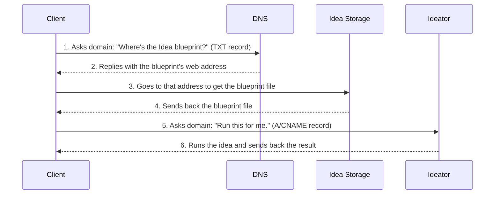

# 102: Concept/Sovereignty

> Sidenote:
>
> - Requires:
>   - [101: Concept/Idea](./101_concept_idea.md)
>   - [103: Concept/Ideator](./103_concept_ideator.md)

## Introduction

This paper explains an idea called **Sovereignty**, which is all about how much control creators have over their creations. Think of it like a ladder. You can start on the bottom step and let us handle everything for you, or you can climb all the way to the top and manage everything yourself.

This is the plan that turns a blueprint for an idea (an `Ideator`) into a real, working service on the internet.

## Your Internet Address is Your Castle

The whole system is built on one simple rule: **your internet address (domain name) gives you control**. This means your `Idea` is never locked into one company or platform. You truly own it.

Here’s how it works: Every `Idea` gets its own unique domain name, like `my-cool-idea.com`. Attached to that domain is a little digital sticky note, called a `TXT` record. This note holds the web address for the `Idea`'s main file. By controlling this little note, you have the final say over where your `Idea` lives and what it is.

### How You Stay in Control

The picture below shows the two main things you can do with an Idea: look at its blueprint (`GET`) and run it like an app (`POST`). It shows how you, the owner of the domain name, are the one directing all the traffic.

**Think of your domain name’s settings as your control panel.** One setting (the `TXT` record) points to where your `Idea`'s blueprint is stored. Another setting (the `A` or `CNAME` record) points to the computer that runs the `Idea`. Since you control both, you decide whether to use our easy-to-use services or set up your own.

> [!HEADSUP] Heads up
> It helps to see this as a range of choices. On one end, you use our system, which is super easy. On the other end, you have **full sovereignty**: you use your own domain name and run everything on your own computers. You become your own provider. Our services are just here to help you get from one end to the other if you want.



## The Five Layers of Service

On top of the foundation that you own your domain, we offer five optional levels of service. These let you pick exactly how much control you want. You can start with our simple services and gradually take over more yourself, or just jump straight to doing it all on your own.

### Layer 1: We'll Hold Your Files for You

This layer is a super easy, no-fuss way to store the main file for your Ideator.

- **How It Works:** To make things simple, we can store your Ideator's blueprint file for you in a big online storage space (like Google Drive or Dropbox, but for developers). The digital sticky note (`TXT` record) on your domain will point to this file's location. If you ever want to store the file somewhere else, you can just change the address on the sticky note to point to your new location.
- **Purpose:** To let you get started right away without worrying about setting up your own file storage.

---

### Layer 2: An Instant Webpage for Your Idea

This layer turns your Ideator into a simple webpage that people can use, without needing any fancy servers.

- **How It Works:** We have a single, universal webpage that works for any Ideator. When someone visits your Ideator's domain in their web browser, some code on that page automatically does a special search to read the digital sticky note (`TXT` record) on your domain. It finds the address of your Ideator's blueprint file (from Layer 1), downloads it, and builds a user interface right there on the spot.
- **Purpose:** To give every Ideator a free, ready-to-use web app, making it incredibly easy for anyone to create something people can interact with.

---

### Layer 3: A Special Mailbox for Computers

This layer makes it easy for other computer programs to read and understand your Idea's blueprint.

- **How It Works:** We put a smart delivery service (a CDN) in front of your file. When another program sends a message (`GET` request) to your Idea's domain, this service knows how to package up the blueprint in a way that's easy for other code to use. It lets developers import specific parts of your `Idea` directly into their own projects. They can still get the plain, raw file if they ask for it, too.
- **Purpose:** To let other programmers easily and safely use your Idea in their own code.

```ts
// This special header helps code editors understand the blueprint
const { default: run, schema } = await import('http://my-idea.com');
console.log(`The Idea's structure is`, schema);

// You can even run the idea like a function
await run(input);
```

---

### Layer 4: Publishing Your Updates

This layer gives you a way to publish new versions of your Idea using code.

- **How It Works:** This layer handles special `PUT` requests sent to your Idea's domain. With one secure command, you can upload a new version of your blueprint file and automatically update the digital sticky note to point to it, making the new version live instantly.
- **Purpose:** To give you a safe and simple way to manage and update your Ideas.

```ts
// Publish a new version of the idea
await fetch('http://my-idea.com', {
  method: 'PUT',
  data: JSON.stringify({ context, schema, solution }),
});
```

---

### Layer 5: A Fully Working Web Service

This is the top layer, which turns your Ideator into a real, powerful web service that other apps can call.

- **How It Works:** This layer handles `POST` requests to your Ideator's domain, telling it to run its logic. This can be handled by our system automatically, or you can set up your own server to do the work.
- **Purpose:** To give you the power of a modern web service, letting anyone publish a fully working app using just a simple blueprint file.

```ts
// Use the idea as a service with some new information
const idea = await fetch('http://my-idea.com', {
  method: 'POST',
  data: JSON.stringify(context),
});
console.log('New result from the idea:', idea.solution);
```

### The Blueprint vs. The Service: A Quick Note

One very important rule in our system is that the public blueprint (`Idea`) is separate from how it actually runs. An `Idea` is a complete plan. It has everything needed for an advanced AI or a person to run it on their own computer. This lets people download your `Idea`, play with it, and use it however they want.

The final layer, "Full API Execution," isn't something you have to use. It's an extra feature and a way to build a business. It lets a creator offer their `Idea` as a reliable, professionally-managed service. This is where you can have business secrets and make money in an open system.

A creator can share a public `Idea` as an open promise—a clear description of what the service does and what you'll get back—while keeping the exact way they do it private.

This private method is the creator's "secret sauce." It might use special AI models, powerful computers, or unique data. The service becomes a trustworthy "black box" that does what the public `Idea` promises. This creates a world where open blueprints and valuable private services can exist together and build on each other.

## Technical Details

All commands are sent to the root of the Idea's domain (e.g., `http://my-cool-idea.com/`).

- **`GET /`**
  - If your browser asks for it (as `text/html`, Layer 2): You get the simple webpage for the Idea.
  - If a program asks for it (as `application/json`, Layer 3): You get the Idea's raw blueprint file.
- **`PUT /`** (Layer 4)
  - You must be logged in. A single `PUT` command uploads the new blueprint and automatically updates the domain's records to make it live.
- **`POST /`** (Layer 5)
  - Requires permission. This runs the Ideator.
  - The body of the request is a JSON object with the input, like `{"context": "The user's input to be processed"}`.

```

```

```

```
