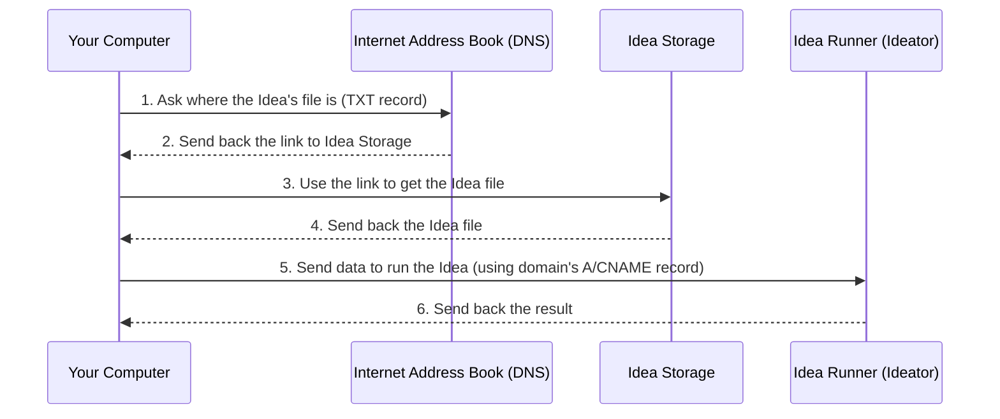

# 102: Concept/Sovereignty

> [!DEFINITION] [Sovereignty](./000_glossary.md)
> This is the big idea that the creator of an :term[Idea]{canonical="Idea"} is its true owner. Just like you own a website address (a domain name), you own your :term[Idea]{canonical="Idea"}'s unique address. Using the internet's address book, called DNS, you decide where your :term[Idea]{canonical="Idea"} lives online. This gives you complete control over it.

> Sidenote:
> - You should know about:
>   - [101: Concept/Idea](./101_concept_idea.md)
>   - [103: Concept/Ideator](./103_concept_ideator.md)

The rules for :term[Sovereignty]{canonical="Sovereignty"} offer creators different levels of freedom. Think of it like a game with different difficulty settings. You can use our simple, ready-to-go services (easy mode), or you can set up and run everything yourself for maximum control (expert mode).

This system is what connects a blueprint for an :term[Idea]{canonical="Idea"} (an :term[Ideator]{canonical="Ideator"}) to a real, working program that people can use.

## Your Own Address on the Internet with DNS

Everything in this system is built on one simple rule: **you control your :term[Idea]{canonical="Idea"}'s identity using DNS.** DNS is the internet's main address book. This means your :term[Idea]{canonical="Idea"} isn't locked into our platform or anyone else's. It's truly yours.

Here’s how it works: Your :term[Idea]{canonical="Idea"} gets a unique domain name, like `my-cool-idea.com`. A small note, called a `TXT` record, is attached to that domain. This note contains a link to the main file that describes your :term[Idea]{canonical="Idea"}. By controlling this simple note, you have the final say on where your :term[Idea]{canonical="Idea"} is and what it is.

### How You Control Everything with DNS

The drawing below shows the two main things you can do with an :term[Idea]{canonical="Idea"}: look at its blueprint (`GET`) and run it like a program (`POST`). It shows how you are in complete control of where these requests go, just by using the internet's standard address book.

**Think of your DNS records as the control panel for your Idea.** The `TXT` record points to where the main description file is stored (:term[Idea]{canonical="Idea"} Storage). Your main domain address (the `A` or `CNAME` record) points to the computer that runs the :term[Idea]{canonical="Idea"} (the :term[Ideator]{canonical="Ideator"}). Because you control both records, you decide if you want to use our services or your own.

> [!HEADSUP] Heads up
> It's best to think of this as a scale of independence. On one end, you can use our managed services, which are easy and convenient. On the other end is **full sovereignty**: you use your own custom domain and host everything yourself. You become your own provider. The layers we provide are just helpful steps to get from easy mode to expert mode if you want.



## The Building Blocks of Control

On top of this main rule of identity, the system offers five optional layers of service, like building blocks you can stack. These layers let you pick exactly how much control you want, from letting us handle everything to doing it all yourself.

### Layer 1: We'll Hold Your Files

This first layer gives you a quick and easy place to store the file that describes your :term[Ideator]{canonical="Ideator"}.

- **How It Works:** To make it super simple to start, we can store your :term[Ideator]{canonical="Ideator"} file for you. The special `TXT` note on your domain will point to that file. If you ever want to move your file to your own server or somewhere else, you just update the `TXT` note to point to the new location. You're never locked in.
- **Purpose:** You don't have to worry about finding a place to host your file just to try things out.

---

### Layer 2: An Instant Web Page

This layer turns your :term[Ideator]{canonical="Ideator"} into a simple web page that people can see and use, without you needing to run a server.

- **How It Works:** We have a single, simple web page that works for any :term[Ideator]{canonical="Ideator"}. When someone visits your :term[Ideator]{canonical="Ideator"}'s web address, some code on that page automatically asks the internet's address book for your `TXT` record. It uses that to find and download your :term[Ideator]{canonical="Ideator"}'s main file, then builds a user interface right there in the browser. It's like a pop-up store that assembles itself on the spot.
- **Purpose:** To give every :term[Ideator]{canonical="Ideator"} a free, ready-to-use web app, making it incredibly easy for anyone to get started.

---

### Layer 3: A Smart Link for Coders

This layer makes it easy for other computer programs to read and understand your :term[Idea]{canonical="Idea"}'s blueprint.

- **How It Works:** We use a smart delivery system (a CDN) that can change what it sends back based on the request. If a program asks for your :term[Idea]{canonical="Idea"}'s web address, the CDN sends it back in a special format that programmers can easily use in their code. They can even import specific pieces of your :term[Idea]{canonical="Idea"} directly. If you want the original file, you just ask for it in a slightly different way (`Accept: application/json`).
- **Purpose:** To give programmers a powerful and familiar way to work with your :term[Idea]{canonical="Idea"} in their own projects.

```ts
// We also provide type information so code editors know what they're working with
const { default: run, schema } = await import('http://my-idea.com');
console.log(`Idea's schema is`, schema);

// Run the idea like a function directly in your code
await run(input);
```

---

### Layer 4: Update with One Click

This layer gives you a way to publish new versions of your :term[Idea]{canonical="Idea"} using code.

- **How It Works:** This layer lets you send an update request (`PUT` request) to your :term[Idea]{canonical="Idea"}'s address. With a single, secure command, you can upload the new version of your :term[Idea]{canonical="Idea"}'s file and instantly update all the necessary records so that the new version becomes live. It all happens at once, so nothing breaks.
- **Purpose:** To give creators a safe and easy way to manage and update their :term[Ideas]{canonical="Idea"} as they grow.

```ts
// Publish a new version of the idea
await fetch('http://my-idea.com', {
  method: 'PUT',
  data: JSON.stringify({ context, schema, solution }),
});
```

---

### Layer 5: A Full-Fledged Program

This is the most powerful layer. It turns your :term[Ideator]{canonical="Ideator"} from a simple file into a real, working web service that can be run by anyone.

- **How It Works:** This layer handles requests to run your :term[Ideator]{canonical="Ideator"} (`POST` requests). When your :term[Ideator]{canonical="Ideator"}'s address receives a request, this layer executes its instructions. You can use our managed service to run it, or you can host and run the program yourself.
- **Purpose:** To give you all the power of a modern web service, allowing anyone to publish a useful program using just a single instruction file.

```ts
// Tell the idea to run with some new information
const idea = await fetch('http://my-idea.com', {
  method: 'POST',
  data: JSON.stringify(context),
});
console.log('New solution for idea', idea.solution, 'conforming to schema', idea.schema);
```

### The Idea vs. The Service: The Blueprint and the Machine

A very important rule here is that we separate the blueprint of the :term[Idea]{canonical="Idea"} from the machine that runs it. An :term[Idea]{canonical="Idea"} file is a complete, all-in-one plan. It contains the goal, the rules, and the solution—everything a smart program needs to run it. This is great because it means anyone can download your :term[Idea]{canonical="Idea"}'s blueprint and run it on their own computer to experiment, change it, or use it for their own projects.

The final layer, "Full API Execution," is an extra convenience and a way for creators to offer a professional service. It lets a creator offer their :term[Idea]{canonical="Idea"} as a reliable, managed program that others can use.

This is where you can have your "secret sauce." You can publish a public :term[Idea]{canonical="Idea"} that acts as an open promise—it clearly says what your service does and what it gives back. But how your service actually does it can be kept private. You might use special computer models, powerful hardware, or unique data that you don't want to share. Your service becomes a trustworthy "black box" that does exactly what it promises, creating a marketplace where open ideas and valuable private tools can work together.

## From One Idea to Your Own Universe

While DNS gives you control over a single :term[Idea]{canonical="Idea"}, its real power is letting you create a **Sovereign Namespace**—your own digital territory. A domain like `my-project.com` doesn't just point to one :term[Idea]{canonical="Idea"}; it’s the start of a whole collection of :term[Ideas]{canonical="Idea"} that you control.

You can organize this territory using paths, just like folders on a website.

- The main address (`my-project.com`) could be your main :term[Idea]{canonical="Idea"} (like your project's chatbot or main plan).
- Paths inside it (`my-project.com/schemas/User`) can point to other, related :term[Ideas]{canonical="Idea"}.

This creates a neat structure: the **domain** gives you ownership over the whole space, and the **path** helps you organize everything inside it. This allows a single owner to manage a whole family of connected :term[Ideas]{canonical="Idea"}, from a tiny building block to a huge application. We explain this in more detail in the :term[Addressing]{href="./110_concept_addressing.md"} concept.

## How It Works (The Details)

All interactions happen at your :term[Idea]{canonical="Idea"}'s main web address (`/`).

- **`GET /`**
  - If you're a browser asking for a web page (Layer 2): You get the simple web page that builds the user interface.
  - If you're a program asking for data (Layer 3): You get the :term[Idea]{canonical="Idea"}'s main descriptive JSON file.
- **`PUT /`** (Layer 4)
  - You must be logged in. A single `PUT` request uploads the new :term[Idea]{canonical="Idea"} file and instantly updates the internet address book to make it live.
- **`POST /`** (Layer 5)
  - Requires permission. This runs the :term[Ideator]{canonical="Ideator"}.
  - The request includes the data needed to run it, for example: `{"context": "The user's input to be processed"}`.

Now that you understand how :term[Sovereignty]{canonical="Sovereignty"} gives you ownership and control over an :term[Idea]{canonical="Idea"}, the next step is to learn what makes an :term[Idea]{canonical="Idea"} runnable. This brings us to the concept of the :term[Ideator]{canonical="Ideator"}, a special kind of :term[Idea]{canonical="Idea"} that can act like a function.

```

```

```

```
