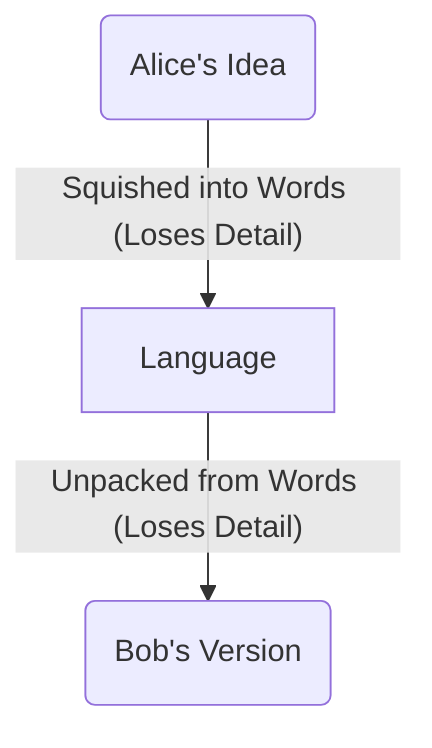
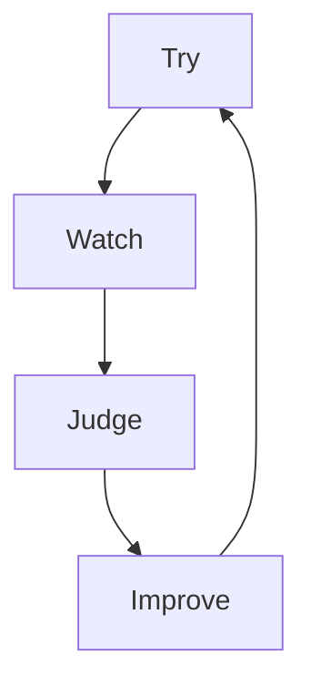

# 106: Concept/Evolution

> [!DEFINITION] [Evolution](./000_glossary.md)
> The way a smart computer system can learn, get better, and even change its own programming all by itself. It does this by watching what happens, getting feedback, or when its goals change.

sidenav

- Requires:
  - [105: Concept/AI-Native](./105_concept_ai_native.md)

This document explains **Evolution**, which is the most important idea behind how these new AI systems work. It's about how a computer program can stop being just a fixed tool and become more like a living thing that can adapt and grow as it learns about the world around it.

sidenav

- [105: Concept/AI-Native](./105_concept_ai_native.md)

## The Communication Problem: A Challenge for Everyone

Have you ever tried to explain a really cool idea or a dream to someone? You use words, but you know the other person isn’t seeing *exactly* what's in your head. That's because words are like squishing a big, complex thought into a small box. Some of the details and feelings always get lost.

This communication gap causes problems all the time when people work together. We think we've explained things perfectly, but later we find out the other person missed something important.

sidenav

- [104: Concept/Latent](./104_concept_latent.md)

An AI, especially a big one that has read most of the internet, has a special skill. It can see the hidden connections between words and ideas that one person might miss. But it has its own communication problem. It might understand the *dictionary definition* of your idea perfectly but miss the *personal meaning* it has for you. A human friend might get your personal meaning but miss the bigger connections.

It’s a mistake to think an AI can read your mind. Just like a person, it needs good, clear information to understand what you really want. Asking an AI to build something complicated perfectly on the first try is like asking a friend to do the same. It never works perfectly the first time—you have to try, check, and fix things over and over.

## Evolution: The AI's Super-Fast Solution

The big difference with an AI system is that it can do all that “trying and fixing” **by itself, super fast**. While humans have to talk, review, and slowly make changes, an AI can go through thousands of these guessing-and-checking cycles in the blink of an eye, without anyone needing to watch over it. This is **Evolution**.

sidenav

- [005: Agent/Loop](./005_agent_loop.md)
- [203: Idea/Process](./203_idea_process.md)

The steps for this super-fast learning are simple:

1.  **Try:** The AI creates a first attempt at solving a problem.
2.  **Watch:** It looks at the result of its attempt to see what happened.
3.  **Judge:** It checks the result against its goals. Did it work well? What parts were weak?
4.  **Improve:** Based on what it learned, it adjusts its own instructions. It’s like telling itself, “Okay, don’t make that mistake again,” and adds a new rule for next time.
5.  **Repeat:** It starts over with the new, improved instructions.

sidenav

This is a lot like how animals evolve. An animal adapts to survive in its environment. For an AI, the “environment” is a mix of your requests, new information, new tools it can use, and the results of its own actions.

## How Evolution Gets Big

A system can’t make huge, amazing changes all at once. It has to be built to learn in tiny steps. Everything in the system, from the smallest `Idea` to the biggest `Plan`, is designed to be able to go through this tiny improvement cycle. Each small improvement adds up, allowing the whole system to make big leaps forward.

A trick to make this even faster is to run many learning loops at the same time. Imagine trying to find the best recipe for a cookie. Instead of baking one batch, trying it, and then baking another, imagine you had a thousand ovens and could try a thousand different recipes all at once. The AI can do this with ideas. It explores many different solutions at the same time and picks the best one.

The only thing slowing it down is how much computer power it has. With enough power, it can explore a huge number of possibilities and find amazing solutions much faster than a team of people ever could.

sidenav

- [101: Concept/Idea](./101_concept_idea.md)
- [010: Agent/Plan](./010_agent_plan.md)

To you, the user, all this happens behind the scenes. It might seem like the AI just magically understood your complicated request in one go. But really, it performed thousands of tiny experiments, learning and improving with each one until it found a solution that perfectly fit what you wanted.

## What It Takes to Be a “Living” System

This ability to evolve on its own is what makes an AI system feel “alive” instead of just being a fancy tool. But for it to work, humans can’t get in the way of the learning loop. If a person has to check the results every time or write new code to help the AI improve, then it’s just a helpful assistant, not a truly independent system.

The whole point is to create a system that can manage its own improvements. When it can try things, see what happens, and get better all by itself, it can truly start to grow and become a powerful partner for solving big, complex problems.