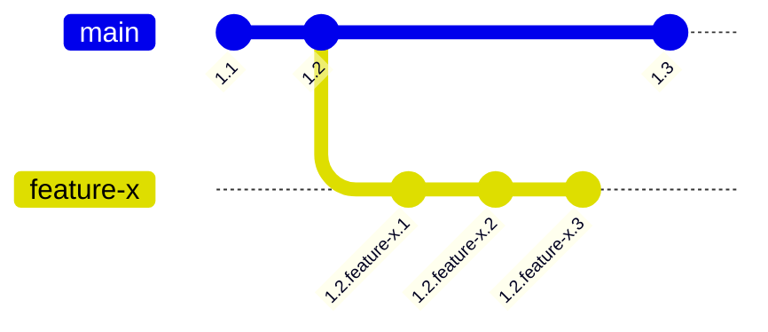

# 108: Concept/Visibility

> [!DEFINITION] [Visibility](../../acts/000_glossary.md)
> This is how the system decides which version of an :term[Idea]{canonical="Idea"} you should see at any given time. It's like asking for a book in a library that has many different editions and drafts; visibility rules figure out exactly which copy to hand you based on the :term[Idea]{canonical="Idea"}'s history, where it's being worked on, and the order you've asked to search for it.

> Sidenote:
> - You should know about:
>   - :term[107: Concept/Identity]{href="./107_concept_identity.md"}
> - This helps you understand:
>   - :term[109: Concept/Addressing]{href="./109_concept_addressing.md"}

Imagine a world full of :term[Ideas]{canonical="Idea" href="./101_concept_idea.md"} that are always growing and connecting to each other. For this to work without being a confusing mess, we need a clear way to know which version of an :term[Idea]{canonical="Idea" href="./101_concept_idea.md"} we're looking at. This is called **visibility**. It's a two-part system:

1.  **Versioning:** This is how we create and keep track of all the different drafts and editions of an Idea.
2.  **Selection:** This is how we choose the right version to show you from all the ones that exist.

## Versioning: Creating All the Different Versions

Before you can see a version, someone has to make it. We use a system called :term[Hierarchical Versioning]{canonical="Hierarchical Versioning"} to track how an :term[Idea]{canonical="Idea" href="./101_concept_idea.md"} changes. A version isn't just a simple number; it's like a family tree that tells the story of the :term[Idea]{canonical="Idea" href="./101_concept_idea.md"}'s life.

Versions have two parts: **number updates** for official public releases (like `1.2`) and **named updates** for new experiments (like `feature-x`). For example, a version named `1.2.feature-x.3` tells you it's the third update on an experiment called `feature-x`, which started from the official version `1.2`.

::::columns
:::column
Versions have two parts: **number updates** for official public releases (like `1.2`) and **named updates** for new experiments (like `feature-x`). For example, a version named `1.2.feature-x.3` tells you it's the third update on an experiment called `feature-x`, which started from the official version `1.2`.
:::
:::column

:::
::::

Here are the rules for changing an Idea's version:

- **Compatible Changes**: These are small, safe edits, like fixing a typo or adding extra information. The new version works just like the old one. This kind of change adds a new number at the end (for example, `1.2` becomes `1.2.1`).
- **Breaking Changes**: These are big changes that make the new version incompatible with the old one, like completely changing how a part of it works. These changes require a bigger version jump (for example, a big change to `1.2` would create a new version `1.3`).

## Selection: Choosing Which Version to See

Now that we have all these different versions, we need a way to pick the right one. This is done by separating how an :term[Idea]{canonical="Idea" href="./101_concept_idea.md"} is saved from how you ask for it. Think of it like a librarian finding a book for you. They need to know two things: **where** to look (which shelf) and **when** it was published (from what time period).

### Branches: Different Shelves for Your Ideas

> [!DEFINITION] [Branch](../../acts/000_glossary.md)
> A branch is like a separate workspace or a different shelf in the library where you can work on things without messing up the main collection. Putting an :term[Idea]{canonical="Idea"} on a branch is like publishing it to that specific shelf.

For instance, every version of an :term[Idea]{canonical="Idea" href="./101_concept_idea.md"} is tagged with the :term[branches]{canonical="Branch"} it belongs to, like `["main", "feature/new-billing"]`. This makes the :term[Idea]{canonical="Idea" href="./101_concept_idea.md"} visible only in those workspaces.

This gives us two big advantages:

- **Safety**: You can work on a new feature (on a `feature/new-billing` :term[branch]{canonical="Branch"}) without affecting the stable, official `main` :term[branch]{canonical="Branch"}. This keeps messy, unfinished work away from everyone else.
- **Freedom to Experiment**: It's super easy to create new :term[branches]{canonical="Branch"}. This lets you try out new things freely. If an experiment doesn't work, you can just delete the :term[branch]{canonical="Branch"}, and it's like it never happened.

### The Search Path: The Order You Check the Shelves

> [!DEFINITION] [Search Path](../../acts/000_glossary.md)
> This is your personal set of instructions that tells the system which branches to look in and in what order. It's like telling the librarian, "First, check my personal desk, then check the 'New Arrivals' shelf, and finally, check the main library."

This answers the **where** question. For example, a developer's :term[search path]{canonical="Search Path"} might look like `['feature/my-new-idea', 'staging', 'main']`.

This tells the system how to find an :term[Idea]{canonical="Idea" href="./101_concept_idea.md"}:

1.  First, look for it on the experimental `feature/my-new-idea` shelf.
2.  If it's not there, look on the `staging` shelf (where things are tested).
3.  If you still haven't found it, look on the official `main` shelf.

This lets you see your own in-progress work as if it were already part of the main system, without actually changing the main system for anyone else.

### The Cutoff Time: Finding a Version from the Past

> [!DEFINITION] [Cutoff Time](../../acts/000_glossary.md)
> This is a timestamp you can add to your request. It tells the system to find the version of an :term[Idea]{canonical="Idea"} that was the latest at that exact moment in the past.

This answers the **when** question. It's like asking the librarian for the book as it existed last Tuesday. Every search you do is for a specific point in time.

If you don't give a :term[cutoff time]{canonical="Cutoff Time"}, the system just assumes you mean right now. But if you provide a timestamp from the past, you can do a "time-traveling search." The system will find the version of the :term[Idea]{canonical="Idea" href="./101_concept_idea.md"} (and everything it depends on) that was considered the latest at that moment. This is super important because it means we can perfectly recreate how things were at any point in history.

> Sidenote:
> - :term[107: Concept/Identity]{href="./107_concept_identity.md"}

## From Rules to Reality

So far, we've talked about the rules for how visibility works — how different versions are made and how we choose between them. Now, we need a simple way to actually use these rules.

The next document, :term[109: Concept/Addressing]{href="./109_concept_addressing.md"}, will show you the special kind of web address we use, called the :term[idea:]{canonical="idea:"} address, to ask for exactly the version you want to see.
