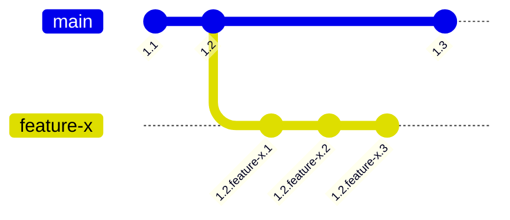

# 108: Concept/Visibility

> [!DEFINITION] [Visibility](./000_glossary.md)
> This is the set of rules that decides which version of an :term[Idea]{canonical="Idea"} you see at any given time. It depends on the :term[Idea]{canonical="Idea"}'s history, which work-in-progress area it belongs to, and how you are looking for it.

> Sidenote:
> - You should read this first:
>   - :term[107: Concept/Identity]{href="./107_concept_identity.md"}
> - This helps you understand:
>   - :term[015: Agent/Meta]{href="./015_agent_meta.md"}
>   - :term[110: Concept/Addressing]{href="./110_concept_addressing.md"}

For a system full of evolving, connected :term[Ideas]{canonical="Idea" href="./101_concept_idea.md"} to work well, we need a clear way to know which version of an :term[Idea]{canonical="Idea" href="./101_concept_idea.md"} we're looking at. Think of it like a document that has many drafts and final versions. How do you know which one to open?

The system for this has two parts: one part that creates and keeps track of all the different versions, and another part that chooses which version to show you.

## Versioning: Creating the Different Drafts

Before the system can show you a version, that version has to exist. We use something called :term[Hierarchical Versioning]{canonical="Hierarchical Versioning"}, which is just a fancy way of creating and tracking the different states of an :term[Idea]{canonical="Idea" href="./101_concept_idea.md"} as it changes. A version number isn't just a simple number; it's a series of numbers separated by dots that tells the story of how the :term[Idea]{canonical="Idea" href="./101_concept_idea.md"} grew and changed.

Versions have two parts: **integer parts** for official public releases (like `1.2`) and **branch parts** for new features being developed (like `feature-x`). For example, a version like `1.2.feature-x.3` tells you a story: "This is the third change made on the `feature-x` project, which itself started from version `1.2`."

::::columns
:::column
Versions have two parts: **integer parts** for official public releases (like `1.2`) and **branch parts** for new features being developed (like `feature-x`). For example, a version like `1.2.feature-x.3` tells you a story: "This is the third change made on the `feature-x` project, which itself started from version `1.2`."
:::
:::column

:::
::::

Here are the rules for creating a new version:

- **Compatible Changes**: This is a small update that doesn't break anything. The new version can be used in place of the old one without causing problems. For example, fixing a typo or adding a new, optional piece of information. This kind of change creates a small revision (like `1.2` becomes `1.2.1`).
- **Breaking Changes**: This is a big change where the new version can't simply replace the old one. This usually happens when you remove or change something important. This kind of change requires a bigger version number jump (for example, a breaking change to version `1.2` would lead to `1.3`). The system can automatically tell when a change is a breaking one.

## Selection: Choosing Which Version to Show You

Now that we have all these different versions, we need a way to pick the right one to show you. The system does this by separating how an :term[Idea]{canonical="Idea" href="./101_concept_idea.md"} is saved from how it is requested. When you ask for an :term[Idea]{canonical="Idea"}, you can specify two things: **where** to look (which project area) and **when** to look (at what point in time).

### Branches: Creating Separate Workspaces

> [!DEFINITION] [Branch](./000_glossary.md)
> Think of a :term[branch]{canonical="Branch"} as a separate copy or a parallel universe for your work. It lets you experiment and develop new things in a safe, isolated space.

For example, every version of an :term[Idea]{canonical="Idea" href="./101_concept_idea.md"} is tagged with one or more :term[branches]{canonical="Branch"}, like `["main", "feature/new-billing"]`. This makes the :term[Idea]{canonical="Idea" href="./101_concept_idea.md"} visible only inside those specific workspaces.

This gives us two big advantages:

- **Isolation**: You can work on a new feature (in the `feature/new-billing` :term[branch]{canonical="Branch"}) without messing up the stable, main version of the project (the `main` :term[branch]{canonical="Branch"}). This keeps unfinished work from causing problems for others.
- **Experimentation**: Creating :term[branches]{canonical="Branch"} is quick and easy. This encourages people to try out new ideas. If an experiment doesn't work, you can just delete the :term[branch]{canonical="Branch"}, and it won't affect anything else.

### The Search Path: Telling the System Where to Look

> [!DEFINITION] [Search Path](./000_glossary.md)
> A :term[search path]{canonical="Search Path"} is an ordered list of :term[branch]{canonical="Branch"} names. It tells the system which workspaces to check for an :term[Idea]{canonical="Idea"} and in what order.

This is how we answer the "where to look" question. For example, a developer working on a new feature might set their :term[search path]{canonical="Search Path"} to `['feature/my-new-idea', 'staging', 'main']`.

This tells the system how to find an :term[Idea]{canonical="Idea"} by looking in layers:

1.  First, look in the `feature/my-new-idea` workspace.
2.  If you don't find it there, look in the `staging` workspace (a place for testing).
3.  If you still don't find it, look in the final `main` workspace.

This lets a developer see their own changes layered on top of the stable system, all working together seamlessly.

### The Cutoff Time: Looking at the Past

> [!DEFINITION] [Cutoff Time](./000_glossary.md)
> A :term[Cutoff Time]{canonical="Cutoff Time"} is a specific timestamp you can include with your request. It tells the system to find the version of an :term[Idea]{canonical="Idea"} that was the latest at that exact moment in the past.

The second part of finding an :term[Idea]{canonical="Idea"} is answering "when to look." Every time you ask for an :term[Idea]{canonical="Idea"}, the system checks against a specific point in time. This is controlled by the :term[Cutoff Time]{canonical="Cutoff Time"}.

If you don't specify a time, the system just uses the current time (`now()`), showing you the newest versions. But you can also provide a time from the past, which is like a "time-traveling query." This tells the system to find the version of the :term[Idea]{canonical="Idea"}—and all the other :term[Ideas]{canonical="Idea"} it depends on—that was considered the latest at that specific moment. This is what makes it possible to perfectly recreate any past state of the system.

> Sidenote:
> - :term[107: Concept/Identity]{href="./107_concept_identity.md"}

## From Rules to Reality

This document explained the rules for **visibility**—how different versions of an :term[Idea]{canonical="Idea"} are created and how the system chooses which one to show you. Now that we have these rules, the last step is to learn the language we use to actually ask for an :term[Idea]{canonical="Idea"}.

The next document, :term[110: Concept/Addressing]{href="./110_concept_addressing.md"}, will introduce you to the `idea:` web address format. It's the specific command you use to request and navigate this world of different versions and branches.