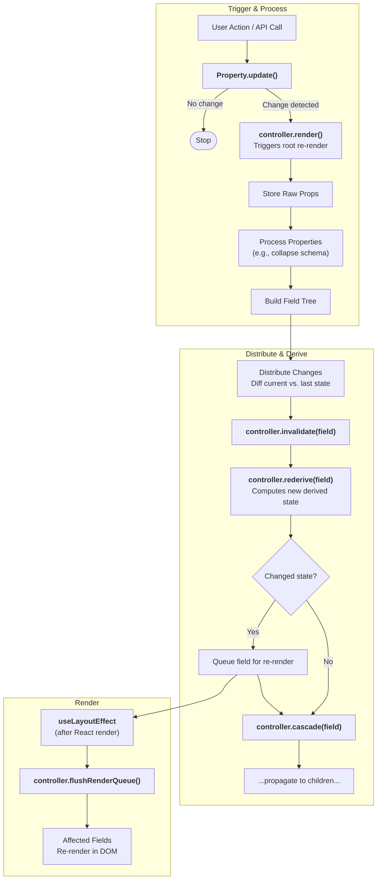

# 802: Package/UI

> [!DEFINITION] Tree Style Architecture
> This is a very fast and flexible system for drawing user interfaces on the screen. It's speedy because of its special 'controller' brain, its ability to check every little piece for correctness, and a smart system that understands how different parts depend on each other.

> Sidenote:
> - Requires:
>   - :term[800: Package/Schemistry]{href="./800_package_schemistry.md"}

The **UI Package** is a toolkit that uses this **Tree Style Architecture**. Think of it as an engine that automatically builds user interfaces, not just simple forms. It's an **Auto-Design Engine**.

## Vision: Beyond Forms

This system was inspired by tools that build forms automatically from a set of rules, but it goes much further. It works like a powerful template engine: you give it a **Schema** (the blueprint for your data) and the **Data** itself (the actual information), and it automatically builds the right user interface for it.

This "Auto-Design" power means the same information can be shown in different ways:

- **Edit Mode**: A form with text boxes and buttons, where you can change the information.
- **Show Mode**: A clean, read-only page that just displays the information, like a finished profile page.

This way, the Schema acts as the single source of truth that controls how information is both entered and displayed.

## Core Architecture

### A Smart System of Interconnected Properties

The whole system is built around a central controller that can learn new tricks. Instead of having a fixed set of features, different parts called **Properties** can be plugged in. These Properties tell the controller what they do and what other Properties they need to work, creating a network of dependencies.

- **Self-Registration**: Properties (like `data`, `schema`, or `styles`) are like building blocks that announce themselves to the system when they're added.
- **Dependency Declaration**: Each Property declares what it needs. For example, the `styles` property might say, "I need to know about `vars` (variables) and `settings` to do my job."
- **Chain Reactions**: When a basic property changes (like the data), the controller automatically updates all the other properties that depend on it, in the right order. This keeps everything in sync.
- **Type Safety**: The system is smart enough to figure out its own complete set of rules based on all the properties that have been plugged in.

### User-Defined Properties

This plug-in system makes it easy for developers to add their own custom logic. They can create new properties to handle special tasks, such as:

- **Slots**: Deciding which icon or button to show based on the current `styles`.
- **Errors**: Checking the `data` against the `schema` to find any mistakes.
- **Custom Logic**: Creating special behaviors, like showing a warning message if a user enters a specific value.

### A Themed System of Components

The engine that builds the UI isn't locked into one specific look. It uses a **Theme** system that acts as a translator, turning abstract data into actual pixels on the screen. Here’s how it works:

1.  **Schema**: The blueprint that defines the structure.
2.  **Controller**: The project manager that processes the blueprint and data, figuring out the exact `state` for every part of the UI.
3.  **Vars**: A style guide that tells the system which tiny components, called `Atoms`, to use for different parts, known as `slots`.
4.  **Atoms**: The most basic UI pieces, like an input box or a label.
5.  **Fields**: The construction crew that assembles the `Atoms` into a complete UI element based on the style guide (`vars`).

This separation means you can change the look and feel at any level, from how data is processed to the final button you see on the screen.

## State Management

The controller is the central brain that manages all the information for the entire UI tree. It uses a technique called **Structural Sharing** to be as efficient as possible with computer memory.

- **Raw Props**: This is the original,unchanged information (`data`, `vars`). It's the source of truth.
- **Current State (`controller.current`)**: The fully processed information that is sent out to all the UI components.
- **Last State (`controller.last`)**: A snapshot of the previous state, used to quickly see what has changed.

Instead of each UI component keeping its own copy of the data, they all look at slices of the central `controller.current` state. This ensures a single source of truth and keeps the entire app consistent.

## The Update & Derivation Pipeline

The controller follows the same set of steps for every update, making the whole process predictable and reliable.

1.  **Trigger**: An action, like a user typing or new data arriving, kicks off an `update`.
2.  **Process**: The raw, new information is processed into the `controller.current` state.
3.  **Distribute**: The controller compares the `current` state to the `last` state to find exactly which UI components have changed.
4.  **Invalidate & Derive**:
    - **`rederive()`**: It re-calculates any dependent properties (like `styles`) for the changed components.
    - **`cascade()`**: It passes down any changes (like design variables) to all the components nested inside the one that changed.
5.  **Render**: All the required screen updates are gathered up and performed in one single, efficient batch.

### Architecture Diagram: Update Lifecycle



## Performance

The system is designed to be very fast by avoiding unnecessary work:

- **Precise Change Detection**: It does a deep check to make sure something *really* changed before deciding to update it.
- **Selective Invalidation**: Thanks to the dependency map, only the properties that are actually affected by a change are recalculated.
- **Batched Rendering**: It groups many small changes together into a single update to the screen, which is much faster.
- **Smart Cascading**: When a style variable changes, it only forces a component to re-render if its final appearance actually changes. This prevents a storm of pointless updates.

## API Reference

### Controller Methods

```typescript
// Update a field property
controller.update(path: string, property: string, value: any): Promise<boolean>

// Merge with existing property value
controller.merge(path: string, property: string, value: object): Promise<boolean>

// Get property value
controller.get(property: string, path?: string): any

// Inherit property value up the tree
controller.inherit(property: string, path: string, key?: string): any

// Register field subscriber
controller.register(path: string, forceRender: () => void): () => void
```

### Property Registration Example

```typescript
const StylesProperty = {
  priority: 50,
  fieldDefaults: { styles: {} },
  dependencies: ['vars', 'settings'],

  derive: field => {
    const newStyles = getComputedFieldStyles(
      field.mode,
      varName => field.controller.inherit('vars', field.path, varName),
      field.type
    );
    return { styles: newStyles };
  },

  invalidate: (field, controller, newValue, oldValue) => {
    controller.rederive(field, ['styles']);
    controller.cascade(field, ['styles']);
  },
};

Property.register('styles', StylesProperty);
```
