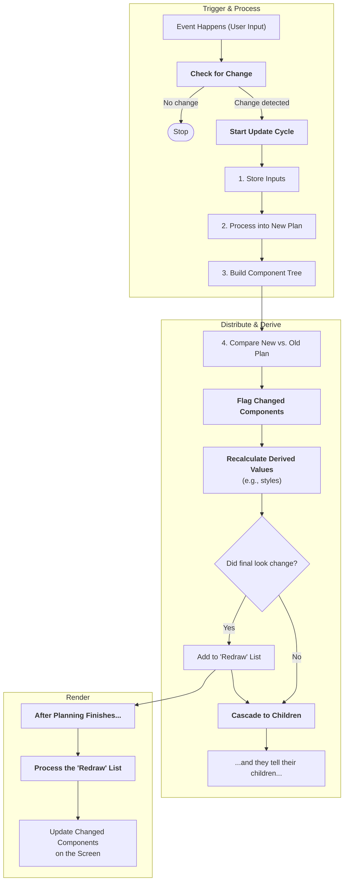

# 802: Package/UI

> [!DEFINITION] Tree Style Architecture
> An engine that automatically builds user interfaces (the part of an app you see and interact with) directly from a data blueprint, called a **Schema**. The Schema acts like the frame of a house. You can then use separate stylesheets to paint and decorate the house, and different "adapters" to build it with various tools, all without changing the original frame.

> Sidenote:
> - Requires:
>   - :term[800: Package/Schemistry]{href="./800_package_schemistry.md"}

The **UI Package** is a system where the **Structure of your data IS the Design of your app**. Instead of building every screen by hand, this engine looks at your data's blueprint (the JSON Schema) and builds the user interface for you automatically. If you change the blueprint, like adding a new field, the interface changes instantly to match.

## Core Idea: The Blueprint is the Only Truth

In many apps, the data and the user interface are built separately and can fall out of sync. This package fixes that by making the **Schema** the single, undisputed plan that the interface must follow.

- **Built on the Fly**: The UI isn't fixed or pre-built. It's created directly from the Schema. Change the Schema, and the UI changes with it.
- **Always Correct**: Because the UI is just a visual representation of the Schema, you get rid of bugs where the screen doesn't match the data behind it.

## Easy Redecorating

While the Schema decides _what_ to show, a **Stylesheet** decides _how_ it looks. This separation lets you completely redesign the app without touching the data's structure.

- **A Layer for Looks**: Stylesheets are like a set of instructions that tell the system how to style each part of the blueprint.
- **Swappable Themes**: You can change the entire layout, colors, and feel of the app just by swapping out the stylesheet. It’s like putting a new theme or skin on your app.

## Adapters: Use Any Tools You Like

The engine doesn't care what UI toolkit you use. It uses **Adapters** to translate its abstract plan into real UI elements you can see on the screen.

- **Connects to Design Systems**: An adapter can connect to popular toolkits (like Material UI or Ant Design), turning your simple blueprint into beautiful, ready-made components.
- **Works Anywhere**: There's a basic adapter that can turn any Schema into a simple, clean HTML webpage, so it always works out of the box.

## Different Views for Different Jobs

You can show the same data in different ways using **View Modes**.

- **Edit Mode**: Creates a form with text boxes, buttons, and dropdowns, so you can change the data.
- **Show Mode**: Creates a clean, read-only page for just looking at the data.

This means one data blueprint can be used for multiple purposes, so you don't have to build separate screens for creating and viewing information.

## Core Concepts

### A Smart System of Cause and Effect

The engine is managed by a central "brain" where different modules or "workers" report for duty. Each worker manages one piece of information (like data, styles, or settings) and tells the brain what other workers it depends on. This creates a chain reaction.

- **Workers Announce Themselves**: When a new module is added, it tells the brain what it does.
- **Workers Declare Needs**: A worker can say, "I can't calculate the `styles` until I know the `settings`."
- **Automatic Updates**: If the `settings` change, the brain automatically tells the `styles` worker to recalculate. Everything stays in sync without any manual effort.
- **Type Safety**: The system is smart enough to understand the types of all the data, making code safer and easier to write.
- **Add New Skills Easily**: You can add new workers with new abilities without having to change any of the old ones.

### Creating Your Own Workers

You can extend the system by creating and registering your own custom workers to add new features. This lets you build powerful tools that are specific to your app's needs. For example, you could create:

- A `slots` worker that decides which UI pieces to show based on the `styles`.
- An `errors` worker that checks the `data` against the `schema` to find mistakes.
- A styling worker that changes the look of a field based on its value.

### How the Interface Gets Built

The system keeps everything separate, allowing the engine to work with any UI tools. The process is like baking a cake:

1.  **Schema is the Recipe**: The recipe defines the ingredients and the structure of the cake.
2.  **Controller is the Baker**: The baker reads the recipe and prepares a `state` (a plan) for every part of the cake.
3.  **Variables are Decoration Choices**: These are notes like, "Use 'StarSprinkles' for the 'top' part of the cake."
4.  **Atoms are the Raw Ingredients**: These are the basic UI building blocks, like an `<Input />` box or a `<Button />`.
5.  **Fields are the Recipe Steps**: A `Field` is an instruction that looks at its decoration notes to see which ingredients (Atoms) it needs.
6.  **Baking is Data-Driven**: A `Field` only uses an `Atom` if its part of the state actually has data for it. No empty decorations.
7.  **Fields for Simple Inputs**: One `Field` might represent a single data point, like a text input with a label.
8.  **Fields for Groups**: Another `Field` can be a container, like a big section of a form that organizes other child `Fields` inside it.

This clean process allows you to customize every part of the system, from how data is handled to the final look of the app.

### Smart Memory Management

The brain (the controller) keeps track of the app's entire state in one central place. It cleverly remembers the original instructions, the current plan, and the last plan to see what's changed.

- **Original Instructions (`controller.props`, `controller.data`)**: The original data you give the app. The system never changes this, so you always have a clean copy.
- **Current Plan (`controller.current`)**: After processing the original instructions, the brain creates a new, clean plan. This is the single source of truth that all the UI components look at.
- **Previous Plan (`controller.last`)**: A snapshot of the plan from the last update. The brain compares the `current` plan to the `last` one to see exactly what changed.

**Sharing the Plan:**

To save memory and keep things simple, every part of the UI shares the same central plan.

- **No Copies**: Instead of giving every component its own copy of the data, they get a shortcut that points to their specific part of the main plan.
- **Always Consistent**: Because everyone is looking at the same plan, the UI is always perfectly in sync.
- **Parents Can See Children**: A bigger component (like a whole form section) can see the full plan for all the smaller components inside it.

### The Update Process

The system uses the same simple, predictable process for the first time it builds the app and for every single update after that.

- **Trigger**: Something happens (like a user typing). A worker checks if the change is important. If not, it stops.

- **Restart**: If the change matters, the brain kicks off a full update cycle.

- **Store Instructions**: The brain reads the latest set of instructions for the app.

- **Process Plan**: It turns those instructions into a new `current` plan.

- **Assign Jobs**: The brain makes sure every part of the plan has a component ready to handle it.

- **Distribute Changes**: The brain compares the new plan to the old one to find the exact parts that changed.

- **Update and Recalculate**: It tells each changed part to update itself. This starts a chain reaction:
  - `rederive()`: Any other parts that depend on the changed part are recalculated (e.g., styles change if data changes).
  - `cascade()`: The change is passed down to any child components, which then run their own updates.
  - Any component that ends up with a new look is added to a list of things to redraw.

- **Draw to Screen**: After all the planning is done, the system updates all the changed parts on the screen in one single, quick batch.

## Performance & Efficiency

### Efficient Updates

The system is built to be fast by doing as little work as possible.

- **Finds Tiny Changes**: By comparing the old and new plans, the system knows exactly which tiny piece of the UI needs to be updated, instead of rebuilding everything.
- **Only Recalculates What's Needed**: It only runs calculations for components that are actually affected by a change.
- **One Update at a Time**: It gathers all the screen updates into a single list and does them all at once, so your screen doesn't flicker.
- **No Wasted Renders**: If multiple changes happen to the same component in one cycle, it still only gets redrawn once.

### Smart Inheritance

The system smartly passes down settings (like CSS variables) from parent components to children, much like how styles work in CSS, without doing extra work.

- **Dependency Map**: The system figures out which parts depend on which other parts once and saves that map. It uses this map to run updates in the right order every time.
- **Lazy Inheritance**: A child component only asks its parent for a setting when it actually needs it.
- **Stops When Overridden**: If a setting is passed down, the process stops at any child component that has its own, more specific setting.
- **No Change, No Update**: If a change to a setting doesn't actually result in a different final look for a component (because it was overridden), the component isn't redrawn. This prevents wasted effort.
- **Real Consequences Only**: This means a change only causes a screen update if it has a real, visible consequence on the UI.

## Example Update Flow

Every update follows the same path. Let's see what happens when a user changes a color setting.

```typescript
// User updates a CSS variable on the 'user.name' field
await controller.update('user.name', 'vars', { '--field-color': 'red' });
```

Here's what goes on behind the scenes:

- The brain is told that the `vars` (CSS variables) for the `user.name` field have changed.
- It sees this is an important change and starts a full update cycle.
- It creates a new plan (`controller.current`) that includes this new color.
- It compares the new plan to the old one and sees that `vars` on `user.name` is different.
- This triggers the chain reaction: the `styles` for `user.name` are recalculated based on the new variable. The change is also passed down to any children.
- Because the `styles` changed, the `user.name` field is added to the list of things to redraw on the screen.
- Finally, the system draws the updated component with the new red color.

## Architecture Diagram: Update Lifecycle



## API Reference

### Controller Methods

```typescript
// Update a field property
controller.update(path: string, property: string, value: any): Promise<boolean>

// Merge with existing property value
controller.merge(path: string, property: string, value: object): Promise<boolean>

// Get property value
controller.get(property: string, path?: string): any

// Inherit property value up the tree
controller.inherit(property: string, path: string, key?: string): any

// Register field subscriber
controller.register(path: string, forceRender: () => void): () => void
```

### Property Registration Example

Properties are self-contained modules that tell the brain how to manage a specific piece of the app's state.

```typescript
const StylesProperty = {
  priority: 50,
  fieldDefaults: { styles: {} },

  // Declare that this property depends on 'vars' and 'settings'
  dependencies: ['vars', 'settings'],

  // --- Lifecycle Methods ---

  // Calculates the 'styles' object. Runs automatically
  // when 'vars' or 'settings' change.
  derive: field => {
    const newStyles = getComputedFieldStyles(
      field.mode,
      varName => field.controller.inherit('vars', field.path, varName),
      field.type
    );
    return { styles: newStyles };
  },

  // How to handle direct updates. Not common for a derived
  // property like styles, which are calculated automatically.
  update: (field, controller, value) => {
    return false; // Tells the system that this property isn't updated directly.
  },

  // This function is part of the chain reaction.
  // It tells the controller to recalculate styles for this field and its children.
  invalidate: (field, controller, newValue, oldValue) => {
    controller.rederive(field, ['styles']);
    controller.cascade(field, ['styles']);
  },
};

// Tell the system about our new property worker
Property.register('styles', StylesProperty);
```

This system provides a powerful and organized way to build complex, fast user interfaces that are easy to manage and extend.
