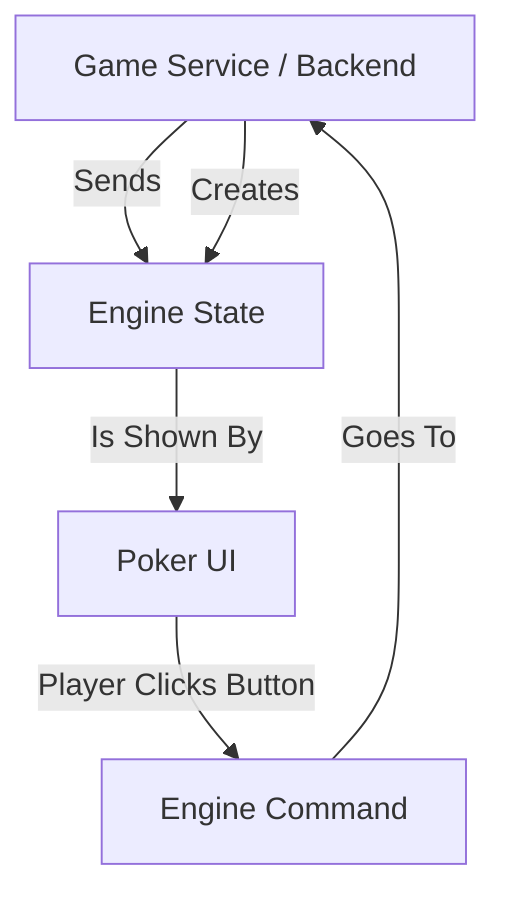

# 851: Package/Poker UI

> [!DEFINITION] Poker UI
> Think of Poker UI as a smart display for a poker game. It’s a library built for React that has one job: show the game exactly as it’s told. It has no brain of its own and doesn’t know any poker rules. It just takes the game's current situation (the “state”) and shows it to you. When a player clicks a button, it doesn't process the move; it just reports the action back to the main game engine.

> Sidenote:
> - **What it needs:**
>   - :term[851: Package/Poker Engine]{href="./851_package_poker_engine.md"} (the game's brain)
> - **What it works with:**
>   - :term[850: Package/Game Service]{href="./850_package_game_service.md"} (for multiplayer games)

The **Poker UI** package is a perfect example of how to build a game's screen, especially when the game's “brain” is shared between many players. It gives you a complete, ready-to-use poker table that you can change the look of. All the rules and logic are handled by a separate program called the :term[Poker Engine]{href="./851_package_poker_engine.md"}.

## Philosophy

The whole idea is to keep the screen (the looks) and the brain (the rules) completely separate:

1.  **Just for Show**: The UI has **zero game rules** inside it. It doesn't figure out who won a hand, calculate pot sizes, or decide whose turn it is. It simply shows the `State` that the engine gives it.
2.  **It Follows Orders**: Imagine a simple text box in an app. The box itself doesn't decide what text is in it; the app tells it what to display. When you type, the box just reports, “Someone typed a letter!” and lets the app figure out what to do. The Poker UI works a lot like that. It accepts a `state` to show and calls a function like `onStateChange` when a player does something.
3.  **Powered by the Engine**: It completely depends on the :term[Poker Engine]{href="./851_package_poker_engine.md"} to be the “brain.” This makes sure that what you see on the screen follows the exact same rules as the game server.
4.  **Ready for Multiplayer**: It's built to plug directly into the :term[Game Service]{href="./850_package_game_service.md"}, making it easy to create an online poker game where many people can play together.

## Architecture

The system works with a one-way flow of information. The game server (the backend) is the one and only source of truth about the game.



This separation makes some cool things possible:

- **Feeling Fast**: When you make a move, the UI can pretend it happened instantly, making the game feel super responsive while it waits for the server to confirm it.
- **Instant Replay**: You can easily watch a replay of a past hand. Just feed the UI a recording of all the previous game states, and it will play it back like a movie.
- **Easy Testing**: You can test if the display looks right by giving it a saved snapshot of a game, without needing to play through a whole game just to get to that point.

## Usage

The main piece you'll use is the `<PokerGame />` component. You just need to give it the current `state` of the game and tell it what to do when a player makes a move.

```tsx
import React, { useState } from 'react';
import * as Poker from '@idealic/poker-engine';
import { PokerUI } from '@idealic/poker-ui';
import '@idealic/poker-ui/src/style.scss';

const App = () => {
  // 1. Get the starting game state, usually from a server.
  const [state, setState] = useState<Poker.State>(initialState);

  const handleStateChange = (newState: Poker.State) => {
    // 2. Instantly update what you see on the screen.
    setState(newState);

    // 3. Then, tell the server (or game engine) what just happened.
    // api.sendAction(newState.lastAction);
  };

  return (
    <PokerUI
      state={state}
      onStateChange={handleStateChange}
      author="Player1" // Tells the UI which player we are, so it knows which secret cards to show us.
      options={{
        buyIn: 1000, // Starting amount of chips.
      }}
    />
  );
};
```

### Integration with Game Service

When you connect this UI to the :term[Game Service]{href="./850_package_game_service.md"} for an online game, the process is similar. The player's action is sent to the service, which figures out what happens next according to the rules and sends back the new state of the game.

```tsx
// ... inside your component
const handleStateChange = async (newState: Poker.State) => {
  // The Service takes the player's action, runs the game rules, and returns the new state.
  const processed = await Service.process(newState);
  setState(processed);
};
```

## Customization

The UI is built to be flexible. You can swap out its individual parts, like the cards or player avatars, with your own custom designs without having to change the main game layout.

```tsx
import { PokerUI, Card } from '@idealic/poker-ui';

// A custom component for how cards look
const MyCustomCard = props => <div className="my-fancy-card">{props.card}</div>;

<PokerUI
  state={state}
  components={{
    Card: MyCustomCard, // Replace the default Card with our own custom one.
    // You can also replace Chips, the Player display, the Board, etc.
  }}
/>;
```

## Styling

The look and feel is controlled by a standard style file (`src/style.scss`). It uses simple, clear names for everything (like `.poker-player` or `.poker-card`), so you can easily write your own styles to change the colors, fonts, and layout.
