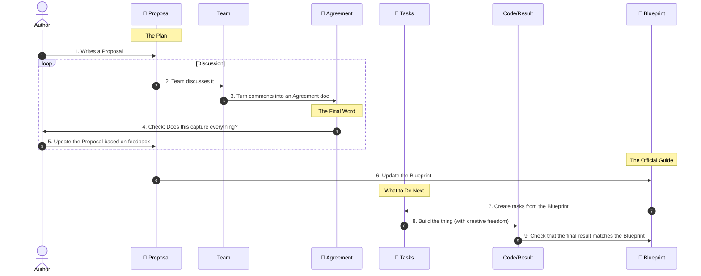

# 02: Company/Process

> [!DEFINITION] Our Standard Process
> This is our official playbook for turning big ideas into real things that work. We do it by sharing responsibility, building on ideas together, and checking in with each other all the time.
>
> Sidenote:
> - Goes with: :term[00: Company/Truth]{href="./50_prompt_truth.md"}

We've reached a point where just exploring ideas isn't enough. To really build, discover, and make progress, we need a clear, disciplined process to follow.

## 1. The Vision

Our main belief is simple: **If you describe exactly what needs to be built, building it becomes easy.**

Right now, we're still manually turning our documents into code or presentations, but we're also building tools to make that automatic. The **Specification** document is our single source of truth for everything. **Having this official blueprint makes the actual work much simpler and means nobody has to micromanage anyone else.**

Once a Proposal is approved, you enter a phase of **Creative Freedom**. The person building it is free to solve the problem in the best way they can think of. The only rules are to follow the **Specification** and the specific tasks created from the Proposal.

**Most importantly, you never edit the Specification directly.** The Proposal process isn't optional—it's the only way to make a change to our official blueprint.

> [!DANGER] NO WORK WITHOUT APPROVAL
> Don't start building anything (like writing code or making designs) until the **Proposal** is officially approved.
>
> - **It’s Cheaper to Change a Plan than a Product:** Rewriting a text document is easy. Rewriting code or redoing 20 slides is painful and expensive.
> - **Start with the Big Picture:** Solve the “why” and the “what” before you get lost in the “how.”

## 2. The Documents We Create

We split our work into three types of documents to make sure everything is clear, safe, and that we're all on the same page.

### :term[20: Specification]{href="./20_document_spec.md"} (The Blueprint)

This is the permanent, official description of our system. It's the only source of truth that matters.

- **Stick to the Truth:** This document must follow the company's rules for clarity, as explained in :term[00: Company/Truth]{href="./50_prompt_truth.md"}. It has to be complete and totally unambiguous.
- **Be Right, Not Fast:** Unlike other documents, the Specification has to be perfect. It's better to leave a part of it blank than to write something that's wrong.
- **The Map:** It shows everyone where we're going. It lets you understand the whole project without having to remember every single detail.
- **Managing Complexity:** When a system gets really big, no one can hold the entire thing in their head. The Specification acts as the project’s memory, allowing it to grow without becoming a mess.
- **Always Up-to-Date:** This is the ultimate guide for our Code, Presentations, and Architecture.

### :term[21: Proposal]{href="./21_document_proposal.md"} (The Suggestion)

This is a temporary document where we suggest a change. It’s where we can safely explain what we want to do without messing up the official blueprint.

- **The Start of a Task:** This document is where our engineering tasks come from. It’s the source of truth for our *intentions*.
- **What vs. How:** It separates the idea (“what we want to do”) from the details (“how we will do it”). This lets us discuss whether an idea is good without getting stuck on technicalities.
- **A Safe Place to Explore:** It lets us suggest huge changes without breaking anything. If a Proposal is rejected, all we've lost is a text file.
- **Instructions for the AI:** This document gives our AI tools the context they need to understand what we want them to do.

### :term[22: Alignment]{href="./22_document_alignment.md"} (The Agreement)

This is an auto-generated summary of our team's discussion about a Proposal. It makes sure every opinion is included and every decision is written down before work starts.

- **Distilled Wisdom:** It turns a long, threaded conversation into a simple list of requirements. It cuts through the noise to find the important stuff.
- **A Living Agreement:** It’s not just a chat log. It's a place where the person who wrote the Proposal and the team members who reviewed it can agree on the final plan that came from their discussion.
- **Instructions for the AI:** This gives the AI the final, approved instructions for how to carry out the changes.
- **A Final Check:** It's a way for the author to double-check that the AI (and the team) completely understands all the feedback before moving forward.
- **Temporary:** We only use this document once, as the official record of the review. We **never** save it to our main code library.

## 3. The Cycle of Agreement

We don't just jump in and write code. We follow a clear cycle:

1.  **Write a Proposal:** An author creates a :term[Proposal Document]{href="./21_document_proposal.md"} explaining a problem and their idea for a solution.
2.  **Discuss:** The team reviews the Proposal. This is where questions, ideas, and debates happen.
3.  **Create the Agreement:** We use an AI to summarize the entire discussion into a clear :term[Alignment Document]{href="./22_document_alignment.md"}. This turns messy comments into a clean list of requirements.
4.  **Review and Rerun:** The author checks the summary. If it’s not quite right, they **don't edit it directly**. Instead, they add more comments to the original discussion to clarify things and then ask the AI to generate a new summary. They repeat this until the summary is perfect.
5.  **Update the Blueprint:** Once everyone is in agreement, we update the official :term[Specification]{href="./20*document_spec.md"} to include the new plan—*before* any code gets written. This is where the “what we want” turns into the “how it will be.”
6.  **Create Tasks:** We make **Jira Tickets** based on the updated Specification.
7.  **Build It:** We create the final product (code, a presentation, etc.).

> [!NOTE] This Isn't Red Tape, It's About Being Clear
> This process isn't meant to slow us down; it’s meant to protect our work and ideas.
>
> - The **Proposal** protects our original intention (Why we're doing this).
> - The **Alignment** protects our agreement (What we decided).
> - **Jira** protects our priorities (What to do next).
> - The **Specification** protects our reality (How it all works).
>
> By making sure we all understand each other *before* we start building, we free up engineers to do their best work without confusion.

> [!NOTE] Creative Freedom & Your Own Game Plan
> When it's time to build, the engineer or AI might create their own internal **Implementation Plan** (a private, step-by-step to-do list). This is their personal guide to get from the Proposal to the final code. It does **not** need a team review. As long as the final product does what the Proposal said it would, the “how” is up to the creator.

> [!WARNING] What to Do If the Plan Changes
> If you start building and find a problem with the plan, you **MUST** stop and go back. Update the Proposal or create a new one. Don't just change course on your own without telling anyone.

## 4. The Check-in Ritual

> [!DEFINITION] 1-on-1 Calls
> These are short, frequent chats with team members to solve problems, answer questions, and make sure we all trust each other.

We check in daily to make sure no one is getting stuck or going off track while working alone.

- **Daily 10-Minute Check-ins:** A quick, focused meeting with your lead to make sure you're still heading in the right direction.
- **Come Prepared:** You must have your questions or topics ready before the call.
- **A Process You Can Trust:** This routine gets rid of the stress of not knowing if you're on the right path.

## 5. The Role of the AI

We use AI not to think for us, but to help us stick to our process.

- **Speak Your Mind:** We often record ourselves talking through our ideas to capture every detail.
- **Instructions for the AI:** The Alignment Document is the main instruction manual we give to our AI tools.
- **Check the Work:** We always check the AI's output to make sure it meets the high standards we've set in our documents.

## Summary

We trade the feeling of 'do-whatever-you-want' freedom for the reality of making real progress. By having clear rules for how we make decisions, we free ourselves up to achieve amazing things together.
