# 02: Company/Process

> [!DEFINITION] Standard Process
> Our team's recipe for turning big ideas into real things. It’s a method for working together, building on our ideas, and checking in with each other often to make sure we’re all on the same page.

> Sidenote:
> - This document works with: :term[00: Company/Truth]{href="./50_prompt_truth.md"}

We’re at a point where just exploring ideas isn't enough. To actually build great things and make real progress, we need a clear and consistent plan that everyone follows.

## 1. The Vision

Our whole process is built on one core idea: **If you get the plan perfect, the work becomes easy.**

Right now, we're still manually turning our documents into code or presentations, but we're also building tools to do this automatically. The **Specification** document is our single source of truth for the plan. **When this plan is clear and correct, actually building the thing is simple, and no one needs to be micromanaged.**

Once a Proposal is approved, you enter a phase of **Creative Freedom**. The person building it is free to solve the problem however they want, as long as they stay within the boundaries of the **Specification** and the tickets created from the Proposal.

**Most importantly, we never edit the Specification directly.** You always have to go through the Proposal process first. It’s the only way to make a change to our official plan.

> [!DANGER] NO WORK WITHOUT APPROVAL
> Don't start building anything (like coding or designing) until the **Proposal** is officially approved.
>
> - **Fail Fast with a Sketch:** It’s easy and cheap to rewrite a plan on paper. It's hard and expensive to rewrite code or redo a 20-slide presentation.
> - **Big Picture First:** Figure out *what* you're trying to achieve before you start fixing small details.

## 2. The Documents We Use

We split our work into three types of documents to keep everything clear, safe, and organized.

### :term[20: Specification]{href="./20_document_spec.md"} (The Blueprint)

This is the master plan for our system. It's the one and only source of truth for what we are building.

- **Stick to the Truth:** This document must be perfectly clear and precise, following the rules we set in our :term[guide to truth]{canonical="00: Company/Truth" href="./50_prompt_truth.md"}.
- **Correctness Over Speed:** The blueprint must be 100% correct. It’s better to leave a part of the plan blank than to fill it in with wrong information.
- **The Map:** It shows everyone where we are going. This way, anyone on the team can understand the big picture without needing to remember every single detail.
- **Managing Complexity:** When a project gets really big, no one can hold the whole thing in their head at once. The Specification lets us grow the system in a smart way while keeping the plan consistent.
- **Always Updated:** It is the official **Source of Truth for the System** we are building (whether it's code, a presentation, or the architecture).

### :term[21: Proposal]{href="./21_document_proposal.md"} (The Suggestion)

This is a temporary document, like a request for comments (RFC), where we can safely write down what we *want* to do. It lets us explore ideas without messing up the official blueprint.

- **Where Tasks Come From:** This is the document that we use to create small, specific tasks for engineers. It's the **Source of Truth for Our Intentions** (and for our task board in Jira).
- **Separating Ideas from Work:** It lets us talk about "What we want to do" separately from "How we will do it." This way, we can agree on the value of an idea without getting stuck on the technical details too early.
- **A Safe Place to Explore:** We can suggest big, crazy changes here without breaking anything. If a Proposal is rejected, all we've lost is a simple text file.
- **Instructions for the AI:** The AI assistants we use need clear context to work properly. This document gives them the instructions they need.

### :term[22: Alignment]{href="./22_document_alignment.md"} (The Agreement)

This is a summary of our discussion, automatically generated from our comments. It makes sure every opinion is heard and all decisions are written down before we start building.

- **Summary of Wisdom:** It turns a long, messy conversation into a simple, flat list of requirements. It cuts through the noise and saves only the important points.
- **A Living Agreement:** It's not just a chat log. It's a workspace where the person who wrote the proposal and the people reviewing it can agree on the final plan that came out of their discussion.
- **Instructions for the AI:** This gives the AI a verified, clean set of instructions to carry out the changes.
- **A Final Check:** The author uses this document as a quick check to make sure the AI (and the team) completely understands all the feedback before moving forward.
- **Disposable:** This is a one-time document that serves as the **Source of Truth for the Review**. It is **never saved** in our main code repository.

## 3. Our Step-by-Step Workflow

We don't just jump into writing code or making slides. We follow a careful process that makes sure we all agree on the goal *before* we start working on the solution.

```mermaid
sequenceDiagram
    autonumber
    actor Author
    participant Proposal as 📄 Proposal (RFC)
    participant PR as PR Review
    participant Alignment as 📄 Alignment
    participant Spec as 📘 Specification
    participant Jira as 🎫 Jira Tickets
    participant Artifact as Artifact

    Note over Proposal: Source of Truth for Intent
    Author->>Proposal: 1. Drafts Proposal

    loop Feedback Cycle
        Proposal->>PR: 2. Discuss
        Note over PR: Source of Truth for Feedback
        PR->>Alignment: 3. Synthesize Alignment
        Note over Alignment: Source of Truth for Consensus
        Alignment->>Author: 4. Review
        Author->>Proposal: 5. Patch Proposal
    end

    Note over Spec: Source of Truth for System
    Proposal->>Spec: 6. Update Spec (Creative Freedom)

    Note over Jira: Source of Truth for Priorities
    Spec->>Jira: 7. Create Tickets
    Jira->>Artifact: 8. Execute
```

1.  **Draft Proposal:** Someone writes up a :term[Proposal Document]{canonical="Proposal Document" href="./21_document_proposal.md"} explaining a problem and how they think we should solve it.
2.  **Discuss:** The team reviews the Proposal and discusses it. This is where everyone asks questions and shares their thoughts.
3.  **Synthesize Alignment:** We use an AI to read all the comments and automatically create an :term[Alignment Document]{canonical="Alignment Document" href="./22_document_alignment.md"}. This turns the conversation into a clear list of requirements.
4.  **Review:** The original author checks the Alignment Document. If it's not quite right, **they don't edit it directly**. Instead, they add more comments to the discussion and run the AI again until the summary is perfect.
5.  **Patch Proposal:** The author updates the original :term[Proposal]{canonical="Proposal" href="./21_document_proposal.md"} with the changes from the :term[Alignment]{canonical="Alignment" href="./22_document_alignment.md"}. Now, the Proposal shows the final, agreed-upon idea, not just the first draft. The Proposal is now "Frozen," meaning it can't be changed.
6.  **Update Spec:** Using the frozen Proposal as a guide, we update the master :term[Specification]{canonical="Specification" href="./20*document_spec.md"} *before* any code is written. This is where we turn the "what" (the idea) into the "how" (the technical plan).
7.  **Create Tickets:** We break down the work into small tasks in **Jira**, based on the goals in the :term[Proposal]{canonical="Proposal" href="./21_document_proposal.md"} and the new details in the :term[Specification]{canonical="Specification" href="./20_document_spec.md"}.
8.  **Execute:** Finally, we build the thing (the code, the presentation, etc.).

> [!NOTE] Not Rules, Just Clarity
> This process isn't meant to slow us down with rules; it's meant to protect our ideas and keep us all on the same page.
>
> | Document          | What It's the Source of Truth for... | Its Job                                               |
> | :---------------- | :--------------------------------- | :---------------------------------------------------- |
> | **Proposal**      | **The Goal**                       | Protects the original vision of the idea.             |
> | **PR Review**     | **The Feedback**                   | Gives us the raw comments and critiques.              |
> | **Alignment**     | **The Agreement**                  | Summarizes what everyone agreed on.                   |
> | **Jira**          | **The Priorities**                 | Keeps track of what we need to work on first.         |
> | **Specification** | **The System**                     | Keeps track of what has actually been planned/built.  |
>
> By making sure we communicate clearly and agree on the plan *before* we start building, we free up engineers to do their best work with confidence.

> [!NOTE] Creative Freedom & Personal Plans
> When it's time to **Execute**, the person building the feature can create their own personal **Implementation Plan** (like a step-by-step to-do list for coding). This is just for them and doesn't need to be reviewed by the team. As long as the final product matches what we agreed on in the Proposal, *how* you get there is up to you.

> [!WARNING] When Plans Change
> If you're building something and discover a problem with the plan (like, "I need to add five more slides," or "This design won't work"), you **MUST** stop and go back through the process.
>
> - **If the review is still open:** Update your Proposal and ask the team to look at it again. You can create a new Alignment document to capture just the new feedback.
> - **If the review is closed:** Don't reopen the old Proposal. Create a new, small Proposal just for the change you need to make.
>
> **Never go off-plan by yourself.** Changes that aren't approved mess up our single source of truth.

## 4. Staying in Sync

> [!DEFINITION] 1-on-1 Calls
> Quick, regular check-ins to unblock people, answer questions, and make sure we all trust each other and are heading in the same direction.

We sync up daily so that no one gets lost or goes too far down the wrong path while working alone.

- **Daily 10-Minute Check-ins:** A short, focused meeting with leadership to make sure your work is still on track.
- **Come Prepared:** You must have your questions and topics ready before the call.
- **A Reliable Process:** These meetings remove the stress of wondering if you're doing the right thing.

## 5. How We Use AI

We use AI as a tool to help us follow our process, not to do our thinking for us.

- **Dictate to Explain:** We often speak our thoughts out loud and have them transcribed to make sure we capture our full intention.
- **Input for the AI:** The final Alignment Document is the main set of instructions we give to our AI assistants.
- **Check the Output:** We check the AI's work to make sure it meets the standards we've defined in our documents.

## Summary

We choose real progress over the feeling of total freedom. By having clear rules for how we make decisions, we free ourselves up to build amazing things together.
