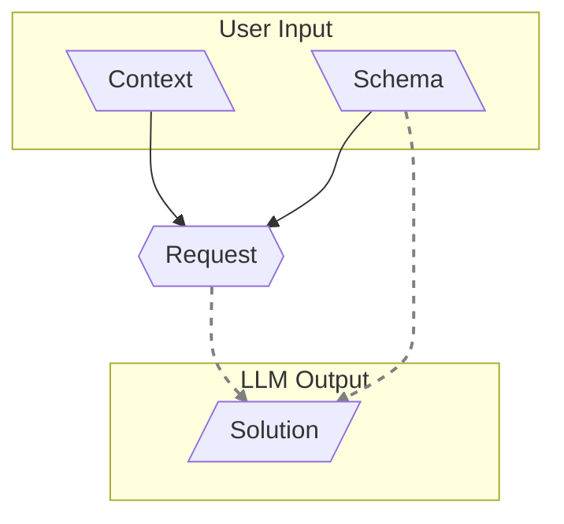

# 001: Agent/Request

> **Request:** Think of a "Request" as giving the AI a single, complete mission. You give it some background info (`context`) and a template for the answer (`schema`), and it gives you back the filled-out template (`solution`). — [Glossary](./000_glossary.md)

This page explains the **Request**, which is the basic building block for how we talk to an AI (what we call an LLM). A `Request` is what turns a big idea from the [101: Concept/Idea](./101_concept_idea.md) document into something a computer can actually figure out. It takes the idea's background information (`context`) and its answer template (`schema`) to create a final answer (`solution`).

## The Request Pipeline

A `Request` isn't just asking a simple question. It's more like a recipe or an assembly line. It takes a bunch of different pieces of information and follows a series of steps to create one perfect answer that fits our rules.

### Context: The Story So Far

The most important part of a `Request` is its `context`. Imagine you're telling the AI a story to get it up to speed. This story is given as a list of `Message` objects. This lets you set up a whole conversation, with different characters or turns, so the AI knows exactly what's going on.

A simple story might look like this:

```json
[
  { "role": "system", "content": "You are a helpful assistant." },
  { "role": "user", "content": "What is the capital of France?" }
]
```

### Special Kinds of Messages

Our system makes this even cooler by allowing special types of messages. Instead of just being plain text, the `content` of a message can be a special package of information, like `{ "type": "state", "state": { ... } }`.

Think of these like special items in a video game. Each special message type has its own instructions for how to use it. As the system reads through the messages, these instructions can change three things about the mission:

- **AI Settings**: It can change things like which AI model to use or how creative it should be.
- **Answer Template (`Schema`)**: It can change the rules for what the final answer should look like.
- **The Story (`Context`)**: It can change the story itself, maybe by turning a special message into plain text for the AI to read, or by adding totally new messages to the conversation.

This lets us work with big, complicated ideas and automatically builds the perfect, precise mission for the AI to handle a task.

### Schema: The Blueprint for the Answer

The `schema` is like a fill-in-the-blanks form or a blueprint that the AI's answer _must_ follow. It tells the AI exactly how to structure its `solution`, whether it's a single word or a complicated report with many parts. This guarantees that the AI's answer will always be organized and easy for our programs to understand.

As these blueprints get more detailed, they can do more than just shape the final answer. They can also guide _how_ the AI thinks. For example, a blueprint can have a section for the final answer, but also a separate section that asks the AI to first write down its step-by-step thinking. This turns the blueprint into a tool for shaping the AI's thought process.

A key idea here is that we can build big, complex blueprints by snapping together smaller, reusable ones, like LEGO blocks. This lets us build an AI that can learn and do new things in a very organized way.

### Putting It All Together and Getting the Solution

After the story (`context`) is fully prepared, the final list of messages and the answer blueprint (`schema`) are sent to the AI in a single mission. The AI's response is the `solution`—a perfectly structured document that follows all the rules of the blueprint.

You can think of this process like the AI writing a short story. Since an AI works by figuring out the very next word to write, it fills out the `solution` from top to bottom, following the blueprint's structure. The order of the fields in the blueprint directly changes the story the AI tells.

For example, if your blueprint first asks for a "My Thought Process" section before asking for the "Final Answer" section, the AI is forced to explain its thinking _before_ giving the answer. The explanation it writes becomes part of the story that helps it figure out the final answer. This is a super powerful way to guide the AI, giving us a lot of control over the result by shaping the path it takes to get there.

> [!TIP]
> This whole mission package—the story (`context`), the blueprint (`schema`), and the final answer (`solution`)—is a complete, self-contained record. When you save it, it becomes what we call an [101: Concept/Idea](./101_concept_idea.md).

## From Answers to Actions

A `Request` is a great way to get a single, well-organized `solution` from an AI. But to build really smart agents, we need more than just good answers. We need a way to give the AI a menu of different tools or actions it can choose from to complete a goal.

The next document, [002: Agent/Tool](./002_agent_tool.md), explains how we create this menu of tools for the AI.

**SIDENOTE_TRANSLATION_SEPARATOR**

- This makes the [101: Concept/Idea](./101_concept_idea.md) possible.

NPM: [https://www.npmjs.com/package/@augceo/agent](@idealic-ai/agent)

**SIDENOTE_TRANSLATION_SEPARATOR**
The AI uses the **background info** (`Context`) and the **answer template** (`Schema`) to create the final **answer** (`Solution`).



**SIDENOTE_TRANSLATION_SEPARATOR**

- [002: Agent/Tool](./002_agent_tool.md)
