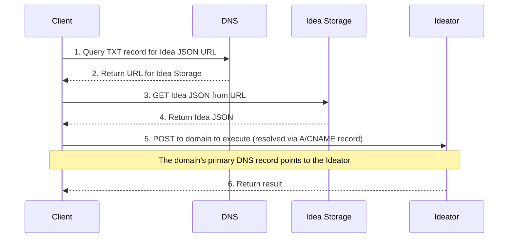

# 102: Concept/Sovereignty

> Sidenote:
>
> - Requires:
>   - [101: Concept/Idea](./101_concept_idea.md)
>   - [103: Concept/Ideator](./103_concept_ideator.md)

## 1. Introduction

This guide explains **Sovereignty**, which is just a fancy word for how much control you have over your creations. Think of it like a menu of options, from letting us handle everything for you to doing it all yourself.

We've set up different levels of control so you can choose what works best. This is how we turn a cool idea (an `Ideator`) into a real thing that actually runs on the internet.

## 2. The Layered Architecture

Our system has five levels, or "layers." Each level gives you more power and control, building on top of the special ID you created in [101: Concept/Idea](./101_concept_idea.md). You can start on the first level with just a simple ID, or go all the way to the top and run a complete web service.

> It's like deciding how to have a pizza. At one end, you can just order a pizza from a restaurant. It's super easy, and they do all the work. At the other end, you can buy your own flour, make your own dough, and bake it in your own oven. You have total control—that's **full sovereignty**. Our layers are like the steps in between, like buying a pre-made pizza crust and adding your own toppings. They help you get from being a customer to being your own pizza chef, if you want.

#### How You Stay in Control: Using the Internet's Address Book (DNS)

The picture below shows the two main things you can do with an Idea: get its instructions (`GET`) or tell it to do something (`POST`). It also shows how you are always in charge by using something called DNS, which is like the internet's main address book.

**Your entries in the address book are your control panel.** You have two special entries for your website name:
1. A little note (`TXT` record) that says: "The *instructions* for this Idea are stored over here."
2. The main address (`A` or `CNAME` record) that says: "To *use* this Idea, go to this place."

By changing these two addresses, you decide where everything goes. You can use our services or switch to your own servers anytime you want.

### Layer 1: We'll Hold Your Files for You

This level gives you a free place to store the main file for your Ideator, so you can get started right away.

- **How It Works:** To make things easy, we'll store your Ideator's instruction file for you in a big online storage folder. The address book entry (`TXT` record) for your project will point to that file. If you ever decide you want to store the file somewhere else (like your own computer or another service), you can just update the address book to point to the new spot. You are never locked in.
- **Purpose:** To help you start creating without worrying about finding a place to host your files.

---

### Layer 2: A Website for Your Idea, Instantly

This layer turns your Ideator into a real website that people can see and use, without needing any fancy servers.

- **How It Works:** We have a special, universal webpage that works for any Ideator. When someone visits your Ideator's web address, this page loads. Its first job is to do a quick, secure lookup in the internet's address book (`DNS-over-HTTPS`) to find your special note (`TXT` record). That note tells it where your Ideator's instruction file is stored. The page then grabs that file and uses it to build a user interface—with buttons, text, and everything—right on the spot inside their browser.
- **Purpose:** To give every Ideator a free, working web app from day one, making it super easy for anyone to create something useful.

---

### Layer 3: A Smart Library for Other Computers

This layer makes it easy for other computer programs to read and understand your Idea.

- **How It Works:** We put a fast delivery network (a CDN) in front of your files. When another program asks for information about your Idea, this network is smart enough to deliver it in a way that's easy for programmers to use. For example, instead of grabbing the whole instruction manual, a program can ask for just "the list of ingredients." It even provides a guide on how to use each part correctly. This makes it really nice for developers to build things that connect with your Idea.
- **Purpose:** To make your Idea powerful and easy for other programs to use, with all the tools developers love.

---

### Layer 4: The "Publish Update" Button

This layer gives you a way to publish new versions of your Idea easily and safely.

- **How It Works:** This is how you send updates. You send a special, secure request (`PUT` request) containing the new version of your Idea file. In one single step, this service uploads your new file and instantly updates the address book to point to it. This makes updating your Idea simple and safe.
- **Purpose:** To give you a secure and simple way to manage and update your creations.

---

### Layer 5: Bringing Your Idea to Life

This is the highest level, where your Ideator stops being just a file of instructions and becomes a real service that can *do* things.

- **How It Works:** At this level, your Ideator can receive commands (`POST` requests) and run its code to get a job done. It's like turning your Lego blueprint into a working robot that follows instructions. You can let us handle the work of running it for you, or you can set up your own robot factory. 
- **Purpose:** To give you the power of a modern web service, letting anyone publish a useful app with just a simple instruction file.

## 3. The Rules for Talking to Your Idea

All conversations with your Idea happen at its main web address (like `your-idea.com/`). Here are the commands computers can use:

- **`GET /`**
  This command means "Show me something."
  - If you ask like a web browser (for a person to see): You get the pretty user interface from Layer 2.
  - If you ask like a computer (for a program to read): You get the raw instruction file (the JSON file) from Layer 3.

- **`PUT /`** (Layer 4)
  This command means "Here is a new version." You'll need a secret key to prove it's you. One command is all it takes to upload the new file and make it live.

- **`POST /`** (Layer 5)
  This command means "Run and do this job." This is how you tell the Ideator to perform its task. You might need special permission to do this. The request must include the information the Ideator needs to do its work, like `{"context": "Please bake a virtual pizza"}`.